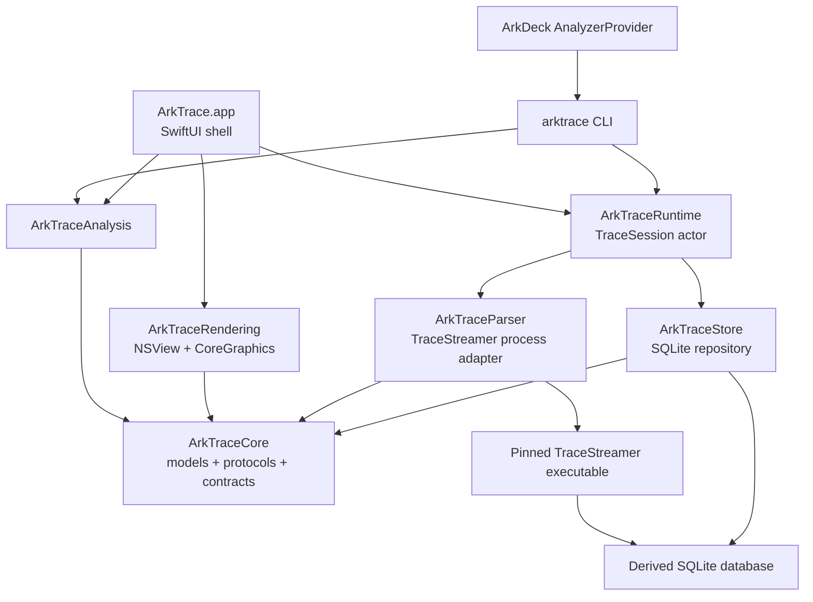
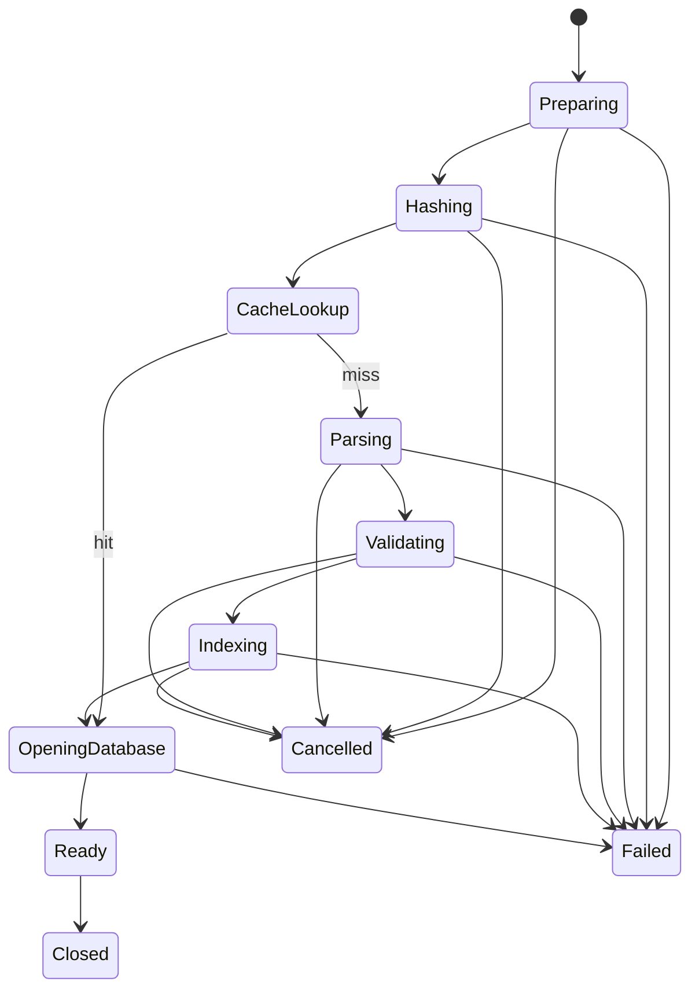

# ArkTrace 设计文档

> 状态：Draft for Review  
> 文档版本：0.1b  
> 日期：2026-08-12  
> 本轮范围：产品与技术设计；不包含开发任务拆分  
> 配套规格：[SPECIFICATION.md](./SPECIFICATION.md)  
> 0.1a 修订（2026-08-12）：§2.1 证据基线改锚 GitCode canonical upstream 并记录基线偏差；§11.1 新增 instant 事件语义；§24 新增发布门 1（上游重锚定）；§25 新增关注点 9–11  
> 0.1b 修订（2026-08-12，Phase 0）：§2.1 完成 GitCode 重锚定（pin `447a0a49`），发布门 1 关闭；新增 [TRACE_STREAMER.md](./TRACE_STREAMER.md)
> Phase 1 实现注记（2026-08-12）：Parser/Store vertical slice、真实 schema evidence、staging validation/index/fsync、原子 Ready 与 mandatory zero-skip gate 已完成；验证见 [PHASE_1_VERIFICATION.md](./PHASE_1_VERIFICATION.md)

## 1. 文档目的

ArkTrace 是一个独立的 macOS 原生 Trace Workbench。它同时提供：

1. 面向开发者的原生 Trace Viewer；
2. 面向 CLI 和 AI Agent 的确定性 Trace 查询与分析运行时；
3. 面向 ArkDeck 的 Host-only Trace Analysis Engine。

本设计回答系统为何这样划分、模块如何协作、哪些上游能力复用、哪些边界不可跨越，以及实现和发布必须通过哪些工程门槛。所有可测试的行为要求集中在配套规格文档中。

## 2. 证据基线

设计不是从示例类型和假想 schema 推导而来。2026-08-12 已核对以下事实源。

### 2.1 OpenHarmony SmartPerf Host

- Canonical upstream（项目书指定）：[openharmony/developtools_smartperf_host @ GitCode](https://gitcode.com/openharmony/developtools_smartperf_host)
- 官方说明：[SmartPerf Host 使用文档](https://gitee.com/openharmony/docs/blob/30904d2051d468bd681b08da17cbc6e87a77dbf1/en/device-dev/device-test/smartperf-host.md?skip_mobile=true)
- 当前 pin（Phase 0 重锚定，2026-08-12）：GitCode `master` @ `447a0a49a7b3b914d6e9bd00648ba5a340f6fbf6`（2026-08-05T20:11:20+08:00，MR !429）
- TraceStreamer 源码版本：`4.3.7`，发布标记 `2025/07/01`（pin 处与初始快照一致）
- 仓库与 TraceStreamer 源文件许可证：Apache License 2.0

重锚定核对（2026-08-12，关闭发布门 1）：0.1a 初始审阅对象为 Gitee 镜像 `5c5afb0c`（2025-09-12），经确认是 GitCode master 的祖先提交，两仓同一历史线。`5c5afb0c..447a0a49` 共 306 个提交、54 个触及 trace_streamer，主要为新增能力表（network profiler、filesystem_io、timerfd_wakeup）、native_memory/hiperf 修复与 macOS 编译修复（2026-07-30 `fix:mac compiler`，说明 macx 构建被积极维护）。ArkTrace required 表中唯一列级变化：`sched_slice` 新增 `prev_itid`/`prev_state` 两列，由 `g_extendField` 开关控制（默认 `false`，默认导出 schema 不变），属 AT-DB-004 定义的 additive 兼容变化。`-e`、`-nm/--nometa`、`.ohos.ts` sidecar、`CREATE TABLE systuning_export.<t> AS SELECT` 导出机制、`meta` 表 `source_name`/`output_name` 绝对路径写入，均在 pin 处复核成立。构建先决条件（clang/gsed/Gitee-SSH 第三方拉取等）与 re-pin 流程见 [TRACE_STREAMER.md](./TRACE_STREAMER.md)。

已确认：

- 原生 CLI 用法为 `trace_streamer <trace> -e <database>`；
- 支持文本 trace 与基于 proto 的 trace；
- 上游声明支持 OHOS、Linux、macOS；OpenHarmony 集成构建包含 macOS arm64 toolchain；
- 独立构建脚本仍包含 x86_64 预构建工具和独立 GN 配置，因此 Apple silicon 原生、可重现构建必须作为交付门验证，不能只依据 README 宣称完成；
- CLI 进程只用 `0/1` 表达成功或失败，旁路 `.ohos.ts` 文件再细分 parser status；ArkTrace 不能只依赖单一退出码判断数据库有效；
- 导出的 SQLite 表是通过 `CREATE TABLE ... AS SELECT ...` 生成，默认没有可依赖的业务索引；
- `meta` 表可能包含输入和输出绝对路径；
- 时间表字段和 SmartPerf 查询均以纳秒工作，SmartPerf 通过减去 `trace_range.start_ts` 对外显示 Trace-relative 时间；
- `process.id/ipid` 和 `thread.id/itid` 是内部稳定身份，PID/TID 可能复用，不能充当域模型主键。

已重点核对的上游表：

| 表 | ArkTrace 用途 | 已确认关键字段 |
|---|---|---|
| `trace_range` | 原始起止时间 | `start_ts`, `end_ts` |
| `process` | 进程目录 | `id`, `ipid`, `pid`, `name`, `start_ts`, counts |
| `thread` | 线程目录 | `id`, `itid`, `tid`, `name`, `start_ts`, `end_ts`, `ipid`, `is_main_thread` |
| `sched_slice` | CPU 调度时间片 | `id`, `ts`, `dur`, `ts_end`, `cpu`, `itid`, `ipid`, `end_state`, `priority`, `arg_setid` |
| `thread_state` | 线程状态 | `id`, `ts`, `dur`, `cpu`, `itid`, `tid`, `pid`, `state`, `arg_setid` |
| `callstack` | named slice / function | `id`, `ts`, `dur`, `callid`, `cat`, `name`, `depth`, async/trace fields |
| `measure` | Counter 样本 | `type`, `ts`, `dur`, `value`, `filter_id` |
| `cpu_measure_filter` | CPU counter 描述 | `id`, `name`, `cpu` |
| `process_measure_filter` | Process counter 描述 | `id`, `name`, `ipid` |
| `stat` | 解析统计与质量信息 | `event_name`, `stat_type`, `count`, `serverity`, `source` |
| `meta` | parser 元数据，可选 | `name`, `value` |

SmartPerf 的可复用语义包括：

- 区间相交查询；
- `trace_range.start_ts` 归一化；
- CPU utilization 的 clipped-duration 算法；
- process/thread/internal identity 的 join 关系；
- `callstack` 与 thread/process 的关联；
- CPU frequency 与 idle counter 的 filter 语义；
- 以每像素纳秒数进行可见事件过滤与最小一像素绘制。

不复用的部分包括：

- TypeScript worker/message plumbing；
- Web Component/DOM 的 Track 树；
- Canvas 对象和浏览器缓存；
- 将整条泳道数据先装入数组再按 viewport 过滤的做法；
- 字符串插值 SQL；
- 与特定 Web sheet、hover 全局变量和 UI 状态耦合的查询。

### 2.2 ArkDeck

- 官方仓库：[ArkDeck/ArkDeck](https://github.com/ArkDeck/ArkDeck)
- 审阅的远端主线快照：`259e16d4`（本地 `origin/main`）
- 本地工作树 HEAD：`9d39e4a3`；与 Trace Analyzer 相关文件在后一提交中未变化
- 已阅读：`AGENTS.md`、`PRODUCT-LOOP.md`、`openspec/constitution.md`、Trace living spec、Catalog、Analyzer Provider、Artifact pipeline、Trace App facade 与相关测试

已确认：

- ArkDeck 已发布 `analyzer.summarize-trace@1`，不得再创建同义 summary operation；
- 该 operation 是 `hostOnly`、`binding: none`，输入是 `sourceArtifactRef: artifactLease`，输出是 derived `trace-summary.json`；
- `AnalyzerProvider` 已实现 immutable artifact lease 校验、固定 analyzer ref、固定参数、无 shell 的 descriptor-bound process dispatch、JSON 校验和 derived artifact provenance；
- 当前 daemon 只实际配置 crash analyzer profile；trace summary 虽在 Catalog 中存在，但生产环境默认 `analyzer.profileUnavailable`；
- 当前 `AnalyzerExecutableResolver` 实际只支持一个 analyzer 可执行文件，不过基础 resolver 协议已经支持 `resolveExecutable(for action:)`，因此可以在保留同一 provider 的前提下按 closed `analyzerRef` 选择多个 pinned executable；
- ArkDeck 的 raw Trace Artifact 由 `capture.diagnostics@1` 产生，ArkTrace 不需要也不得获得 HDC 或设备控制能力。

## 3. 产品目标

### 3.1 Human 路径

```text
Trace 文件
  → 本地异步解析
  → 原生 Timeline
  → CPU / Process / Thread / Slice / Counter
  → Zoom / Pan / Search / Selection
  → Inspector 与区间统计
```

### 3.2 Agent 路径

```text
Trace Artifact
  → arktrace CLI / ArkTrace libraries
  → typed bounded query
  → deterministic reduction
  → versioned JSON
  → Agent reasoning
```

### 3.3 ArkDeck 闭环

```text
ArkDeck capture.diagnostics@1
  → immutable trace.htrace Artifact
  → analyzer.summarize-trace@1
  → pinned arktrace executable
  → trace-summary.json derived Artifact
  → Agent
  → 下一次 typed request
```

## 4. 责任边界

### 4.1 ArkTrace 负责

- Host 上已有 Trace Artifact 的解析；
- TraceStreamer 依赖管理与调用；
- SQLite schema 适配、校验、索引和查询；
- Trace domain model；
- 确定性分析与 bounded context；
- macOS Timeline 与 Inspector；
- CLI 与 versioned machine contract；
- 分析结果的 trace/parser/tool provenance。

### 4.2 ArkTrace 永不负责

- HDC、设备发现、设备身份或授权；
- Trace capture；
- HAP、`.so`、Flash 或应用生命周期；
- ArkDeck Runtime/Job/Capability 状态机；
- LLM SDK、prompt orchestration 或通用 Agent Framework；
- 云上传、账号或遥测平台。

### 4.3 边界不变量

1. ArkTrace 的设备权限为零。
2. ArkTrace 的输入必须是 Host 可读文件或 ArkDeck 已解析的 immutable Artifact lease。
3. App、CLI 与 ArkDeck adapter 复用同一 Core/Store/Analysis，不各自实现 Trace 语义。
4. Agent API 不暴露 raw SQL。
5. 原始 Trace 永不原地修改。
6. 所有 derived 数据都可由 trace hash、parser identity、schema adapter version 和参数重建。

## 5. 总体架构



### 5.1 依赖方向

```text
ArkTraceCore                  ← 无 UI、SQLite、Process、ArkDeck 依赖
ArkTraceParser    → Core
ArkTraceStore     → Core
ArkTraceAnalysis  → Core
ArkTraceRuntime   → Core + Parser + Store
ArkTraceRendering → Core
ArkTraceCLI       → Core + Runtime + Analysis
ArkTraceApp       → Core + Runtime + Analysis + Rendering
```

`ArkTraceRuntime` 是必要的两用编排层：App 与 CLI 都要共享 session、cache、parse、schema validation 和 cancellation。如果把这些职责放入 App 或 CLI，会产生两套生命周期；如果放入 Core，会反向引入 Process/SQLite 依赖。

## 6. 仓库结构

```text
ArkTrace/
├── README.md
├── LICENSE
├── Package.swift
├── ArkTrace.xcodeproj
├── Apps/
│   └── ArkTraceApp/
├── Sources/
│   ├── ArkTraceCore/
│   ├── ArkTraceParser/
│   ├── ArkTraceStore/
│   ├── ArkTraceAnalysis/
│   ├── ArkTraceRuntime/
│   ├── ArkTraceRendering/
│   └── ArkTraceCLI/
├── Tests/
│   ├── ArkTraceCoreTests/
│   ├── ArkTraceStoreTests/
│   ├── ArkTraceAnalysisTests/
│   ├── ArkTraceRuntimeTests/
│   ├── ArkTraceRenderingTests/
│   └── ArkTraceIntegrationTests/
├── Fixtures/
│   ├── traces/
│   └── databases/
├── ThirdParty/
│   └── TraceStreamer/
├── scripts/
│   ├── build_trace_streamer.sh
│   ├── fetch_test_fixtures.sh
│   ├── benchmark.sh
│   └── test.sh
└── docs/
    ├── DESIGN.md
    ├── SPECIFICATION.md
    ├── TRACE_STREAMER.md
    ├── CLI.md
    └── ARKDECK_INTEGRATION.md
```

Swift Package Manager 是 libraries、CLI 和测试的构建事实源；Xcode project 只负责 macOS app bundle、签名和资源装配。项目不提交无意义空目录。

## 7. 核心域模型

### 7.1 时间

- 所有公开时间都是 Trace-relative nanoseconds；
- 使用 `Int64`，不使用 `Double` 存储时间；
- 区间采用半开语义 `[startNs, endNs)`；
- 只有在 viewport 映射阶段，先减去 viewport origin 后才转换为 `Double`；
- 输入数据库原始时间只存在于 Store adapter 内部。

Store 把早于 `trace_range.start_ts` 的绝对时间临时 clamp 为 `0`，以表达抓取开始前已存在的 process/thread；晚于 `trace_range.end_ts` 的值可为展示安全 clamp 到 `durationNs`，但必须视为异常数据。非 identity 时间列若不是 SQLite `INTEGER` storage class，可以按 optional/缺失值丢弃。上述 clamp 与丢弃必须通过有界计数进入 `dataQuality.warnings`；probe 一旦还有未检查的尾部，无论已采样行是否发现异常都必须标记 truncated，不能把未检查数据报告为 `dataQuality.ok`。required identity 仍然 fail closed。

核心值类型：

```swift
struct TraceInstant: Hashable, Codable, Sendable {
    let nanoseconds: Int64
}

struct TraceDuration: Hashable, Codable, Sendable {
    let nanoseconds: Int64
}

struct TraceTimeRange: Hashable, Codable, Sendable {
    let startNs: Int64
    let endNs: Int64
}
```

所有区间构造都检查 `0 <= startNs <= endNs <= traceDurationNs`；其中 `startNs == endNs` 的退化区间仅允许用于 instant 事件（见 §11.1、规格 AT-TIME-006），query/selection/analysis range 必须严格满足 `startNs < endNs`。

### 7.2 身份

```swift
struct ProcessKey { let ipid: Int64 }
struct ThreadKey { let itid: Int64 }
struct EventKey { let table: TraceEventTable; let rowID: Int64 }
```

PID/TID 是展示和过滤字段，不是唯一身份。任何 `pid`/`tid` 查询允许返回多个 internal identity，并显式带出各自时间范围。

### 7.3 主要实体

- `TraceMetadata`
- `TraceProcess`
- `TraceThread`
- `CpuSlice`
- `ThreadStateInterval`
- `TraceSlice`
- `TraceCounterSeries`
- `TraceCounterSample`
- `TraceTrackDescriptor`
- `TraceSelection`
- `TraceSummary`
- `TraceContext`
- `TraceDataQuality`

模型只包含已经由 schema adapter 证实存在的字段。上游新增列通过 capability 暴露，不直接渗透到稳定 JSON contract。

## 8. TraceStreamer 集成

### 8.1 决策

MVP 使用 `TraceStreamerProcessParser`，不使用 Swift 重写 parser，也不把 C++ 深度嵌入首版。

```swift
protocol TraceParser: Sendable {
    func identity() async throws -> TraceParserIdentity
    func parse(
        source: URL,
        destination: URL,
        progress: TraceProgressHandler?,
        prepareDatabase: @escaping TraceDatabasePreparer
    ) async throws -> ParsedTrace
}
```

未来的 `TraceStreamerNativeParser` 必须遵守同一协议和输出 schema validation，不得改变上层 domain contract。

### 8.2 可执行文件解析

生产解析器不从不受控 `PATH` 猜测工具。解析顺序为：

1. 调用方显式注入且已验证的绝对路径；
2. ArkTrace.app bundle 中的固定资源路径；
3. CLI 安装布局中的固定 `libexec` 路径；
4. 仅 Debug 构建允许开发者 override。

每次运行记录：

- upstream repository；
- upstream commit；
- TraceStreamer reported version；
- parser binary SHA-256；
- target architecture；
- ArkTrace parser adapter version；
- build recipe version。

### 8.3 调用方式

```text
Process.executableURL = pinned trace_streamer
Process.arguments = [sourceSnapshotPath, "-e", privatePartialDatabasePath, "-nm"]
```

不使用 `/bin/sh -c`，不拼 shell 字符串。Parser 先在 session-owned private temp 中生成 source 与 binary snapshot，hash/identity 和真正交给子进程的字节完全一致；原始文件后续变化不影响本次 provenance。子进程只写 private partial DB，最终校验与取消 gate 通过后才原子提升到此前不存在的 destination，不删除或覆盖 caller 文件。snapshot/staging 的 Foundation 错误统一映射为无绝对路径的 typed error。`-nm` 避免上游 `meta` 表把用户绝对路径写入缓存数据库。ArkTrace 自己的无路径 metadata sidecar 保存 parser/tool provenance。

### 8.4 解析成功判定

以下条件全部成立才算成功：

1. process exit status 为 0；
2. destination 是 regular file，非 symlink；
3. 文件头是合法 SQLite；
4. `PRAGMA quick_check` 返回 `ok`；
5. schema adapter 支持 required tables/columns；
6. `trace_range` 恰有可用范围，且 duration 为正；
7. required table 的基本 referential checks 通过；
8. staging 数据库完成 ArkTrace index migration；
9. 所有文件 fsync 后原子提升到 cache entry。

`.ohos.ts` status sidecar 只作为诊断证据，不替代以上判定。

### 8.5 取消

取消解析时先向子进程发送 TERM，等待 500 ms grace period，必要时只向同一已知且仍由该 `Process` 表示的 PID 发送 KILL，并显式 `waitUntilExit`/reap。实现不使用 checked continuation，因此自然退出与取消不存在 double-resume。取消与 atomic promotion 通过同一 gate 串行化；若移动先赢得竞态但调用任务在返回前已取消，只在 device/inode 仍匹配本次产物时撤销 destination 与 metadata sidecar。Repository detached validation 返回后也再次检查调用任务的取消状态。未完成或已取消的 staging entry 永不保持 Ready，后续清理只触碰 session-owned temp directory。

## 9. Schema Adapter 与数据库

### 9.1 为什么需要 adapter

TraceStreamer 的 `meta` 不提供可依赖的数据库 schema version，导出表也可能随 upstream 演进。因此 ArkTrace 不能假设版本号等于 schema。

`TraceSchemaAdapter` 通过 `sqlite_master`、`PRAGMA table_info`、required column semantics 和探测查询建立 capability set：

```swift
struct TraceSchemaCapabilities {
    let cpuScheduling: Bool
    let threadStates: Bool
    let namedSlices: Bool
    let cpuCounters: Bool
    let processCounters: Bool
    let frames: Bool
}
```

Schema fingerprint 是排序后的完整 table/column/type/PK 描述的 SHA-256；v2 preimage 使用固定域标记、版本、record count，并对每条 record 及其中每个 UTF-8 字段使用 64-bit length prefix，合法标识符或 declared type 中的 `|`、换行等字节不能造成序列化碰撞。来自 `sqlite_master` 的标识符统一按 SQLite 规则转义，带空格、连字符或引号的合法表/列不能被跳过；schema 最多允许 4,096 张表，枚举只读取 `LIMIT 4097`，超限返回 `TRACE_SCHEMA_UNSUPPORTED`。新增无关列是兼容变化；required 列缺失、SQLite declared affinity 与字段语义不兼容、或关键 join 不成立是 `TRACE_SCHEMA_UNSUPPORTED`。`trace_range` 唯一性只读取 `LIMIT 2`。required relationship source 最多采样 1,024 行，目标表不截断，整个 join 受 250,000 SQLite VM-step progress budget 约束；超预算 fail closed。事件 capability 只有在所需列 affinity 兼容且事件表非空时成立；optional counter capability 还必须在两侧有界样本内存在 `measure.filter_id → filter.id` 的真实 join，空表或互不相交的 filter ID 不能宣称完整能力。

### 9.2 Store

`TraceDatabase` 负责连接、statement 生命周期、interrupt 和 progress handler；`SQLiteTraceRepository` 实现 Core 中的 typed repository protocols。

数值读取必须先检查 SQLite storage class；required process/thread identity 仅接受 `SQLITE_INTEGER`，不得依赖 `sqlite3_column_int64` 对 `NULL`、`TEXT` 或 `REAL` 的静默转换。

```swift
protocol TraceRepository: Sendable {
    func metadata() async throws -> TraceMetadata
    func processes(_ query: ProcessQuery) async throws -> BoundedPage<TraceProcess>
    func threads(_ query: ThreadQuery) async throws -> BoundedPage<TraceThread>
    func cpuSlices(_ query: CpuSliceQuery) async throws -> TimelinePage<CpuSlice>
    func threadStates(_ query: ThreadStateQuery) async throws -> TimelinePage<ThreadStateInterval>
    func slices(_ query: SliceQuery) async throws -> TimelinePage<TraceSlice>
    func counters(_ query: CounterQuery) async throws -> TimelinePage<TraceCounterSample>
}
```

### 9.3 连接策略

- Indexing 前数据库是 staging writable；
- Ready 后以 read-only 方式打开；
- 每个 session 由 actor 管理连接和取消；
- 所有 SQL 使用 prepared statement 和 bind；
- event query 必须含 range 和 limit；
- SQLite progress handler 定期检查 deadline/cancellation；
- cancel 调用 `sqlite3_interrupt`；
- 不使用重量级 ORM。

### 9.4 ArkTrace 索引

上游 export 没有业务索引。ArkTrace 在 derived DB 上创建版本化、命名隔离的索引，至少覆盖：

- `sched_slice(ts, cpu)`；
- `sched_slice(itid, ts)`；
- `thread_state(ts, cpu)`；
- `thread_state(itid, ts)`；
- `callstack(callid, ts)`；
- `process(pid)`；
- `process(ipid)`；
- `thread(tid, ipid)`；
- `thread(itid)`；
- counter 的 `(filter_id, ts)`。

Phase 1 index version 为 `1`，名称统一使用 `arktrace_v1_*`。`process(ipid)`/`thread(itid)` bootstrap indexes 在 required relationship probe 前创建，使真实无索引 export 的 target lookup 保持在 VM-step budget 内；其余索引在 semantic validation 后迁移。不存在相应 optional table/column 时不创建该索引。索引 schema version 进入无路径 metadata sidecar，并在 Phase 2 参与 cache key；索引失败不会降级成无界扫描，而是使 session 加载失败。Ready 连接使用 read-only + 平台 `SQLITE_OPEN_NOFOLLOW`；macOS `/var` symlink 先以 POSIX `realpath` 规范化 parent，但 final database component 保持不解析，仍由 SQLite fail closed。

## 10. Trace Session 与 Cache

### 10.1 Session 状态机



状态携带 stage、可取消性和无虚假百分比的进度信息。TraceStreamer 没有可靠总量时，Parsing 显示 indeterminate。

### 10.2 Fingerprint

快速身份用于同一文件的初步 cache lookup：

- file size；
- mtime；
- file resource identity；
- leading bytes。

稳定身份始终是 streaming SHA-256。Cache key：

```text
traceSHA256
parserBinarySHA256
upstreamRevision
schemaAdapterVersion
indexSchemaVersion
```

### 10.3 Cache 布局

```text
~/Library/Caches/com.arktrace.ArkTrace/traces/
└── <trace-sha256>/
    └── <parser-key>/
        ├── database.sqlite
        └── metadata.json
```

`metadata.json` 不保存输入绝对路径。Cache entry 用临时目录构建并原子 rename。默认高水位 20 GiB、低水位 16 GiB，按 LRU 清理未被 session 使用的 entry；永不删除原始 Trace。

## 11. Query 与 LOD

### 11.1 区间语义

事件与查询区间相交的统一定义：

```text
event.start < query.end && event.end > query.start
```

时长为 NULL 或负数的 open-ended 事件只在读取时临时 clamp 到 trace end，并标记 `isOpenEnded`；不能悄悄变成完整事件。

上游 `dur = 0` 的事件是 instant 事件：区间退化为 `startNs == endNs`，与查询区间的相交判定改为 `queryStart <= startNs < queryEnd`，聚合时计入 eventCount 但不贡献占用时长，Timeline 上渲染为 marker（至少 1 物理像素）且仍是可选择的真实事件（规格 AT-TIME-006）。instant 不得被静默丢弃，也不得与 open-ended 混淆。

### 11.2 Viewport Query

Renderer 提交：

- visible range；
- visible track IDs；
- pixel width；
- requested detail；
- max primitives；
- deadline；
- generation ID。

Store 返回不可变 `TimelineSnapshot`。旧 generation 的结果被丢弃，不能覆盖新 viewport。

### 11.3 两级 LOD

1. `detail`：返回单个 event，硬上限与 viewport width 成比例；
2. `density`：按时间 bucket 返回 utilization/count/dominant metadata，不返回可选中的伪 event。

Store 首先执行 bounded count/probe。若 detail 会超过预算，直接执行 bucket aggregation，不先把所有 event 加载到 Swift。输出 primitive 数量接近 viewport pixels，而不是 trace 总事件数。

### 11.4 搜索

搜索通过 typed filters 完成：PID、TID、process name、thread name、slice name。名称搜索 escaped 并 bind；首版不建立通用全文检索。结果按 `(startNs, eventKey)` 稳定排序，默认限量。

## 12. Analysis Engine

`ArkTraceAnalysis` 是纯本地、确定性 reduction。它不依赖任何 LLM SDK。

### 12.1 基础分析

- Trace summary；
- per-CPU utilization；
- top running processes/threads；
- long named slices；
- thread state distribution；
- scheduling latency（仅 schema/state 语义可证实时启用）；
- hot intervals；
- bounded range statistics。

### 12.2 计算原则

所有时间聚合使用 clipped overlap：

```text
overlap = max(0, min(eventEnd, rangeEnd) - max(eventStart, rangeStart))
```

CPU utilization 以 CPU/range 为分母。发生重叠、负时长、缺失引用或超过 100% 时不静默 clamp 结论，而是在 `dataQuality.warnings` 中给出异常，展示值可以 clamp。

### 12.3 Context 构建

Context 不是 raw dump。构建顺序：

1. 校验中心时间或 range；
2. 查询该范围内的 CPU slice、thread state、named slice、counter；
3. 提取被引用的 process/thread；
4. 计算小型 summary；
5. 按 section budget、event budget、byte budget 做确定性裁剪；
6. 输出 section-level truncation 和 data quality。

优先保留：命中过滤条件的事件、离中心最近事件、最长事件、summary；同优先级按稳定 key 排序。

## 13. Timeline Renderer

### 13.1 结构

```text
SwiftUI controls
  → NSViewRepresentable
  → TimelineNSView
  → CoreGraphics renderer
  → immutable TimelineSnapshot
```

大量事件不映射为 SwiftUI `View`。SwiftUI 只负责窗口、sidebar、toolbar、Inspector 和状态。

### 13.2 Viewport

`TimelineViewport` 保存：

- `visibleRange: TraceTimeRange`；
- content width/height；
- vertical scroll offset；
- track layout；
- scale `nsPerPoint`；
- generation。

Zoom 以鼠标位置为 anchor，pan 保持 Int64 时间。布局和 hit-test 共用同一 snapshot 与坐标转换，避免显示和选择漂移。

### 13.3 Track

MVP track 类型：

- CPU Scheduling；
- Process；
- Thread State；
- Named Slice / Function；
- 已证实存在时的 Counter。

Track descriptor 与 event data 分离。Collapse 只影响可见 layout/query，不丢弃 session 数据。Density LOD 是统计图层，不能伪装成原始事件供 Inspector 选择。

### 13.4 Draw cycle

1. 主线程读取当前 immutable snapshot；
2. 绘制背景、time ruler、track separators；
3. 绘制 density 或 event primitives；
4. 绘制 hover、selection、range overlay；
5. 文本只在 primitive 宽度足够时绘制；
6. 数据缺失时保留上一代 snapshot 并显示 loading overlay，避免 pan/zoom 闪白。

首版使用 CoreGraphics。只有基准证明 CPU rendering 是真实瓶颈后才考虑 Metal；Renderer protocol 已隔离后端。

## 14. macOS App

### 14.1 布局

```text
Toolbar
├── Sidebar: track tree / search
├── Timeline
└── Inspector: event or range details
```

使用 `NavigationSplitView` 构建 shell，Timeline 是 AppKit bridge。

布局遵循 macOS 的 leading-to-trailing 阅读顺序：Sidebar 用于定位对象，Timeline 承载主要分析任务，Inspector 展示当前选择的细节。Timeline 始终是视觉与空间主区域；窗口变窄时先收起 Inspector，再允许 Sidebar 进入 compact 状态，并为两个 pane 保留可见、可键盘触达的 disclosure control。不能仅因实现方便给文字 pane 设置不可适应字体、语言或窗口缩放的固定宽高。

Timeline 是刻意保留的二维工作区：横向滚动表示时间，纵向滚动表示 track。其他工具栏、表单与 Inspector 不得产生无意的横向滚动。分组间距大于组内间距，track label、数值列与 controls 保持稳定对齐；所有 leading/trailing 关系使用语义方向，避免把界面锁死在 left/right 假设上。

### 14.2 主要交互

- Open、Drag & Drop、Recent、Reload；
- trackpad/mouse pan；
- cursor-anchored zoom；
- click event selection；
- drag range selection；
- zoom to selection、reset；
- expand/collapse tracks；
- keyboard searchable process/thread/slice；
- Cancel parse/query/analysis。

App 只显示 Core typed error 的本地化表述，不解析 TraceStreamer log 推断错误。

### 14.3 Keyboard、VoiceOver 与 motion

优先使用原生 SwiftUI/AppKit controls，使 Toolbar、Sidebar、Search、Timeline、Inspector、loading 与 Cancel 进入自然且可预测的 focus order。键盘模型：

- `Tab` / `Shift-Tab` 在主要区域与 controls 间移动；
- Timeline 获得 focus 后，`Left` / `Right` 移到同一 track 的前一/后一真实 event，`Up` / `Down` 移到相邻可见 track；
- `Option-Left` / `Option-Right` 平移约一个 viewport 的 10%，`+` / `-` 围绕当前 selection 或 viewport center 缩放；
- `Return` 选择 focused event，`F` zoom to selection，`0` reset，`Escape` 清除 transient range/selection；
- sheet、dialog 或 error disclosure 关闭后，focus 返回触发它的 control；pane 收起时，focus 转移到对应 disclosure control。

Canvas 不为数十万事件创建 accessibility element。它向 VoiceOver 暴露 focused track 摘要、当前 focused/selected event、当前 viewport/range 和可用键盘动作；Inspector 提供完整、可复制的语义详情，Search 提供到任意可查事件的替代导航路径。Selection、loading、结果计数、完成和错误变化通过原生 accessibility notification 宣告，但高频 pan/hover 不逐帧播报。

所有 icon-only control 都有可本地化的 accessible name；focus ring 清晰可见；状态不能只靠颜色表达。默认密度下主要 toolbar target 尽量达到 40×40 pt，任何可交互目标不得小于 24×24 pt，且相邻 hit area 不重叠。动效遵循系统 Reduce Motion：loading 不依赖自动播放动画表达进度，pane/event transition 可被禁用或替换为无位移变化。

## 15. CLI 与 Machine Contract

### 15.1 CLI 是正式产品面

CLI 与 App 使用同一 `TraceSession` 和 repository。命令集：

```text
doctor
inspect
summary
processes
threads
query
context
analyze
```

所有 agent-facing command 支持 `--json`、deadline 和输出限制。JSON 模式下 stdout 只包含一个 JSON document，日志只写 stderr。

### 15.2 Envelope

```json
{
  "schemaVersion": "1.0",
  "tool": {
    "name": "arktrace",
    "version": "0.1.0",
    "buildRevision": "..."
  },
  "trace": {
    "sha256": "...",
    "durationNs": 0,
    "parser": {
      "version": "4.3.7",
      "upstreamRevision": "...",
      "binarySha256": "..."
    },
    "schemaFingerprint": "..."
  },
  "request": {},
  "limits": {},
  "result": {},
  "truncation": {
    "truncated": false,
    "sections": []
  }
}
```

错误也使用 versioned envelope 和 typed code。稳定 contract 不输出 absolute source path、cache path、raw SQL 或不受限 parser log。

## 16. ArkDeck 集成

### 16.1 MVP：复用现有 summary operation

ArkDeck 保留：

```text
analyzer.summarize-trace@1
  input: sourceArtifactRef
  output: trace-summary.json
```

集成时配置 `trace-summary@1` profile 指向 pinned `arktrace`，固定参数选择 `summary --json`。Artifact path 仍由 Provider 从 lease 解析后作为独立 argv 添加。AI、App、CLI 均不能传 executable path 或 argv。

### 16.2 多 analyzer executable

不能要求 ArkTrace 同时实现 crash/hilog analyzer，这会污染产品边界。ArkDeck 的现有 `AnalyzerExecutableResolver` 应按 typed `AnalyzerInvocation.analyzerRef` 选择：

- crash → `arkdeck-agentd` pinned identity；
- trace summary → `arktrace` pinned identity；
- 其他 analyzer → 各自 closed profile。

底层 `RuntimeExecutableResolving.resolveExecutable(for action:)` 已支持这种 action-specific resolution。任何 ref/profile/hash 漂移都在 Availability 阶段返回 unavailable，不能到 Job 运行后才发现。

### 16.3 输出校验

ArkDeck 除了“是 JSON”外还要校验：

- schemaVersion 支持；
- tool name/version；
- analyzer result kind；
- envelope `trace.sha256` 等于 source Artifact lease hash；
- result 未因 stdout budget 截断；
- parser/tool provenance 存在；
- derived hash/byte count 与 receipt 一致。

### 16.4 深度分析边界

现有 `analyzer.summarize-trace@1` 只适合无参数 summary，不能表达 timestamp/range/pid/tid/context limits。深度闭环需要时，ArkDeck 应新增一个非重复的 typed analysis operation（推荐 `analyzer.analyze-trace@1`），使用 closed `kind`、typed range/filter/resource bounds，输出 `trace-analysis.json`。这是新 published operation，必须遵循 ArkDeck 当时的 living specs 和维护者 review；它不阻塞 ArkTrace standalone MVP，也不替代现有 summary operation。

## 17. 并发与 Cancellation

- `TraceSession` 是 actor，session state 不能跨 Trace 污染；
- Parser、Hasher、Indexer、Query、Analysis 都不运行在 MainActor；
- 打开新 Trace 会取消旧 session 的 in-flight work；
- query 使用 generation + deadline + SQLite interrupt；
- Renderer 只消费 immutable snapshot；
- App close、window close、CLI signal 都触发 structured cancellation；
- cancellation 是 typed terminal outcome，不包装成 generic failure。

## 18. 错误模型

Core error code 至少包括：

```text
INVALID_ARGUMENT
TRACE_FILE_NOT_FOUND
TRACE_FILE_UNREADABLE
TRACE_FORMAT_UNSUPPORTED
TRACE_STREAMER_UNAVAILABLE
TRACE_STREAMER_IDENTITY_MISMATCH
TRACE_PARSE_FAILED
TRACE_SCHEMA_UNSUPPORTED
TRACE_DATABASE_INVALID
TRACE_CACHE_CORRUPT
QUERY_FAILED
QUERY_TIMEOUT
QUERY_LIMIT_EXCEEDED
OUTPUT_LIMIT_EXCEEDED
ANALYSIS_UNSUPPORTED
CANCELLED
INTERNAL_ERROR
```

每个错误包含 code、message、retryable、stage 和安全的 details。底层路径与 parser stderr 默认不进入 machine error；可在用户主动诊断导出中提供脱敏版本。

## 19. 安全、隐私与本地优先

- 不联网解析；
- 不自动上传 Trace、数据库、summary 或 crash data；
- raw Trace 不修改；
- cache 目录权限限定当前用户；
- 不跟随 source/cache symlink 完成危险写入；
- 输出不包含 absolute path；
- 不允许 raw SQL agent API；
- 不允许任意 executable selection；
- 临时文件和 cache promotion 使用明确、session-owned 路径；
- ArkDeck 只通过 immutable Artifact lease 进入；
- 导出由用户显式发起，并标注 derived provenance。

## 20. 性能设计

性能目标通过结构保证，而非只靠基准数字：

- parser 不阻塞 MainActor；
- exported DB 增加 ArkTrace indexes；
- query 必须 range/limit aware；
- timeline query 由 viewport 驱动；
- zoomed-out 使用 aggregation；
- snapshot 与绘制 primitive 有硬上限；
- context 与 machine output 有 byte budget；
- pan/zoom 不同步等待数据库；
- 不将整条 Trace 的 slice/event 装入内存。

基准按 small、medium、large 真实 Trace 分组，记录 trace size、parse duration、DB/index duration、DB size、cache-open、viewport query、context、analysis、peak RSS 和 frame timing。没有真实样本时不输出伪性能结论。

## 21. 测试策略

### 21.1 单元测试

- Int64 time/range/clipping/overflow；
- PID/TID reuse；
- viewport transforms；
- LOD selection；
- cache key/atomic promotion/eviction；
- JSON encode/decode and golden files；
- typed errors；
- context budget/truncation；
- analysis formulas。

### 21.2 Store 与 schema 测试

- 使用真实 TraceStreamer DB fixtures；
- required/optional/additive/missing column matrices；
- parameter binding；
- overlap boundary；
- limit+1 truncation；
- cancellation/progress handler；
- indexes 与 query plan；
- corrupt DB/ref integrity。

### 21.3 Parser 集成测试

真实执行 pinned TraceStreamer，将合法最小 trace 解析为 DB，然后用 Store 查询 metadata/process/thread/CPU/slice。

### 21.4 CLI 测试

验证每个命令的人类输出、JSON golden、exit status、stdout/stderr isolation、timeout、cancel、output budget。

### 21.5 UI 测试

只覆盖关键路径：open、ready、timeline、zoom/pan、select、Inspector、search、cancel。Renderer 的 layout/hit-test 尽量做无窗口单元测试。

### 21.6 ArkDeck contract 测试

- operation 保持 `analyzer.summarize-trace@1`；
- trace analyzer unavailable/available reason；
- action-specific executable identity；
- argv 无 shell；
- source lease hash 校验；
- JSON schema/hash/provenance 校验；
- derived artifact publication；
- malformed/truncated/wrong-trace output 拒绝。

## 22. 分发与许可证

ArkTrace 自身许可证已于 2026-08-12 建仓时确定为 MIT（与 ArkDeck 一致）。TraceStreamer source/binary 以 Apache-2.0 notice 分发，但这不等于其全部第三方依赖已完成审计。

发布前必须产出：

- `ThirdParty/TraceStreamer/manifest.json`；
- upstream revision、binary SHA-256、architecture、build recipe；
- 完整 license inventory；
- `THIRD_PARTY_NOTICES.md`；
- source offer/notice/attribution 所需文件；
- 可重现 build 或可验证构建 provenance；
- macOS app/CLI 中对应 license UI/文件。

禁止运行时下载未知 `latest` binary。

## 23. 已确定的架构决策

| 决策 | 结论 |
|---|---|
| Parser | 首版复用 TraceStreamer process executable |
| C++ interop | 不阻塞 MVP；未来可在协议后替换 |
| 数据库 | 系统 SQLite3 + typed repository，无 ORM |
| 时间 | Trace-relative Int64 nanoseconds，半开区间 |
| Identity | ipid/itid 为稳定 key，PID/TID 为属性 |
| App renderer | SwiftUI shell + NSView/CoreGraphics |
| LOD | detail + density，两者 contract 不混淆 |
| Agent API | versioned typed JSON，不暴露 raw SQL |
| Analysis | 本地、确定性、bounded，不嵌 LLM SDK |
| Cache | content-addressed，parser/schema/index identity 参与 key |
| ArkDeck summary | 扩展现有 `analyzer.summarize-trace@1` |
| ArkDeck deep analysis | 需要时新增非重复 typed operation，不污染 ArkTrace Core |
| Device access | ArkTrace 永远没有 |

## 24. 必须实证的发布门

以下不是留给实现者自由猜测的设计问题，而是必须用真实证据关闭的工程门：

1. ~~对 canonical upstream（GitCode）master 重跑 §2.1 证据核对，重新 pin TraceStreamer revision/版本~~——已关闭（2026-08-12，Phase 0）：重锚定至 GitCode master `447a0a49`，核对结论见 §2.1 与 [TRACE_STREAMER.md](./TRACE_STREAMER.md)；
2. ~~TraceStreamer 在当前 Apple silicon/macOS toolchain 的原生、可重现构建~~——已关闭（2026-08-12，Phase 1）：原生 arm64 二进制构建成功（Apple clang 21；gn/ninja 为上游 darwin-x86 预编译件经 Rosetta 运行），配方固化于 `scripts/build_trace_streamer.sh`，provenance 记录于 `ThirdParty/TraceStreamer/macx/manifest.json`；浮动 third_party tip 以构建时 SHA 记入 manifest，完全预 pin 列为后续硬化项（见 TRACE_STREAMER.md §4）；
3. binary redistribution 的完整第三方许可证清单；
4. ~~至少一个可再分发真实 `.htrace`/`.ftrace` fixture~~——已关闭（2026-08-12，Phase 1）：Apache-2.0 的 `hiprofiler_data_ability.htrace`、`trace_small_10.systrace` 与 `zlib.htrace` 连同上游许可证/NOTICE 提交至 `Fixtures/traces/`；后两者分别提供非空 scheduling/state 与 named-slice 证据；
5. ~~required schema fingerprint 与真实 DB fixture~~——已关闭（2026-08-12，P1-T05）：pinned TraceStreamer 从两个真实 fixture 重复导出 byte-identical `-nm` DB；schema adapter v2 的 91-table length-prefixed schema fingerprint 为 `cb34d8b668c21d9a5f50949338e0f4777fcd113f1ecfac4446afcb6ddf25bfc3`，source/DB SHA、range、per-fixture capabilities 与六张 required table row counts 锁定在 `Fixtures/databases/trace_streamer_4.3.7.schema-evidence.json`；real integration gate 同时把 actual executable SHA、manifest、evidence parser identity 与每次解析返回的 `metadata.parser` 绑定，并从 fixture/license 实际字节重算 Git blob OID 与 SHA 后重建验证；
6. parser cancellation 在大 Trace 上无 orphan process/cache promotion；
7. indexed viewport query 在 large trace 上满足规格目标；
8. ArkDeck action-specific multi-analyzer resolver 不弱化 pinned identity；
9. 一次真实链路：ArkDeck Trace Artifact → ArkTrace → derived analysis Artifact；
10. 一次真实调试闭环：baseline capture → structured analysis → Agent evidence-backed decision → 下一轮 ArkDeck typed request → follow-up capture → deterministic comparison。

这些门的关闭结果应进入后续实现与验证报告；本轮不把它们拆成任务。

## 25. Review 关注点

本设计 review 建议重点确认：

1. `ArkTraceRuntime` 作为 App/CLI 共享编排层是否接受；
2. 对外统一 Trace-relative Int64 ns 是否接受；
3. `-nm` + ArkTrace 自有 provenance sidecar 是否接受；
4. derived DB 内创建 ArkTrace indexes 是否接受；
5. detail/density 两级 LOD contract 是否接受；
6. ArkDeck summary 复用现有 operation、deep analysis 另走非重复 typed operation 是否接受；
7. ArkDeck analyzer resolver 按 `analyzerRef` 选择多个 pinned binary 是否接受；
8. 本地 cache 默认 20/16 GiB 水位是否需要调整；
9. App 分发形态：是否启用 App Sandbox、Developer ID 直发还是 App Store、是否支持 Intel（universal binary）——影响 AT-APP-001 的 security-scoped bookmark、TraceStreamer 子进程调用、cache 路径与构建目标；
10. ~~ArkTrace 自身 LICENSE 的选择~~——已决：MIT（2026-08-12 建仓时随初始提交确定，见 §22）；
11. ~~无障碍契约（AT-APP-009～012、AC-AT-016）保留为 0.1 DoD 硬门，还是分层交付（0.1 保留键盘可达与 focus 基线，完整 VoiceOver/Reduce Motion 契约移至 0.2）。~~——已决定（2026-08-13，Phase 3 进入决策候选）：保留当前 SPEC 与 DoD，AT-APP-009～012 及 AC-AT-016 仍是 0.1 硬门。P3-T08 不得将 VoiceOver canvas semantics、focus restoration 或 Reduce Motion 降级为后续版本任务。
