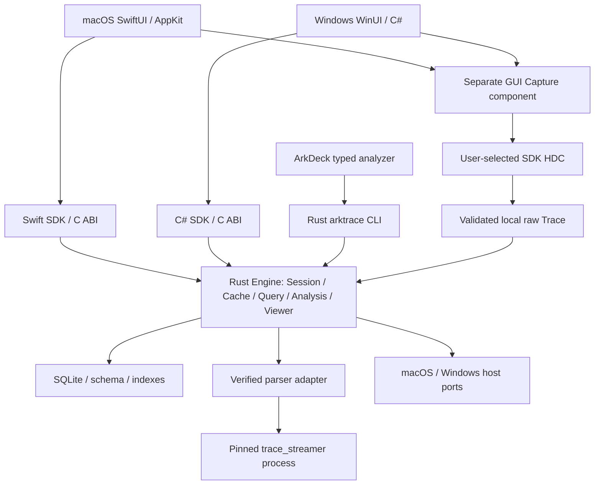
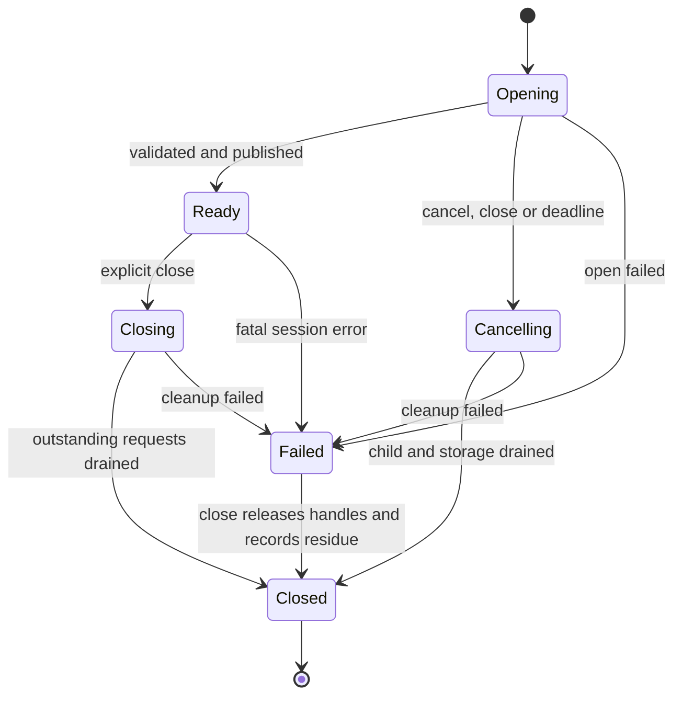

# ArkTrace 共享 Rust 内核与原生 UI 迁移设计

> 版本：1.1；日期：2026-10-02。配套执行清单：[迁移任务](RUST_CORE_MIGRATION_TASKS.md)。
> 性质：按用户本次迁移请求制定的目标架构与实施方案，不是已实现或已验收声明。
> 核对基线：ArkTrace `9172c9525f954ec397e0555d7d03cd4367f3efcf`（1.1 复核至 `5f9934d6`，其间仅文档变化）；
> 参考 ArkDeck `9c0d1a92e111562ed95ac61d0e5505b453024316`（1.1 复核至 `52a4737b2`）。不代表远端最新状态。
> 1.1 修订：对齐 ArkDeck 已裁定的 Windows Trace 范围与 `trace.inspect` 路线；补齐需求映射、
> Swift/C# SDK 分发、Windows 取消与运行时依赖、标注生命周期，并修正里程碑与状态机的不一致。

## 1. 决策、范围与完成条件

采用**一份 Rust 语义内核、一个 Rust CLI、两套原生 UI、窄平台适配层**。
ArkTrace 继续是独立仓库；ArkDeck 消费固定版本的发行包和 SDK，不复制内核源码。
现有上游 C++ TraceStreamer 继续负责原始格式解析；本次迁移替换的是 ArkTrace 的
模型、解析编排、数据库、查询、分析、缓存和时间线投影，不重写 TraceStreamer。

直接动因：ArkDeck 已改为 Rust daemon + 原生 UI 并开放 Windows 阶段，而 ArkTrace 只有
macOS Swift 实现与 arm64 parser，ArkDeck 在 Windows 上只能把 Trace analyzer、
`trace.inspect` 与 Trace Viewer 记为 deferred/unavailable（其设计 §E.2、§L.1 第 5 条与
2026-09-25 的 `trace.inspect` 裁定）。

默认目标平台为 macOS 26+ / Apple silicon 与 Windows 11 / x64，与 ArkDeck 2026-09-30 裁定的
首发支持格一致。Windows ARM64、Linux 产品、Web Viewer、远程分析服务和新增 Trace 数据类型
不在本轮范围。Linux 可以运行纯 Rust 测试，但编译通过不形成产品支持声明。
Windows 的完整目标包含原生 Viewer 和显式 GUI Capture；离线 CLI 是解除 ArkDeck Windows
阻塞的首要交付，可先于 Viewer 交付。ArkDeck 已把 Windows Trace 的 supported 门槛定为
capture/inspect/export 对等、Viewer 后置，因此 Windows Viewer 不是 ArkDeck 首版的前置。

本次请求授权的是迁移设计与任务编制。本文指定的 crate、协议、目录和命令凡标为
“目标”或“拟新增”，均由相应任务实现；写入本文不代表已经存在。

最终完成条件：

1. macOS/Windows 的 CLI、Viewer 和 ArkDeck 分析消费方使用同一 Rust 实现；
   Swift/C# 中没有第二份 SQL、分析公式、缓存生命周期或时间线命中语义。
2. 当前九个 CLI 命令、macOS 已有功能和公开消费 API 有明确保留或迁移记录；
   Windows 完成对应原生体验，不能以 `unavailable` 通过成功路径验收。
3. 真实 parser、真实 Trace、两端主机、签名发行包、干净主机与故障路径均有新证据。
   现有 Phase 0–7 的 Completed 和历史发布门不认证新内核。
4. 原始 Trace 不变，用户持久标注和收藏有可恢复的迁移路径，退出或取消不遗留失控子进程。
5. 已有 Swift 内核及临时桥接在全部消费者切换后删除；原生 Swift UI 与必要兼容 SDK 保留。

## 2. 当前事实与问题

### 2.1 模块清单

下表为上述 ArkTrace 基线的 `Sources/<module>/**/*.swift` 实测，行数包含注释和空行。
它表示迁移面，不是工期或需要逐行翻译的工作量。

| 现有模块 | 文件 / 行数 | 目标动作与责任 |
|---|---:|---|
| ArkTraceCore | 18 / 3,138 | migrate/split：领域类型、时间、查询契约进入 Rust；Darwin IO、OSLog 离开纯模型层 |
| ArkTraceParser | 3 / 2,368 | migrate：parser 身份、快照、运行、取消、诊断预算 |
| ArkTraceStore | 5 / 6,687 | migrate：SQLite、schema 适配、索引、查询与完整性检查 |
| ArkTraceRuntime | 3 / 3,985 | migrate：Session、cache、lease、发布与回收 |
| ArkTraceAnalysis | 5 / 4,592 | migrate：summary/context/analyze 和 Viewer 分析 |
| ArkTraceRendering | 6 / 4,575 | split：布局、LOD、snapshot、命中规则进入 Rust；NSView/CoreGraphics 留在 macOS |
| ArkTraceAppSupport | 8 / 3,250 | split：共享生命周期/标注进入 Rust；Observation、窗口、bookmark、焦点留在 Swift |
| ArkTraceCLI | 11 / 5,956 | replace：Rust CLI；保留现有 argv、JSON、预算、错误和资源契约 |
| ArkTraceCapture | 1 / 1,296 | isolate/migrate：迁入独立 GUI-only Rust capture 组件，离线内核不得依赖它 |
| arktrace（executable） | 1 / 60 | replace：Rust `arktrace` 入口 |
| ArkTraceSignalShim（C target） | 1 `.c` + 1 header / 132 | replace：SIGINT/SIGTERM self-pipe 进入 Rust CLI；Windows 语义见 §10.1 |
| ArkTraceCLIResourceFixtures | 仅测试资源 | retain：测试资源来源，不进入生产依赖闭包 |

表外还有两类迁移面：`Apps/ArkTraceApp/`（43 个 Swift 文件 / 3,182 行，另含 xcstrings、
Assets）保留为 macOS 原生 UI；`Tests/` 的 44 个文件 / 29,633 行是 001 提取行为向量的主要来源。

依赖事实源为 [Package.swift](../Package.swift)。对外 API 已有独立包的
[编译基线](../scripts/api-baseline/Sources/ArkTraceAPIBaseline/APIBaseline.swift)，
不能因为符号在本仓“看似无人使用”就删除。

### 2.2 本次迁移必须解决的实际缺口

| 缺口 | 已核对事实 | 迁移处理 |
|---|---|---|
| Windows parser | 仅有 [macx manifest](../ThirdParty/TraceStreamer/macx/manifest.json)，arm64、上游 `447a0a49…`、4.3.7；无仓内 Windows 可审查发行包 | 早期完成 Windows x64 构建与语义比对，不能等 UI 做完 |
| Apple 平台绑定 | Darwin、MachO、CryptoKit、OSLog、CoreGraphics；CLI doctor/identity 与签名布局也受平台约束 | 明确 port，不靠扩大 `cfg` 或禁用校验完成移植 |
| ArkDeck loader | Rust loader/trust/doctor 只在 macOS 编译：校验 product `0.1.0`/build `1`、arm64、bundle id、JSON contract 1.0、`ArkTraceCLI.app` 布局、Developer ID + 公证 + staple、CDHash，tree digest 含 POSIX mode；Windows daemon 一旦设置 `ARKDECK_ARKTRACE_DESCRIPTOR` 即拒绝启动，且 Windows 没有 `runtime service install/update` | Windows 发行契约、loader 与 descriptor 选择方式都是 ArkDeck 侧独立交付；macOS 新版本号同样要 loader 放行 |
| ArkDeck inspect | Rust `HostServices::trace_inspection` 只有默认实现，对所有请求答 `operationUnavailable`；2026-09-25 裁定：G5 内保持拒绝 (c)，之后走 (b) 由已加载的 reviewed CLI 回答，(a) 在 ArkDeck 内重写解析被否决 | 017/018 经 CLI `inspect --json` 接入，含 handler、`resourceNotFound` 帧、schema 扩展、成功与拒绝路径 |
| 质量事实转换 | [TraceOfflineInspectionService](../Sources/ArkTraceAppSupport/TraceOfflineInspectionService.swift) 因 `issue.message != nil` 拒绝整个结果；ArkDeck 裁定这是 ArkTrace 缺陷，CLI Machine 契约已在边界丢弃 message | 不等 Rust：现行 Swift 先在边界丢弃自由文本、继续校验 category/scope/count（001）；Rust 继承修正后行为，修正前后各留向量 |
| 版本错配 | ArkDeck 链接 ArkTrace `9172c952…`，其 manifest 只接受 recipe `a2e47752…`；ArkDeck 不 pin CLI revision、只 pin 合同，现有 reviewed CLI 构建于落后 74 个提交的 `61d0f2ae…`，携带 recipe `e4fec8cc…`；ArkDeck App 另自带 recipe `a2e47752…` 的 parser | 维护者从 ArkDeck 链接的 revision 重新发布 reviewed distribution（(b) 的另一前置）；兼容记录同时覆盖 engine、SDK、CLI 与各产品自带 parser，不沿用旧 PASS |
| 两类下游消费者 | ArkDeck daemon 经 descriptor 消费 CLI（`summary`/`context`/`analyze`，固定 `--json --no-cache` 与预算）；ArkDeck macOS App 直接 import Core/Analysis/AppSupport/Rendering（Runtime 经 `ArkDeckTraceAdapter`），以 `signedBundleInPlace` 原位执行自带 parser | CLI 接入和 Swift SDK 接入分别验收 |
| ArkDeck 现有 Rust 移植 | ArkDeck daemon 已移植 distribution loader/trust/doctor、summary 与 analysis envelope validator、三个 provenance 常量，以及 purge-only 的 cache 维护（macOS 根在 App 容器，Windows 根为 `%LOCALAPPDATA%\ArkDeck\Trace`，`LockFileEx` 锁 `u64::MAX-1` 一个字节） | 这些是 ArkTrace CLI、manifest、Machine JSON 与 cache 格式的第二个消费实现；任何格式变化与 ArkDeck 对应移植同批验证 |
| Windows 采集 | ArkDeck Windows HDC tuple 为空（CHG-2026-078 仍为 proposed），managed HDC 与 USB mapping 未闭合；其 XPA-021 还要求 Windows 主机 + DAYU200 并依赖 XPA-020 | 属 ArkDeck 设备通路；本仓离线迁移不依赖它也不绕过它；capture/inspect/export 对等仍是 ArkDeck 自己的验收门 |
| 标注与缓存耦合 | [view-state.json](../Sources/ArkTraceAppSupport/TraceViewStateStore.swift) 放在 parser-key 对应 cache entry 中，按 AT-APP-004 随该 entry 回收 | 换实现、parser hash 或 cache root 会使旧标注不可见；切换前必须备份并导入（§9），不能以清缓存代替迁移 |

### 2.3 如何参考 ArkDeck

继承其三点：共享业务实现、平台端口明确、以真实纵向链路和差分证据逐步替换。
参考设计的冻结入口见第 16 节；任务状态、旧门锁、维护者待处理 PR 不进入本仓日常实现前置。

“与 ArkDeck 同架构”指同一组原则，不照搬其进程拓扑：

| 维度 | ArkDeck 的选择 | ArkTrace 的对应与理由 |
|---|---|---|
| 共享语义 | 一个 Rust 权威 Runtime，Swift/C# 不各写语义 | 一组 Rust 引擎 crate，App/CLI/SDK 共用 |
| 进程拓扑 | P3：authority 在 daemon，原生 UI 经 XPC/Named Pipe 访问；进程内 cdylib（P2）因 authority 不能进客户端、abort 会变成 UI 崩溃而被否决 | GUI 进程内链接 Rust 库，parser 仍是子进程，ArkDeck daemon 经签名 CLI 子进程消费。引擎没有设备 authority 或 durable journal；ArkDeck App 今天已在进程内承载 ArkTrace 引擎（其 §D.1/§E.2“ArkDeckTraceAdapter + ArkTrace 保留”） |
| panic | workspace release `panic=abort` + 重启恢复；FFI kernel 用 `unwind` + `catch_unwind` | FFI 库 `panic=unwind` 并在边界捕获（§7.2），CLI 单独选择并测试 |
| 契约与对等 | `spec/` 为唯一事实源；T0 字节 / T1 语义 / T2 不比对，`message` 属 T2 | `contracts/` 与 §5.3 同名三级 |
| 迁移 | Swift oracle + 差分、隔离开发根、单次 cutover、保留回滚窗口 | 隔离 cache 根，§12 的切换与回滚 |
| Windows 栈 | WinUI 3 + Windows App SDK 2.5.1、self-contained x64；MSIX + xcopy；Azure Artifact Signing | 作为候选栈，014/016 在本仓实测后锁定，降低日后嵌入 ArkDeck 的成本 |

ArkDeck Runtime 的唯一设备 authority、Capability、HDC 注册、durable Job journal 等
是设备执行产品的边界。ArkTrace 的离线 Session 不接管这些概念；本仓 GUI Capture
继续遵守 [CAPTURE.md](CAPTURE.md) 的显式用户操作边界。
设备相关集成验证由 ArkDeck 已发布 typed operation 完成，迁移测试不会调用 raw HDC 代替它。

## 3. 架构选择

| 方案 | 收益 | 主要代价 | 本轮结论 |
|---|---|---|---|
| 继续 Swift 内核并移植 Windows | 可沿用 Swift 源码 | Darwin/进程/文件身份/工具链/发行仍需移植，Windows C# 仍需桥接 | 不作为迁移目标 |
| Rust 共享库 + C ABI + 原生 UI | 一份语义；长期 Session；viewport 可批量交换，CLI 直接复用 | 必须严格管理 FFI 生命周期、线程与 panic | **选定** |
| 每个 App 启动 Rust helper，UI 全走 IPC | 引擎崩溃与 UI 隔离 | 增加进程/身份/IPC/大 snapshot 传输和运维契约 | 暂不引入；只有测量证明需要隔离时调整 transport |
| 独立账户级 daemon | 多产品共享服务与统一 owner | 本产品没有需要常驻 authority 的离线能力，增加安装和恢复负担 | 不引入 |
| Swift 与 C# 各实现内核 | 两端自由实现 | 两套 SQL、分析、缓存和边界语义持续分叉 | 排除 |

共享库中的文件和 parser IO 在 Rust 后台执行。FFI 是同进程的可信编程边界，
不是保护任意恶意调用者的沙箱；`catch_unwind` 不能捕获非法内存访问、OOM abort 或
C/C++ 崩溃。TraceStreamer 始终保持独立子进程。该取舍须由 AT-RUST-012 的边界测试
和 AT-RUST-019 的实际负载验证，不声称使用 Rust 即自动获得安全或性能。

## 4. 组件与部署

### 4.1 数据链路



每个 GUI 进程创建自己的 Engine，多个文档创建独立 Session。CLI 每次调用创建 Engine，
输出后等待清理退出；ArkDeck 每个 Job 仍使用其固定 CLI profile。没有 GUI/CLI 共用的
全局服务进程。跨进程 cache 协调靠文件 lease；不同产品默认各自保存数据：ArkTrace App 与 CLI
现共用 `~/Library/Caches/com.arktrace.ArkTrace/`，ArkDeck 使用自己的根，Windows 两种安装形态见 §10.2。

### 4.2 拟新增 crate

表中 A → B 表示 A 依赖 B。避免把每个对象做成 crate；先维持以下明确责任边界。

| crate | 责任 | 允许依赖 |
|---|---|---|
| `arktrace-contract` | 时间/身份、请求/结果、错误、预算、canonical JSON、版本 | 无平台 IO；serde/sha2 等纯依赖 |
| `arktrace-platform` | 文件/目录身份、锁、原子发布、进程树、单调时钟、资源测量、签名 | 无 Trace 领域依赖；libc/windows-sys |
| `arktrace-parser` | 固定 parser identity、输入快照、argv lowering、数据库接收 | contract/platform |
| `arktrace-store` | SQLite、schema/index、typed queries、quality probes | contract/platform；SQLite binding |
| `arktrace-analysis` | 确定性公式、context/summary/analyze | contract；只依赖 bounded repository trait |
| `arktrace-viewer` | track tree、布局、LOD、颜色 slot、hit-test、search/navigation 投影 | contract；只依赖 bounded repository trait |
| `arktrace-engine` | 组合根、Session、cache、lease、请求调度、标注持久化 | 上述 crates |
| `arktrace-cli` | argv、资源定位、信号、presentation、单文档 stdout | engine/contract/platform；不依赖 UI 或 Capture |
| `arktrace-ffi` | C ABI、handle 表、异步请求/结果所有权 | engine/contract/viewer |
| `arktrace-capture` | GUI-only capture 请求、预设、HDC 调用与收取状态机 | platform；自身的 Capture 类型，不依赖离线 engine |
| `arktrace-capture-ffi` | 单独的 Capture ABI 与生成绑定 | capture；不进入离线 SDK/CLI 依赖闭包 |

测试 harness、benchmark、oracle comparator 先作为 `rust/tests/`、`rust/scripts/` 和
目标 crate 的测试存在，不为纯工具新增无调用者的服务层。
`arktrace-viewer` 与 `arktrace-analysis` 不执行 SQL、不启动进程；Engine 提供 Store 实现。
“共享 Core”指整组 Rust 引擎模块，不意味着把 IO 放入 `arktrace-contract`。
platform 返回自己的 host 结果，由 parser/engine 映射到 Trace 错误；Capture 可复用
这些 host 原语而不间接链接离线 Core、Store、Runtime 或 Analysis。

### 4.3 本机实现与工具链

Rust 2024 edition，两个原生构建 target：`aarch64-apple-darwin`、
`x86_64-pc-windows-msvc`。AT-RUST-002 在两个主机上选定并提交 exact toolchain、
MSRV、Cargo.lock；不把参考仓的 `stable` 当可复现 pin。

依赖默认采用 `serde/serde_json`、`sha2`、`rusqlite` 的固定 SQLite 构建、
`libc/windows-sys`、构建期 `cbindgen`；实际版本由任务核验后锁定。
SQLite 版本、编译选项、排序规则与现有系统 SQLite 的差异必须实测，不直接承诺 DB bytes 相同。
Windows MSVC 产物默认动态依赖 VC++ 运行库（`VCRUNTIME140.dll`），干净主机未必具备；`arktrace.exe` 与
`arktrace_ffi.dll` 默认静态链接 CRT（`+crt-static`），否则须按再分发规则随包携带并在干净主机验证。
parser 的 Windows 运行库依赖由 003 列明并随 parser 放在固定目录。
第一方 `unsafe` 限于 platform、FFI，以及必须包装 SQLite progress/interrupt 的窄模块；
其余 crate 禁止。依赖本身的 native/unsafe 代码仍纳入供应链清单。

macOS 保持现有 Swift 6.3/Xcode 26.6 构建基线；Windows 采用 WinUI 3 + C#。
ArkDeck 当前 `.NET SDK 10.0.401`（其 `global.json` 允许 latestPatch 浮动）、Windows App SDK `2.5.1`、
self-contained x64 仅作可复用的候选组合，AT-RUST-002/014 须在本项目验证后写入自己的
`global.json` 与 package lock，并决定是否同样允许 patch 浮动。
不要求 UI 工具链安装在 headless CLI 用户机器上。

## 5. 领域语义、契约与差分

### 5.1 不变项

- trace-relative `Int64` 纳秒；query range 为 `[start,end)` 且非退化；instant 事件允许零长度，
  计数与区间相交仍遵循现有 `TraceTimeRange`；open-ended event 不伪造成确定时长。
- `ipid/itid` 是进程/线程身份；PID/TID 是可复用属性。EventKey 绑定来源表与 rowID，
  不能把 `measure` 与 `process_measure` 的相同行号混为一项。
- stable order、limit+1 截断、capability unavailable、unknown=null、质量事实与预算共同生效。
- Raw Trace 不原地修改；parser 输出必须先私有校验、准备、发布为 Ready 后才可查询。
- Local-first：解析、查询、分析、cache 与 UI 留在本机，不自动上传，离线内核不发起网络访问
  （AT-SYS-004、AT-SEC-004）；两端都以负向测试证明，而不是只靠依赖清单推断。
- App、CLI、ArkDeck 不各写分析公式，不从 UI 文案、warning message 推导机器状态。

### 5.2 单一事实源

拟新增 `contracts/`，只存消费者真正需要的 JSON schema、枚举、操作清单、ABI 描述和向量。
AT-RUST-001 从当前实现、规范、测试提取，不先设计一套无调用者的通用 DSL。
生成 Rust/Swift/C# 的边界类型与绑定；公式和状态转换在 Rust 实现，并以测试约束。
继续保留现有 `Tests/ArkTraceCLITests/Fixtures/MachineJSON/` 作为来源，迁入时记录
原文件 digest，不维持两份可独立编辑的正本。

CLI Machine JSON `1.0`、CLI argv、SDK API、FFI ABI、cache schema、distribution manifest
是不同版本面。改 Rust 语言不自动 bump Machine JSON；ABI 与跨平台 distribution 可
引入自己的明确版本。接口不兼容时先显式拒绝，不能静默协商到另一份语义。

parser adapter `1`、schema adapter `2`、index schema `3` 既参与 cache key，也被 ArkDeck 以
源码常量逐字比对 Machine JSON 的 `provenance`（[ARKDECK_INTEGRATION](ARKDECK_INTEGRATION.md)
“Schema versions are a release coupling”）。Rust Store 只在 schema/索引语义确实变化时 bump，
并与 ArkDeck 的对应改动同批发布；否则旧 pin 会在 Job 准入后才以 `analyzer.schemaMismatch` 失败。

### 5.3 对等的三个级别

| 级别 | 比较对象 | 规则 |
|---|---|---|
| T0 字节一致 | 同一 provenance 下的 canonical result/request、cache key preimage、冻结的机器向量 | 精确字节；整数精度、排序、escaping、null、浮点拼写须有向量 |
| T1 语义一致 | 查询行/顺序、分析数值、状态转换、错误族、取消结果、UI 动作、平台文件安全保证 | 允许平台实现不同；所有允许差异逐项写入 comparator |
| T2 展示或环境差异 | 字体、原生窗口结构、路径、平台身份、实际耗时、诊断文案 | 不做跨平台字节相等；敏感路径仍不得进入机器输出 |

真实 engine build、签名后 binary hash、parser hash、recipe、DB 文件 hash 不伪装为 Swift 值。
跨平台 golden comparison 比较相同语义，并单独核对**真实** provenance；仅允许白名单中的
具体环境字段重映射，禁止整段忽略 `trace/provenance/dataQuality/truncation`。
相同数据不保证不同 SQLite 构建生成相同文件字节，不能以重写摘要强行对齐。

Swift oracle 是当前已承诺行为的参照，不是所有缺陷的规范。质量 `message` 拒绝等已识别
缺陷以单独回归向量修正，记录旧结果、新结果及依据；禁止为了匹配旧 bug 放宽有效事实校验。

## 6. Session、线程与资源模型

Engine 对外提供 typed `open/inspect/query/context/analyze/viewport/search/close`，以及 Viewer 与
维护所需的目录、事件详情/邻接导航、标注读写、cache inventory/purge、licenses 与 doctor 自检；
这些同样是有界、版本化操作，不接受 SQL，也不接受请求级 parser/cache 路径。
长工作通过 `RequestId` 提交；调用返回前只做有界校验和入队，不执行 hash、parse、SQL 或等待子进程。
Rust 管理有界 worker pool；每条 SQLite connection 同时只被一个 worker 使用。
查询可并发，但并发连接数和解码内存必须受每 Session/Engine 预算约束。



`Opening` 内部保留 preparing/hashing/cacheLookup/parsing/validating/indexing/openingDatabase
阶段；稳定进度由 Rust 发出，UI 只投影。普通 query/analyze 错误结束请求，不自动使 Session 失效。
致命身份变化、poison 或无法保证资源所有权才使 Session 进入 Failed。Failed 不是资源黑洞：
它只拒绝新请求，仍须接受 `close` 释放句柄与可释放资源；无法清理的残留以可观测记录交给
下次启动的自有残留恢复，不能因进入 Failed 而让 handle 永远无法释放。

- `cancel(RequestId)` 幂等。截止时间使用单调时钟；终态必须等子进程、SQL、lease、staging
  清理完成。超时不是“返回错误后继续偷偷运行”；cleanup failure 优先于普通 cancelled。
- GUI 连续 pan/zoom 采用 generation。旧结果可释放但不得覆盖新视图；队列对可合并的
  viewport 请求采用 latest-wins。分析请求不可被 viewport 覆盖。
- `close(SessionId)` 拒绝新请求、取消/排空旧请求，释放 DB、快照和 lease；重复 close
  返回已关闭。应用退出先显式 drain，终结器仅作兜底，不在 GC/主线程执行长清理。
- 同一 Session 的结果与身份绑定；不会把另一个文件、重新打开后的 generation 或另一套
  parser 生成的数据拼到一起。source 的最终 SHA 与读取的快照一致。

SQLite 多线程保证取决于编译和连接使用方式，不能只凭 `Send` 或序列化 mode 推断安全；
每连接串行访问和 interrupt 生命周期由 Store 包装保证。
依据：[SQLite threading](https://www.sqlite.org/threadsafe.html)。

## 7. FFI、SDK 与数据所有权

### 7.1 选定接口

macOS 将 `staticlib` 经固定 XCFramework/SwiftPM binary target 接入；Windows 使用
固定位置的 `cdylib` 与 C# `LibraryImport`。构建开发包与发布包使用同一 ABI。
`arktrace-ffi` 只暴露 C ABI，不暴露 Rust layout、trait object、Swift object 或 .NET object。

ArkDeck 以 revision pin 消费 ArkTrace Swift package，而 Rust 静态库是不入 Git 的构建产物，因此 binary
target 的来源必须先定：默认用 `binaryTarget(url:checksum:)` 指向已发布的 XCFramework 资产，checksum 写在
该 revision 的 Package.swift，资产先于下游 pin 发布且不可替换；本仓开发与 CI 用显式的本地构建覆盖，
不让 SwiftPM 解析浮动资产。C# SDK 以带 `runtimes/win-x64/native/arktrace_ffi.dll` 的版本化 NuGet 包交付，
包版本绑定 ABI 与 contract digest。两种分发方式由 012 冻结、016 发布。

目标 ABI 操作族（名称由 AT-RUST-001/012 冻结）：

| 操作族 | 行为 |
|---|---|
| ABI identity / engine create | 核对 ABI 版本与 contract digest；固定产品配置、parser 与存储根 |
| session open / request submit | 返回带 generation 的整数 handle；输入内存于返回前复制/校验 |
| request poll / event batch | 背景 executor 等待或取有界进度；UI 线程只能 nonblocking poll |
| result acquire / release | 返回 Rust-owned immutable result；独立 release，不依赖下一次调用 |
| snapshot acquire / release / hit-test | 单次批量获取布局、primitive、string table；命中与绘制共用同一 snapshot |
| request cancel / session close / engine drain | 幂等取消，明确资源排空终态；无隐式重试或重新打开 |

冷路径请求/结果采用 closed、bounded UTF-8 JSON，复用领域类型；viewport 热路径采用
版本化 `repr(C)` record arrays + string table，避免逐 event FFI 或海量 JSON 解码。
不得把这些内部 session 方法伪装成已有 CLI 命令。
初始 ABI 限制由已有产品预算约束，精确帧/字符串/数组上限由 001 冻结、012 强制验证。

### 7.2 句柄、缓冲区、异常

- 使用带 generation 的 opaque integer handle，释放后使用、跨 Engine 使用与重复释放返回
  稳定错误。输入 pointer/length 的合法性是 SDK 的前置；FFI 无法证明任意恶意地址有效。
- Rust 分配的 buffer 只能由 Rust release；Swift/C# 不释放、不修改底层内存。
  `SafeHandle`/Swift owner wrapper 管理生命周期；绘制完成才释放 snapshot。
- 大结果在 Rust 与 native 侧的副本都计入内存预算；consumer 不能无限 retain 旧 snapshot。
  64-bit 时间保持 `int64_t`/Swift Int64/C# long，禁止经过 Double 或 JS number 中转。
- 首版使用轮询/有界事件批次，避免后台 Rust 持有 UI 回调。Swift/C# async wrapper
  将事件交回自身 UI dispatcher，不在 UI 线程等待 Rust mutex、SQL 或 child exit。
- 所有导出函数及 worker task 边界捕获 Rust unwind，返回 INTERNAL_ERROR 并 poison 相关
  Session；不允许 unwind 穿过 C ABI。清理失败必须可观测。OOM、native fault 可终止进程，
  下次启动只恢复自己的残留，不宣称 `catch_unwind` 可以恢复它们。
- FFI 构建选择 `panic=unwind`，并验证实际产物；不能照抄 ArkDeck workspace release profile 的
  `panic=abort` 后仍声称 panic 可转成错误。CLI 也显式测试 panic/异常退出时资源回收边界。

依据：[Rust FFI](https://doc.rust-lang.org/nomicon/ffi.html)、
[.NET native interop](https://learn.microsoft.com/en-us/dotnet/standard/native-interop/best-practices)。

### 7.3 Swift 兼容面

保留 `ArkTraceCore/Runtime/Analysis/AppSupport/Rendering` 中真实外部消费者需要的名称，
实现可变为 Rust-backed wrappers。`TraceDocumentController` 继续提供原生 Observation、
菜单与焦点桥接；`TraceProductConfiguration` 仍固定产品配置；
`TraceOfflineInspectionService` 和 `TraceCacheMaintenanceService` 转发到同一个 Rust owner。

兼容包装不再执行 SQL、写 cache metadata、重算分析或扫描 parser identity。
已公开的大类型可先桥接，再与 ArkDeck 同时更新；不能先删除产品再等待下游修复。
现有包外 API baseline 是最低编译门，ArkDeck App 真正构建与打开 Trace 才证明消费闭环。

## 8. 文件、进程与 parser 平台端口

| 能力 | macOS | Windows | 共同保证 |
|---|---|---|---|
| 文件身份 | held FD、dev/inode、size、digest；目录相对访问 | held handle、volume/file ID、size、digest；内部路径拒绝 reparse，显式输入按下文分类 | 验证的 bytes 就是读取/执行的 bytes，路径替换不可重绑定 |
| 私有存储 | owner/mode、无可写不可信祖先 | 根目录经 known-folder API 解析，不读 `LOCALAPPDATA`/`TEMP` 环境变量；DACL 只授当前用户，SYSTEM/Administrators/TrustedInstaller 视同 root | 不通过修 ACL 掩盖不可信现有目录 |
| 锁与发布 | `flock` shared/exclusive lease、rename、fsync | `LockFileEx` 字节范围锁、同卷 handle rename、FlushFileBuffers；锁定字节与 ArkDeck purger 约定一致（现为 `u64::MAX-1`） | 同 key 一个构建者；partial 永远不可见为 Ready；锁文件布局与锁定字节是跨产品契约 |
| 子进程 | executable + argv、受控进程组、TERM→grace→KILL、reap | CreateProcessW 挂起创建、加入 kill-on-close Job 后再恢复；可靠 argv 编码、受控继承 handle、NUL stdin | bounded stdout/stderr，取消后没有存活子树 |
| 签名 | Developer ID / hardened runtime / notarization | Authenticode / pinned publisher / timestamp | 身份校验不由请求覆盖，不提供 skip-trust 开关 |
| UI 文件许可 | 原生 picker/bookmark 保持访问期，再传受限 source 配置 | 原生 picker 路径，Rust 打开并持有 handle | 显式输入文件可按现有规则解析一次 symlink；内部 cache/工具路径拒绝链接逃逸 |

Windows Job Object 的 kill-on-close 与显式取消需测试嵌套 Job、父退出、孙进程和
管道 drain，不用 Unix signal 名称伪造等价行为。
依据：[Windows Job Objects](https://learn.microsoft.com/en-us/windows/win32/procthread/job-objects)。
macOS 自身突然退出时不能仅靠 PID 清理，需验证 parser 父死亡处置/监督策略；不能只测正常 close。

Windows reparse point 不等于链接：symlink/junction 沿用“显式输入解析一次、内部路径拒绝”；
OneDrive 云文件占位符、重复数据删除等非链接 tag 既不能笼统按链接拒绝，也不能静默跟随。显式输入
对这些 tag 的允许范围、读取时 hydration 失败的错误码，以及 UNC/网络共享、`\\?\` 长路径，由 004 实测后冻结。

parser 生产调用保持 `trace_streamer <source> -e <partial-db> -nm`。
stdout、stderr、`.ohos.ts` 各自受限（当前各 64 KiB）；退出码零不等于 Ready。
完整链路是 input/tool snapshot → export → quick_check → required schema/range/relationship
validation → indexes → metadata → 同卷 Ready 发布。失败与取消清理自己的 staging。

现有两种 parser 执行策略由产品配置固定，必须保留：`immutableSnapshot`（非沙箱 App/CLI 先把 helper
复制为私有只读快照再执行）与 `signedBundleInPlace`（沙箱签名 App 只能原位执行 sealed bundle 内的
helper，身份由签名与封印保证）。Windows 的 MSIX 安装目录只读，对应原位执行；ZIP 形态沿用快照或持有
handle 的原位执行，二者都必须执行已核验的同一 bytes。parser 子进程只获得固定最小 environment
（[APP_DISTRIBUTION](APP_DISTRIBUTION.md)）；Windows 另须限定 DLL 搜索目录，CWD、PATH 与用户可写目录
不得参与加载。

cache miss 时现有实现把 source 分块完整复制为 session 私有只读快照（未用 clonefile），再按该快照
计算 SHA 并解析；large trace 因此多占同等磁盘并拉长冷打开。Windows 可评估“持有拒绝写/删除共享的
handle、原位解析”替代复制，但须证明 parser 以兼容共享模式打开且路径在持有期间不可替换；证明前两端
沿用复制快照，磁盘需求计入 preflight。

Windows parser 首先尝试同一 upstream revision、插件集合和适用补丁，记录 Windows recipe。
Apple-clang 补丁不机械套用；稀疏 protobuf 修复的语义须在两端保持。
用三份仓内 small fixture、固定 medium、reviewed large 比对 required tables、capabilities、
时间/身份、quality 与查询结果。若必须换 upstream revision，作为明确 parser 升级同时更新
两端锁与样本，不能悄悄把 Windows 标为等价。Windows parser 不必与 macOS hash 相同。

## 9. 存储、并发与用户数据迁移

### 9.1 存储分类

| 数据 | 迁移策略 |
|---|---|
| Raw Trace | 原地只读，任何重建与差分均不改它 |
| parser 产生的 SQLite、派生索引 | 可重建；不为语言迁移强行原地改写旧 DB |
| cache metadata、owner/lease | 不允许新旧实现并发写同一 namespace；严格字段校验，未知格式保留并跳过 |
| flags/marks/favoriteTrackIDs | 现行 AT-APP-003/004：按 trace 内容哈希写在 cache entry 内的 `view-state.json`，随该 entry 被 LRU/purge 回收，损坏或版本不认时降级为“无标注”。迁移不得因换实现、namespace 或 parserKey 丢失它们：切换前备份并单向导入；常规回收语义保持，若要与 cache 解耦须先修订规格 |
| recent documents / security bookmarks | 原生平台负责，macOS 继续读既有偏好；不跨平台传递书签或绝对路径 |
| 发行 manifest、benchmark、历史 evidence | 不改历史身份；新实现生成自己的记录 |

### 9.2 发布、lease 与迁移路径

开发期使用隔离的 Rust cache/staging root。不同 parser hash 本来会生成不同 parserKey；
除此之外初期采用新的 **根目录 namespace** 避免与 Swift writer 竞争，不在既有 metadata
中私自增加字段。新 key 算法、schema/index 版本只在语义需要时变更。

切换时提供有界、单向的旧 cache reader：

1. 固定产品根目录，拒绝链接/越界，识别每个 entry 的真实 source hash 和 parser identity。
2. 持合适 lease，对 `view-state.json` 做严格有界读取；把原 bytes 备份到该产品私有 migration
   backup，保留 digest、源版本与完成状态。损坏 sidecar 不阻塞 trace open，但保留原 bytes
   并给出可见导入失败，不能静默覆盖它。
3. 有效 flags/marks 的 trace-relative 时间与 favorite track identity 按原语义导入新 entry；
   收藏 ID 内嵌 parser 分配的 `itid`/`ipid`、filter id 或 CPU（`TimelineTrackSource.stableID`），
   只在同一 parser identity 下可直接沿用；跨 parser 版本无法解析的收藏保留为未匹配记录，不映射到另一条泳道。
4. 新 DB 通过真实 parser 重建。Ready 后原子提交导入结果；中断重跑不会重复标注。
5. 原 entry 和 backup 不自动删除。只有显式用户清理或另一个有证明的维护动作才回收。

旧格式 reader 只承担数据导入，不恢复旧引擎运行。回滚切回旧应用与旧 namespace；
新版本产生的标注不会神奇出现在旧版本，回滚流程必须先备份/导出，明确这一可见限制。
如果同一旧 trace 存在多个 parser entry 且标注不同，不按 mtime 猜赢家：保留各份并让用户
选择导入，未决冲突只阻塞该 trace 的标注导入。

### 9.3 维护与 ArkDeck

cache hit 检查、构建 lease、active lease、high/low watermark、LRU、隔离重建和 cleanup
沿用 [SPECIFICATION §16](SPECIFICATION.md) 的语义；默认 20/16 GiB。
Ready 查询的 DB 为只读；写 access timestamp 与标注要有单独串行/文件锁，不把 UI 写入
放进 SQLite read transaction。跨进程 App/CLI 同开、purge 与活跃解析竞争必须测试。

ArkDeck Rust daemon 已有 purge-only 的 Trace cache 移植（无 watermark/LRU）：entry id 为
`sha256(traceSHA:parserKey)`，依次探测 `.locks/<id>.lock`、`.leases/<id>.lease` 与
`traces/.staging/.owners/` 下的 owner 证据，metadata 严格字段解码；仍有活跃 Session 或 Artifact
持有 Trace 数据时不删除。它在 macOS 清理 ArkDeck App 容器内由 App 的 Swift 引擎写入的 cache，在
Windows 清理 daemon 自建的 `%LOCALAPPDATA%\ArkDeck\Trace`，即 macOS 今天已有两个实现按同一协议协作。
不能让它和新 Engine 各自按不同规则删除同一 cache。AT-RUST-017/018 必须先选定并验证一种明确接入：
优先让 daemon 以固定 revision 依赖 ArkTrace 的维护 crate（只含 census/purge/lease，不含 parser、SQL
或 Capture；受 ArkDeck 依赖政策约束）替换其移植；若保留移植，则由 ArkTrace 发布 cache 布局、metadata
与锁协议向量（含 Windows 锁定字节），两边做跨进程对等测试。接入完成前，新 cache root 不交给旧 purger，
旧数据不自动清理。

## 10. CLI、发行与 ArkDeck 集成

### 10.1 CLI 完整性

必须覆盖 `doctor/licenses/inspect/summary/processes/threads/query/context/analyze` 九个命令，
以及 global flags、help/version、错误优先级、human escaping、Machine JSON 和信号退出。
保持 [CLI.md](CLI.md) 的默认预算：30 s invocation deadline、10k rows/events、8 MiB output；
范围仍为 100–120,000 ms、1–100k rows/events、1 KiB–64 MiB output。
GUI/parser 内部预算不能错误替代 CLI 的整次调用 deadline。
保留开发 CLI 的 `--trace-streamer <absolute-path>`，并对该文件执行完整身份校验；
生产 GUI/ArkDeck 的 parser 仍由固定产品/发行配置选择，单次请求不能覆盖它。

输出先通过 closed typed validation 和完整 byte budget，再一次提交 stdout；不得输出半截成功。
exit code 0、2–9 的既有分类保持；Windows Ctrl+C 映射第一次取消及清理后的 status 8。
第二次强制终止的宿主机制可不同，记录为平台差异，不伪造 POSIX signal number。

交互控制台的 Ctrl+C/Ctrl+Break 走结构化取消，但 ArkDeck 在 Windows 以挂起创建 + kill-on-close Job
运行子进程：环境只有 `PATH`/`SystemRoot`/`WINDIR` 与受校验覆盖项，stdin 为 NUL，超时与取消直接
`TerminateJobObject`，从不发送 Ctrl+C（ArkDeck 视其与 macOS TERM→KILL 为 T1 等价）。因此 Windows
CLI 必须承受整树硬终止：parser 在同一 Job 内一并结束；被杀后只留下 session 私有、永不可见为 Ready
的残留，由后续调用按 owner 证据回收；定位存储根不依赖 `LOCALAPPDATA`/`TEMP`/`USERPROFILE` 环境变量。
宿主需要私有存储根时（如 ArkDeck 在 macOS 用私有 HOME 跑 doctor），Windows 用 010/018 冻结的显式
覆盖项，而不是替换环境变量。
`doctor --self-test` 始终用真实 parser 和 bundled fixture 的 ephemeral session；
`licenses` 校验完整实际依赖清单，迁移后不能继续假设只有历史 18 个文件。

### 10.2 发行单元

macOS 首个 Rust CLI 保留现有 `ArkTraceCLI.app` 的固定路径形状，降低下游变更；
重新签名、notarize、生成所有真实 SHA/CodeDirectory，不复用旧 manifest 值。ArkDeck loader 仍逐字校验
product version/build 与 bundle id，版本号一变就需 017 同步放行。
GUI 将 Rust 静态库链接到原生 App，签名整个 App 与内嵌 parser。

Windows 拟采用 versioned headless ZIP 和原生 GUI package：

```text
ArkTraceCLI-<version>-windows-x64/
  bin/arktrace.exe
  parser/trace_streamer.exe
  resources/TraceStreamer/manifest.json
  resources/licenses/...
  resources/self-test/zlib.htrace
  distribution-manifest.json
```

GUI 另携带固定位置的 `arktrace_ffi.dll`，不通过 PATH/CWD 选 DLL；Capture DLL 只随 GUI。
ZIP 的 CLI 使用 `bin/`，避免在 NTFS 上与 `ArkTrace.exe` 大小写重名。
Windows GUI 默认采用 MSIX，并保留可在隔离目录测试的 unpackaged candidate；
更新/卸载保留用户数据，不把可变 cache 放进安装目录。MSIX 默认把对 `%LOCALAPPDATA%` 的写入虚拟化到
包私有位置；若 MSIX GUI 与 ZIP CLI 要像 macOS 一样共享 cache/lease 根，须像 ArkDeck（其裁定 8）那样
声明 `unvirtualizedResources`，否则明确改为两个独立根并同步规格；两种形态都在干净主机实测。

跨平台 manifest 使用显式版本和平台枚举，closed discriminated schema：common identity +
macOS trust 或 Windows trust。不在现有 Apple-only v1 上偷偷增加可忽略字段。
Windows tree digest 用显式 relative path、文件 role、size、SHA 的长度前缀记录，定义
大小写冲突拒绝、Unicode 与排序规则；不能将 NTFS 权限伪装成 POSIX mode。
新格式的具体字段由 AT-RUST-016 与下游 loader 一起冻结；既有 v1 reader 保持拒绝未知格式。

Authenticode 验证包含 WinVerifyTrust 签名链、时间戳和确定的 publisher pin；开发证书与生产签名分离。
若生产签名沿用 ArkDeck 的 Azure Artifact Signing，leaf 证书会短期轮换，manifest 与下游 loader 只能钉
publisher 身份（链到 Microsoft root、leaf 组织名、账户专属 EKU），不能像 macOS `certificateSHA1` 那样钉
证书哈希；开发签名者可保留证书哈希 pin（同 ArkDeck 裁定 17/46）。
确切生产 publisher 是发布所需输入，缺失不阻塞开发、合同测试或开发证书验证。
签名后 bytes 才是发行 identity；unsigned 可重现构建与 signed provenance 分别记录。

### 10.3 ArkDeck 的两条消费线

**CLI/Runtime 线：**安装固定发行包 → loader 验证 → doctor 自测 → 两个 analyzer 可用 →
持有原始 Artifact 的真实身份 → 执行 bounded CLI → 校验完整 envelope → 发布派生 Artifact。
`trace.inspect` 按 ArkDeck 2026-09-25 裁定的 (b) 由同一已加载的 reviewed CLI `inspect --json` 回答，
逐字段转换 report（`engine.sourceRevision` 指该 distribution 的 revision）；缺失 Job/Artifact 的
`resourceNotFound` 帧与 schema 扩展同步进 ArkDeck 控制 schema、recorded frames 和生成物。
软件缺口不能靠关闭校验消除。Windows 还缺 ArkDeck 侧的 descriptor 选择入口（现行环境变量会让
Windows daemon 拒绝启动，且没有 `runtime service install/update`），由 018 与 ArkDeck 一起确定。

**App/SDK 线：**ArkDeck pinned package → Swift compatibility SDK → Rust library →
同一 Session/cache/Viewer API。核对 `TraceProductConfiguration` 的 App container、
parser execution policy（ArkDeck App 以 `signedBundleInPlace` 执行自带 parser）、UI 身份、recent keys；
Rust 实现不能写进独立 ArkTrace 的目录。ArkDeck Windows 的 Trace Viewer 按其裁定后置；014 的 Windows
Viewer 以可嵌入的 WinUI 组件 + C# SDK 交付、经产品配置注入，届时 ArkDeck 复用而不复制。

两线各自有固定兼容记录：ArkTrace source revision、engine build、ABI/JSON/schema/index
versions、parser provenance（含各产品自带的 parser）、发行 manifest hash、ArkDeck consumer revision。
macOS 分析接通不等于 Windows loader 接通；SDK 编译通过不等于 App 实际运行通过。

本仓产出 CLI/SDK/manifest/corpus；ArkDeck 仓修改 loader、composition、inspect handler、
依赖 pin、生成物及消费测试。下游 PR 与维护者 review 属下游边界；不会因本设计写入就
声称它们已合入。ArkDeck 的 HDC 注册/采集是另一条依赖。离线接入使用合法持有的真实 Trace，
但 `trace.inspect` 的 report 契约只接受 `capture.diagnostics@1` 产出的 `trace.htrace`，Windows 在 HDC
注册前无法真实采集，所以 Windows 正向样本的来源（ArkDeck 认可的导入路径或签名测试铺设）由 018 与
ArkDeck 共同确定，fixture 拒绝路径不能充当成功路径。

## 11. 原生 UI 对等与 GUI Capture

### 11.1 Viewer 共享语义

Rust 输出 immutable snapshot：viewport generation、logical dimensions、track/depth layout、
event key、primitive bounds、LOD/density、color slot、label facts、truncation/quality。
绘制与命中使用同一 snapshot；物理像素的最小宽度只改变 visual bounds，不改 domain time。
只在视口局部转换为浮点坐标，先做相对时间减法，避免大 Int64 直接转 Double 丢失精度。

可见 lanes、overscan、32 depth-row 上限、density cache 等现有行为先由向量冻结，
后续性能调优显式验证。批次按颜色 slot 组织；hover 是 overlay，不触发 SQL 或基础批次重建。
应用不得把每个 event 做成一个 SwiftUI/XAML 控件。
macOS 继续 NSView/CoreGraphics，Windows 默认 [Win2D/Direct2D](https://learn.microsoft.com/en-us/windows/apps/develop/win2d/) canvas；两端用原生文本/控件
实现 Inspector、菜单和可访问性。具体 Windows renderer 包版本由 014 固定。
AT-RENDER-001/007 现写为 NSView + CoreGraphics，Windows backend 落地时同步修订为“按平台列出 backend、
共用同一 snapshot 与命中契约”，不在规格未改时声称 Windows 满足该条。
palette/token 定义迁入同一 presentation 来源，生成两端表与颜色 verifier 输入；
迁移 `verify_palette.py` 的数据源时继续保留现有对比度/色差约束，不因删 Swift 色表丢掉检查。

| 产品面 | 必须一致的语义 | 平台适配 |
|---|---|---|
| 打开/拖放/Recents/Reload | source identity、错误、阶段、取消、cache hit | picker、bookmark、窗口与文件关联 |
| 进程/线程/泳道 | grouping、filter、稳定 ID、展开、收藏、跳转 | native tree/list、滚动与焦点 |
| 时间线 | CPU/state/slice/counter/frame、深度、LOD、pan/zoom、选择、hover | canvas、DPI、触摸板/鼠标、系统颜色 |
| 搜索/分析 | query、结果顺序、选中事件、范围统计、unsupported | 文本布局、表格、原生 accessibility |
| 标注 | flags/marks、持久/临时、命名/颜色/收藏、撤销边界按现状 | 编辑器与快捷键 |
| 设置/维护 | inventory、purge、licenses、错误可恢复性 | OS path display、reveal、主题 |
| Capture | 预设、范围、设备选择、进度、取消、原子保存 | SDK 发现、文件选择、OS 进程端口 |

快捷键比较动作而非强制相同修饰键；Command 对应 Windows 的合理 Ctrl 绑定。
`TraceShortcutCatalog` 现为 README 中英文快捷键表的唯一来源并由 `ShortcutCatalogTests` 锁定；迁移后改为
共享动作目录 + 每平台键位映射，两端菜单、帮助与 README 表从同一来源生成，不维护第二份手写表。
现有 xcstrings 文案与 App 侧错误本地化（AT-ERR-001）作为 Windows `.resw` 的对照来源，机器语义只读 typed code。
语义 ID 不使用本地化文本。macOS VoiceOver 与 Windows Narrator、键盘、缩放、高对比度、
Reduce Motion 各自真测。像素截图不作为跨平台业务对等判据。

### 11.2 Capture 独立迁移

GUI Capture 的状态机/预设/精确 argv 在独立 `arktrace-capture` 共享；对应 Swift/C# binding
只在 GUI 依赖闭包内。无默认 feature 将 Capture 拉入 CLI/engine/analyzer。
现有独立 Capture 的 SDK/PATH 发现规则与 pinned parser 的禁止 PATH 规则分别保留。
Windows 默认 SDK 路径须在主机实测，不能照搬 macOS Homebrew/DevEco 路径。同机可能同时运行
ArkDeck 的 managed HDC server 或 DevEco 的 server；Capture 不得为对齐版本而结束、重启或替换
不属于本次请求的 HDC server，端口/版本冲突以可恢复错误呈现。

现有 5–300 s、16/32/64/128/256 MB 边界、显式设备选择、固定 hiprofiler 请求、
owned remote 临时文件、local atomic save、取消和 cleanup 延续。
软件测试可用受控 stand-in；真实 Capture 验收由明确授权的 GUI 工作流执行。
ArkDeck 集成继续走 ArkDeck typed operation；不得经本 Capture SDK 绕开其设备 authority。

macOS 旧 Capture 可以暂时保留而先切换离线内核；完整迁移结束时，共享 capture 语义也
退出 Swift，Swift 仅留窗口和 Observation。Windows Viewer 开发不等板卡或 Capture 验收。

## 12. 迁移阶段、切换与退出

| 里程碑 | 可观察结果 | 主要任务 |
|---|---|---|
| M0 基线与双平台骨架 | 契约/oracle 可复现；两端原生 Rust 工程与 CI；Windows parser 可行性明确 | 001–003 |
| M1 首个真实纵向切片 | macOS Rust `inspect --no-cache` 解析真实 Trace，含失败与取消；Windows parser 就绪后在 Windows 复跑同一切片 | 004–007 所需子集、010 inspect 子集；Windows 复跑另需 003 |
| M2 完整离线内核 | 九命令、cache、query/analysis 两端同一语义通过；Windows headless CLI candidate 可交下游 | 003–010、016 headless |
| M2W ArkDeck Windows 离线解阻 | ArkDeck Windows 用真实 Windows CLI 完成 inspect/summary/analyze | 018（M2 后即可完成，不等 Viewer/SDK） |
| M3 macOS 消费切换 | 原生 App + ArkDeck SDK/CLI 使用 Rust，公开行为保留 | 011–013、016 macOS、017 |
| M4 Windows 完整工作台 | WinUI Viewer、GUI Capture 可验收 | 014、015、016 Windows GUI |
| M5 发布与清退 | 两端签名/干净主机/性能/数据迁移通过，旧 Swift 内核删除 | 019–020 |

ArkDeck Windows 的关键路径是 001/002 → 003 与 Windows 004/005 → 006/007 → 008/009 → 010 →
016 Windows headless → 018。ArkDeck analyzer 固定以 `--no-cache` 调用，下游联调可先用 010 的
`--no-cache` 子集开发候选开始，正式验收仍要求完整 010；Viewer、SDK 与 Capture 不在这条路径上。
这些是验收里程碑，不是严格串行任务锁。Windows parser/host ports/CI 早期展开；
macOS App adapter 和 Windows UI skeleton 在 ABI 冻结后可开发，最终验收等待真实 engine。
任何任务缺外部证据只阻塞其对应发布能力，不阻塞无关软件实现。

开发期间 Swift 是 reference，Rust 使用隔离根。差分仅在不可变 trace、私有 staging/cache
上运行；不得双跑设备 Capture、用户导出或 destructive purge。
临时 sidecar/fallback 不设为默认方案；禁止产品遇到 Rust 错误后悄悄重跑 Swift。

正式切换在文档关闭、请求 drain、lease 释放后进行。preflight 核对版本、parser、ABI、
根目录权限、磁盘空间、标注备份与下游兼容；失败留在旧安装且不给出成功。
升级为新的 versioned install，旧发行包和原始用户数据保留至回滚窗口结束。

删除顺序：所有消费者改用 Rust-backed SDK/CLI → 新包实际运行 → 移除旧 Swift
Parser/Store/Runtime/Analysis/CLI 算法与临时 oracle recorder → 保留冻结 oracle、
原生 Rendering/AppSupport 包装和必要数据导入 reader。不按任务编号先删依赖。

## 13. 验证、性能与 CI

### 13.1 证据分层

1. 纯单元/属性测试：时间、overflow、identity、排序、formula、canonical encoding。
2. Swift↔Rust differential：现有 fixture + 真实 parser 产物；独立根；允许差异白名单。
3. 原生 OS 测试：权限、路径替换、文件锁、crash windows、process tree、ABI、签名失败。
4. 真实端到端：signed package → parser → CLI/GUI/ArkDeck；成功路径与主要拒绝路径。
5. 真机 Capture/ArkDeck debug loop：精确版本、真实设备、来源摘要、结果；不得用 fixture 代替。

至少覆盖：非 ASCII/空格/长路径、大小写冲突、Unicode 名称、symlink/junction/reparse、
hardlink、外部替换、readonly/disk-full、cache hit 后变化、同 key 多进程、解析发布前/后
进程退出、取消每阶段、管道不关闭、ABI 过期 handle、重复 release、多个窗口关一个、
旧 viewport 结果迟到、Int64 最大边界、缺表/加表/坏关联、预算最小 error、日志路径泄漏。

现有真实 small 为 `Fixtures/traces/{zlib.htrace,hiprofiler_data_ability.htrace,trace_small_10.systrace}`。
medium 为 [固定 fixture 清单](../Fixtures/phase3-performance-fixtures.json) 的
`pbreader.htrace`（265,032,803 bytes）；large 沿用同一清单的策略：独立采集、可再分发、
>500 MiB 且 ≤2 GiB 的单个 type-0 protobuf segment，经 `ARKTRACE_LARGE_TRACE` 提供并有 reviewed
provenance 与许可。没有对应文件就报告未测，不能靠 padding、拼接或复制事件拼大文件。

### 13.2 性能预算

延续 [SPECIFICATION §20](SPECIFICATION.md) 的现有目标，不从 ArkDeck 的 daemon 数字
推导 ArkTrace 预算；迁移不凭语言选择承诺提速。

| 工作负载 | 现有目标 |
|---|---|
| Main thread | parse/hash/index/query/analysis 不同步执行完整阶段 |
| cached medium open | p95 ≤ 1 s |
| medium directory 首屏 | p95 ≤ 150 ms |
| 8 tracks / 2,000-point viewport | medium p95 ≤ 250 ms；large ≤ 500 ms |
| context `[10.15 s,10.25 s)`、现有默认预算 | medium p95 ≤ 1 s；large ≤ 2 s |
| range analysis `[10.1 s,10.3 s)`、现有默认预算 | medium p95 ≤ 3 s；large ≤ 5 s |
| 已有 snapshot draw | 常见 viewport 60 fps / p95 ≤ 16.7 ms；large 至少 30 fps |
| primitive bound | 默认 ≤ 20,000；超出必须 LOD/coalescing |
| 内存 | 每 Session snapshot + decoded events 软上限 256 MiB；进程总体软目标 ≤ 1.5 GiB |

首次 parse/index 独立报告，不偷偷混入或排除已有 workload。§20.1 的 small/medium/large 分级
与 AT-PERF-010 的输出字段（size/hash、cache state、parse、index、DB size、open、query 分位、
context、analysis、peak RSS、frame stats）保持不变。Windows 采用相同 workload 和产品目标，但必须单独
记录参考硬件，不拿两台不同机器的墙钟比值声称优化；AT-PERF-002 现以“基准 Apple silicon”定义，
Windows 参考硬件须先写入规格，再据以验收。

现有 `TracePerformanceMetrics` 把 path-free 指标写入 points-of-interest signpost，并可交给测试 observer。
Rust 引擎发出同样有界、无路径的 metric 事件，经事件批次交宿主：macOS 继续写 signpost，Windows 用
ETW/EventSource；指标不进入 cache identity、provenance 或 Machine JSON。
FFI acquire/release、native 转换/复制、draw、Rust 引擎、parser child 分别测量；同时报告
整个产品 peak RSS/working set、CPU、handles/FD、线程、退出残留。
缓存预算不包括用户主动保留的 raw trace，但 disk/quota 仍需可观测。

001 先采当前 Swift baseline；019 延续现有 benchmark 的采样口径，warm workload 至少
20 个有效样本，记录 raw values/p50/p95/max 与冷/热状态。主机安静，编译与性能测量分开。
新增 soak/fuzz 预算由 019 实测后固定到测试配置，缺预算不影响功能开发，但性能发布项不能标 PASS。

### 13.3 CI 与本地反馈

002 扩展现有 [ci_plan.sh](../scripts/ci_plan.sh)：Rust pure、macOS native、Windows native、
Swift binding/App、C# binding/App、contract/distribution、定时性能。未知 diff 选择全部相关
车道，纯文档不强制编译。编译成功的 Windows `cfg` 测试必须真的在 Windows 跑；
Unix 上 0 tests 不是通过 Windows 验证。现有 planner 只有 swiftpm/app/contracts 三车道，
`rust/`、`contracts/`、`windows/`、`bindings/` 等新顶层路径的非文档文件会落入“未知 → 全选”，
002 须补对应规则与 planner 自测。Cargo 沿用 `run-swiftpm.sh` 的做法：target 与依赖缓存放在仓库外
的稳定缓存根并允许受限环境覆盖，不在 checkout 内堆积构建产物；AGENTS.md 随 002 补 Rust/Windows
的最小构建与验证入口。

每个任务本地只跑受影响的测试与必要失败路径；CI 对完整 diff 选车道。
仍适用的 phase 验证按能力保留并接入 Rust 产物；不要让新内核重走所有历史 Phase 的
串行脚本，也不能删除发布要求来换绿。fixture-only 与 parser-absent skip 有精确 allowlist，
发布验收要求真实 parser，不允许 skip。

## 14. 风险与处理

| 风险 | 处理与负责任务 |
|---|---|
| Windows parser 无法用当前 pin 生成等价 DB | 003 提前 spike；不阻塞 macOS；若需升级给出两端 delta 和真实对比 |
| FFI 生命周期/跨线程悬空数据 | 012 的 opaque handles、RAII、压力/故障测试；019 sanitizers/fuzz |
| SQLite/排序/浮点/时间差异 | 001 精确 corpus；007/009 差分；不得宽泛忽略 numeric/provenance |
| 底层 parse 虽成功却无正确索引/语义 | 006 多条件 Ready；007 required/optional schema 向量 |
| 新 hash/namespace 丢失 flags/marks | 008 只读迁移、备份、重复导入、冲突处理；020 回滚演练 |
| purge 与另一个进程 Session 竞争 | 008 原生跨进程 lease；017/018 下游 census/purge 协同 |
| UI 两份实现的规则分叉 | 011 共享 layout/LOD/hit-test；013/014 共享语义动作与选择向量 |
| parser/engine 更新被 loader 拒绝 | 016 发行契约 + 017/018 消费方正负向，实际签名后 identity |
| Swift/Rust 双维护无限延长 | 以 M3/M5 切换清退；临时桥接必须标删除任务 020 |
| 无真实 Windows/签名/large fixture | 写明具体未验收项，软件继续；020 不声称跨平台 release complete |
| Capture 泄漏到 host-only 入口 | 002/015 依赖图和二进制入口检查；独立 crate/FFI，无默认 capture feature |
| 误把分析迁移当作修好 ArkDeck HDC | 018 明确离线成功；设备链由下游既有 HDC 任务单独验收 |
| ArkDeck 现有 Rust 移植（loader、validator、purge）与新格式漂移 | 001 冻结并发布向量；017/018 同批修改 ArkDeck 移植；格式变化按 §5.2 走版本面 |
| Windows 硬终止留下孤儿 parser 或可见残留 | 005 Job Object 与自有残留回收；010/018 以 `TerminateJobObject` 注入验证 |
| Swift SDK 二进制资产缺失或被替换 | 012/016 用 url + checksum 的 binary target，资产先于下游 pin 发布且不可变 |
| 常规 LRU/purge 回收标注被误判为迁移丢失 | 008 区分常规回收与迁移导入；规格修订前保持 AT-APP-004 |

## 15. 可执行默认值与真正的外部输入

本方案已给出默认技术路线：Rust library、C ABI、原生 UI、上游 parser、macOS arm64 +
Windows x64、独立 GUI Capture、隔离 cache、CLI 优先。普通实现不为这些选择逐项再问。

仍需在对应任务获得的事实：

- 003：Windows parser 构建、插件与依赖 DLL 的真实结果；不能由上游宣称替代。
- 001/019：当前机器的 Swift 基线、reviewed medium/large 文件可用性与许可。
- 012/014：实际 FFI 开销、Windows canvas/UIA 与图形会话结果。
- 016/020：生产签名 publisher/凭据、干净主机与安装形态。开发证书不能替代生产证据。
- 017/018：ArkDeck 对新 SDK/manifest 的消费改动和维护者 review；现有 loader 不会自动兼容。
  Windows 另需 ArkDeck 确定 descriptor 选择入口、正向 Trace 样本来源与 cache 维护接入方式。
- 001/016：从 ArkDeck 链接的 revision 重新发布 reviewed macOS CLI distribution，是维护者发布动作。
- 015/020：GUI 真实设备采集；ArkDeck 设备流程另需其 registered HDC/USB facts。

这些是验收输入，不是把整个迁移标为 blocked 的理由。实现中发现新的架构事实时，
在本设计与受影响任务一起修订，记录原因及可观察影响，保持任务数量围绕产品闭环。

## 16. 参考与实施入口

- [迁移任务与依赖](RUST_CORE_MIGRATION_TASKS.md)：唯一的新迁移进度清单。
- [现行规格](SPECIFICATION.md)、[现行设计](DESIGN.md)、[CLI](CLI.md)、
  [TraceStreamer](TRACE_STREAMER.md)、[GUI Capture](CAPTURE.md)。
- [CLI 发行](CLI_DISTRIBUTION.md)、[App 发行](APP_DISTRIBUTION.md)、
  [ArkDeck integration](ARKDECK_INTEGRATION.md)：现行消费边界，按任务同步更新。
- [ArkDeck 冻结架构参考](https://github.com/ArkDeck/ArkDeck/blob/9c0d1a92e111562ed95ac61d0e5505b453024316/docs/design/cross-platform/rust-core-cross-platform-architecture.md)：
  借鉴 module/port、T0/T1/T2、纵向任务与证据组织；不继承其全部历史流程。
- [ArkDeck Windows Trace 任务背景](https://github.com/ArkDeck/ArkDeck/blob/9c0d1a92e111562ed95ac61d0e5505b453024316/openspec/changes/chg-2026-074-shared-rust-runtime-core/tasks.md)：
  TASK-XPA-021 与既有 inspect/Windows 分发缺口；第 1077–1083 行是 2026-09-25 的 `trace.inspect` 测量与裁定。
- [ArkDeck Windows 维护者裁定](https://github.com/ArkDeck/ArkDeck/blob/9c0d1a92e111562ed95ac61d0e5505b453024316/openspec/changes/chg-2026-074-shared-rust-runtime-core/evidence/windows-maintainer-rulings-20260930.md)：
  本文引用的第 8（MSIX 不虚拟化）、17/46（publisher 身份 pin）、30（Windows Trace 根）、
  32（`bin\` 布局）、33/42（Windows 无 `runtime service install/update`）条。

本次文档不改变现行产品已支持的平台，不改历史 evidence，不构建 Rust 内核，
不创建发行包、不操作设备、不修改 ArkDeck。相应行为由配套任务实际交付。
