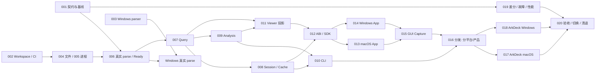

# ArkTrace Rust 内核迁移任务

> 日期：2026-10-02；版本：1.1。架构依据：[迁移设计](RUST_CORE_MIGRATION_DESIGN.md)。
> 初始状态：20 项任务，0 项完成；本文件的创建与修订不代表实现、测试或发布已通过。
> 实施基线：ArkTrace `9172c9525f954ec397e0555d7d03cd4367f3efcf`（1.1 复核至 `5f9934d6`，其间仅文档变化）。
> 1.1 修订：补齐各任务需求编号（含此前未引用的 AT-LOD/CTX/JSON/MODEL/AD 与 AT-SYS-004），
> 加入不依赖 Rust 的下游解阻项、ArkDeck 已裁定的 `trace.inspect` 路线及 Windows 取消/运行时/分发要求。
> 实施已开始：001/002/004/005/006/007/010 为 in-progress，0 项完整 done；本轮优先推进 macOS 验收。
> 实际记录：[首轮基线与 workspace](migration-runs/AT-RUST-001-002-2026-10-02.md)。
> 2026-10-06 增量：011/012/013 的生产 Rust hot snapshot → macOS Rendering 接线已实现，
> ABI/snapshot format 2、完整 Inspector facts、原始 deadline 与有界 retained copies 已验证。
> GUI、large/performance、完整进程树、下游和适用发行验收仍 open；不改写完整任务状态。
> 见[原生渲染记录](migration-runs/AT-RUST-011-013-2026-10-06-native-rendering.md)。
> 后续加入当前 ABI 2 的 488 字段呈现对照与 99 变体实际 Swift converter 回归；
> 仅测试/向量变化，生产 bytes 未变。见[wire 回归记录](migration-runs/AT-RUST-011-013-2026-10-06-wire-regressions.md)。
> 当前 ABI 2 字符串准入新增 103 个变体与 85 次拒绝后恢复，实际 native converter 通过；
> native load/copy owner 生命周期与整体验收仍 open。见[字符串边界记录](migration-runs/AT-RUST-012-013-2026-10-06-string-admission.md)。
> 修正契约声明仍为格式 1、实际 producer/consumer 已为格式 2 的不一致，统一生成常量；
> 当前新 SDK/App、真实 medium cold/cache/Inspector 及适用 macOS checks 通过。
> 见[快照格式契约记录](migration-runs/AT-RUST-012-013-2026-10-06-snapshot-format-contract.md)；总验收仍 open。
> 后续实际 Rust pack → Swift convert 的 5 个 scenes / 598 字段回归通过，默认 CI 同时核对
> producer 与冻结 records。见[packed conversion 记录](migration-runs/AT-RUST-011-013-2026-10-06-packed-conversion.md)。
> 当前 ABI 的真实 native load 新增 3 组 / 7 次 load 持有期、共享 copies、Codable 与
> byte/owner 拒绝后恢复验证；同时修复 SwiftPM 源码同步删除缓存 SDK 的问题。
> 见[snapshot load 记录](migration-runs/AT-RUST-012-013-2026-10-06-snapshot-load-ownership.md)；
> 小 trace 有界验证已通过，取消/deadline、GUI、性能及其余完整任务验收仍 open。
> 已修复 Return 激活当前 snapshot 已移除事件的焦点问题；默认三组回归及 packed snapshot
> 的 5 次 convert / 5 次当前 Swift loader / 90 次实际 keyDown 对照通过。
> 见[键盘焦点记录](migration-runs/AT-RUST-011-013-2026-10-06-keyboard-focus.md)；
> loading 显示上一帧时仍能激活该帧 detail，macOS 总验收继续 open。
> 同一 native 键盘候选已逐字节纳入长期回归；当前主线 native 全套 761 项通过，
> 见[主线键盘回归记录](migration-runs/AT-RUST-011-013-2026-10-06-native-keyboard-regression.md)。
> 实际 native load 的调用前取消、原始绝对 deadline 过期及两次健康恢复已纳入主线；
> native 全套 763 项通过，错误后与最后 owner 释放后额度回到 opening 基线，close 后归零。
> 见[取消与 deadline 回归记录](migration-runs/AT-RUST-012-013-2026-10-06-native-load-cancellation.md)；
> in-flight 取消、Rust retained hit 接线及完整 macOS 验收仍 open。

## 1. 执行规则与完成语义

- 一个任务交付一段可观察产品能力，包含代码、正向/负向验证和必要文档；可以分多个 PR，
  但不能只改任务状态就算交付。S/M/L 是相对规模，不是工期承诺。
- **开工依赖**决定接口/源码是否足以开始；**完成依赖**决定该任务能否验收。
  Windows 图形会话、生产签名、真机缺失只阻塞需要它的验收，不阻塞其他软件。
- 先核对实际 diff 和当前源码。不要照抄旧任务里的函数名、版本、PR 状态或历史 PASS。
  变更 parser、schema、ABI、SDK、发行格式时同步真实消费者，不只更新本仓测试。
- `ready`=可开始；`planned`=尚未开始且存在列出的接口依赖；`in-progress`=已开始；
  `blocked`=具体外部条件使该任务剩余工作无法推进；`done`=交付物与要求的验证均完成。
  缺真机不能标真机完成；有软件结果时写子项实际状态。
- 软件任务不要求先做正式签名/真机发布。001、002、003 可以立即开展；Windows parser
  尽早验证，避免再出现“WinUI 完成后才发现引擎不能分发”。
- macOS 现有功能、原始 Trace、flags/marks/favorites 和 ArkDeck 消费 API 是迁移约束。
  发现旧缺陷时增加有依据的差异向量，不逐字复制 bug，不为通过测试放宽规格。
- 表中拟新增路径和脚本是目标，不表示当前存在。实际创建时再把验证命令写进 run 记录。
  本任务清单不授权 Repo Agent 绕过 ArkDeck Runtime 操作设备。
- “需求”行列出任务必须保持或随交付修订的 SPECIFICATION 条款。仍以 Swift/macOS 写成的条款
  （如 AT-SYS-003/006、AT-CLI-010、AT-RENDER-001/007、AT-PERF-002）在对应能力交付时同步修订；
  规格未改之前，不声称 Windows 或 Rust 实现已满足该条。

## 2. 任务总表与依赖

表内编号均为 `AT-RUST-` 后缀；更精确的按平台完成条件见各任务。

| 编号 | 交付 | 开工依赖 | 完成依赖 | 状态 | 规模 |
|---|---|---|---|---|---|
| 001 | 行为/契约/oracle/性能基线 | 无 | 无 | in-progress | M |
| 002 | Rust workspace、工具链、双平台 CI | 无 | 无 | in-progress | M |
| 003 | Windows TraceStreamer 构建与身份 | 无 | 无 | ready | L |
| 004 | 文件身份、权限、锁与原子发布端口 | 002 | 001、002 | in-progress | L |
| 005 | 进程树、取消、输出预算与签名端口 | 002 | 004 | in-progress | L |
| 006 | 真实解析→校验→索引→Ready | 001、002 | 004、005；Windows 加 003 | in-progress | L |
| 007 | SQLite typed query、搜索与目录 | 001、002 | 006 | in-progress | L |
| 008 | Session/cache/lease/标注迁移 | 001、002 | 004、006、007 | in-progress | L |
| 009 | summary/context/analyze 与质量事实 | 001、002 | 007 | in-progress | L |
| 010 | Rust CLI 九命令与取消/资源契约 | 001、002 | 005–009；Windows 加 003 | in-progress | L |
| 011 | 共享时间线投影、LOD、命中与导航 | 001、002 | 007、009 | in-progress | L |
| 012 | C ABI、Swift/C# SDK 与生命周期 | 001、002 | 008、009、011 | in-progress | L |
| 013 | macOS App 接入 Rust SDK | 012 接口冻结 | 008、011、012 | in-progress | L |
| 014 | Windows 原生 Viewer | 002、012 接口冻结 | 003、008、011、012 | planned | L |
| 015 | 独立 GUI Capture 共享实现 | 002、004、005 | 004、005、013、014 | planned | L |
| 016 | 两平台 CLI/SDK/App 发行契约与打包 | 002；Windows recipe 待 003 | 003、005、010、012；GUI 包加 013–015 | planned | L |
| 017 | ArkDeck macOS CLI + SDK 消费接入 | 010、012 接口冻结 | 010、012、013、016 的 macOS 产物 | planned | L |
| 018 | ArkDeck Windows 离线消费接入 | 010、016 Windows schema 冻结 | 003、010、016 的 Windows CLI 产物 | planned | L |
| 019 | 差分/故障/性能/资源验证基础设施 | 001、002 | 001、002；具体能力随实现加入 | planned | L |
| 020 | 发布验收、安装切换、回滚与 Swift 清退 | 各能力可独立预验收 | 003–019 的适用完整结果 | planned | L |

“接口冻结”指 schema/ABI 与最小可编译 SDK 已在对应任务交付，允许 UI 开始实现；
不把 scripted engine 当作该 UI 任务的最终成功。016 可按 headless/macOS GUI/Windows GUI
分别交付产物，017/018 不必等待另一个平台 GUI 打包。



图展示主要关系，不把 GUI→016 箭头解释为 headless CLI 打包前置。
最短可用路线是 001/002 + macOS 004/005 → 006/007 → 010 的 inspect 子集；
完整 Windows 离线路线再加 003、Windows 004/005、008/009 和 016/018，这也是解除 ArkDeck Windows
阻塞的关键路径。ArkDeck analyzer 固定 `--no-cache`，下游联调可在 008 完成前用 `--no-cache` 子集开始，
正式验收仍要求完整 010。HDC/真机不在离线软件关键路径上。

001 交付 6 的两项（Swift 侧 message 修正、从 ArkDeck 链接 revision 重新发布 reviewed CLI）不依赖 Rust，
解除的是 ArkDeck macOS `trace.inspect` 选项 (b) 的前置，应最先完成。

## 3. AT-RUST-001 — 冻结行为、接口、oracle 与当前基线

- 状态：in-progress；开工依赖：无；完成依赖：无。
- 平台/输入：macOS 当前 Swift 与可用真实 fixture；Windows 只记录未知项；无设备执行。
- 需求：AT-SYS-002/006、AT-TIME-*、AT-ID-*、AT-MODEL-002、AT-QUERY-001/002、AT-CLI-*、
  AT-JSON-*、AT-ERR-*、AT-PERF-*；清单范围覆盖 AT-APP-*、AT-RENDER-*、AT-AD-*。
- 路径：拟新增 `contracts/`、`rust/tests/fixtures/`、`docs/migration-runs/`；现有 CLI/Core/
  Store/Rendering tests、`scripts/api-baseline/`；只为 recorder 增加最小 test seam；
  交付 6 修改 `Sources/ArkTraceAppSupport/TraceOfflineInspectionService.swift` 及其测试。

交付：

1. 按九命令、SDK 公共 API、Session/cache、query/analysis、Viewer/标注、Capture 建立
   “现有入口→目标 owner→行为向量→验收任务”清单，标出 package/public/internal 边界。
2. 提取 Machine JSON、错误 code/stage/retryable、limits、时间/身份、排序/截断和
   CLI parse 向量。记录 Swift commit、parser/schema/index identity 和每个 corpus digest。
3. 记录真实 small 三文件结果、medium/large 可用性、无 parser 与 malformed input 的结果。
   对 Windows provenance 差异制定字段级比较规则；不抹去实际身份。
4. 列出 `dataQualityNotMachineSafe` 与发行 pin 错配的已知问题；为前者准备修正前后向量，
   普通 parser warnings 不得被误判成 unsafe machine result。
5. 在安静主机采当前 Swift open/query/context/analysis/viewport/cancel/内存基线。
   缺某类 fixture 写明 not measured，不捏造数字；不阻塞合同提取。
6. 不等 Rust 的下游解阻（ArkDeck 2026-09-25 裁定的 (b) 前置）：现行 Swift
   `TraceOfflineInspectionService` 在边界丢弃自由文本 message，仍拒绝 unclassified、未知 scope 与
   负 count，附回归测试，作为独立小 PR；该修正合入且 ArkDeck 更新 pin 后，维护者从 ArkDeck 链接的
   revision 构建、签名、公证并发布 reviewed CLI distribution，使 recipe pin 一致。发布属维护者输入，
   单独记录状态，不阻塞本任务其他交付；本任务 done 只要求 Swift 修正合入。

验收：

- recorder 连续两次输出相同 canonical 语义；corpus 的哈希与来源可重放。
- 覆盖 Int64 边界、instant/open-ended、PID/TID reuse、empty/truncated、unknown/null、
  最小 output budget、非法 quality、unknown key、取消/cleanup failure 优先级。
- 包外 API 基线与当前 App、ArkDeck App 的消费符号清单对得上；无 orphan 消费者。
- 有 baseline 原始样本与缺失清单，不把历史 Phase 报告当作本次复测。
- 带自由文本（含路径）的 warning 经 offline inspection 返回结构化 report，message 不出现在结果中；
  真实 small fixture 不再整体被 `dataQualityNotMachineSafe` 拒绝。

## 4. AT-RUST-002 — Workspace、工具链和双平台 CI 骨架

- 状态：in-progress；开工/完成依赖：无。
- 已有严格双平台原生 CI：main `45bf447` 使用 Rust 1.99.0、Xcode 27.0，macOS 258 项、
  Windows 146 项测试及 build/lint/contract 通过；Windows gate 已修正失败传播和 checkout 字节身份。
  hosted App 实际构建仍因缺 parser 跳过，binding 链接与干净 Windows 运行库验收未完成，
  见 [双平台 CI 记录](migration-runs/AT-RUST-002-2026-10-03-native-ci.md)。
- 平台/输入：macOS arm64、Windows 11 x64 native runner；无设备。
- 需求：设计 §4/13；AT-SYS-001/003/006。
- 路径：拟新增 `rust/`、`contracts/` 生成入口、`windows/` 最小 binding 项目；
  `.github/workflows/`、`scripts/ci_plan.sh` 及 planner tests。

交付：

1. 最小 contract/platform/engine/CLI workspace；其余 crate 在有调用方时逐步加入。
   exact rust toolchain、Cargo.lock、MSRV 与两个 target 的原生编译记录。
2. 第一方 unsafe 边界、依赖许可清单、格式/lint/test、架构依赖检查。
3. 薄 Swift/C# smoke target，证明头文件生成、静态/动态链接、artifact 定位可行，
   未完成引擎不得包装成可用产品。
4. 扩展 CI planner，已实现模块选对应 Rust/native/SDK/App 车道；未知 diff 保守选择。
   doc-only、README shortcut、现有 phase contracts 的选择行为保留。
5. 与 `run-swiftpm.sh` 同类的稳定缓存 runner：cargo target 与依赖缓存位于仓库外、可被受限环境覆盖；
   Windows 产物的 CRT 链接方式（默认 `+crt-static`）进入 workspace 配置；AGENTS.md 补 Rust/Windows 的
   最小构建与验证入口。

验收：

- 两端真实 runner build/test，带 native OS 断言；0-test Windows harness 在 macOS 不算 PASS。
- 修改共享契约/平台代码会选两端车道；仅文档不会意外触发全量构建；planner 自测通过。
  `rust/`、`contracts/`、`windows/`、`bindings/` 等新路径有明确规则，不再落入“未知 → 全选”。
- Windows 产物在未装 VC++ 运行库的主机上可启动，或缺依赖时给出可定位错误。
- CLI/engine 的依赖闭包不含 GUI/Capture；无相邻 ArkDeck checkout path dependency。
- toolchain 和 dependency 缺失的错误可定位，不自动使用任意系统版本。

## 5. AT-RUST-003 — Windows TraceStreamer 可复现构建与 pin

- 状态：ready；开工/完成依赖：无，直接核对当前第三方源码/配方。
- 平台/输入：Windows 11 x64 构建主机、上游源码、真实 Trace；无设备操作。
- 需求：AT-SYS-005、AT-PARSE-002/003/004/010、AT-DB-*、AT-SEC-002/005、AT-CLI-011（许可清单）；
  AT-PARSE-001/007 的调用与成功判定由 006 接入。
- 路径：`ThirdParty/TraceStreamer/`、拟新增 Windows build/verify 脚本；
  `docs/TRACE_STREAMER.md`、`THIRD_PARTY_NOTICES.md`、许可/fixture 检查。

交付：

1. 优先从当前 `447a0a49…`、同插件集合与适用补丁构建 PE x64 parser；核对 upstream
   Windows 脚本真实入口（原生 MSVC 或 MinGW 交叉编译），记录所选工具链对运行库、补丁与
   GN/Ninja 获取方式的影响，不依据未下载的 release ZIP 宣称可用。
2. 锁定 source/toolchain/dependency/patch/recipe；明确全部 DLL 依赖和安装资源，运行库随 parser
   放在固定目录或静态链接。unsigned 重建字节与 signed 最终 identity 分开记录。
3. 两个 clean build 的可重复性记录；若 bytes 受可解释构建元数据影响，修构建或明确
   未通过，不削弱现有 reproducibility 要求。
4. Windows manifest、license inventory、下载 asset 校验和 parser 语义比对结果。

验收：

- 三份 small + medium 的真实 `-e -nm` 产物；large 若缺失列为发布输入，020 仍需补齐。
- 与 macOS 同 source 的 required schema、时间、身份、quality、查询语义相符；
  不要求两 OS 的 executable/DB hash 相同。
- 空格/Unicode 路径、输出 sidecar、插件覆盖、损坏输入和 DLL 缺失均有实测。
- 在未安装构建工具链与 VC++ 运行库的干净 Windows 11 x64 主机上，仅用发行目录内文件即可运行。
- manifest drift、hash mismatch、缺 license 拒绝；产物 binary 不直接提交 Git。
- 若需上游升级，交付明确 delta 与两端 re-pin 方案；不能静默用另一版本冒充 parity。

## 6. AT-RUST-004 — 文件、目录、权限、lease 与发布端口

- 状态：in-progress；开工依赖：002；完成依赖：001、002。
- 已实现 macOS held descriptor、owner mode/ACL/ownership 校验、bounded 快照复制、文件同卷无覆盖发布、
  identity-owned 清理与 shared/exclusive lease；真实 APFS 跨卷和 ENOSPC 结果见
  [2026-10-03 文件端口记录](migration-runs/AT-RUST-004-2026-10-03-macos.md)。
  lease conversion、完整 owner/entry-lease 协调、ArkDeck purger 对等与 Windows 文件端口尚未完成，
  不将 004 标 done。
- 后续增加 readonly flat-directory seal（64 个 regular files/aggregate byte limit）及完整目录
  同卷无覆盖发布、取消回退、payload/ancestor/replacement/collision 故障验证。三份实际 parser
  DB 已复制为 sealed payload 并验证发布前后同 digest；原生 APFS 跨卷目录拒绝且候选保留。
  此原语未替代 owner/crash/Ready 协议，见
  [004/005 后续记录](migration-runs/AT-RUST-004-005-2026-10-03-publication-bootstrap.md)。
- 后续已实现隔离 Rust 根的 owner v2 ledger：exclusive owner lease、creating→bound、发布位置登记、
  quarantine/removing/removed、有界 held-directory 回收与 stale identity 查找。创建/回收的 8 个实际
  SIGKILL 窗口区分可回收与不确定证明；已发布状态保留，等待 entry lease authority。76 个 Rust tests
  及三份真实 parser 的 owner 创建/登记、5 个 session 的后续 Rust 回收通过，见
  [004 owner 记录](migration-runs/AT-RUST-004-2026-10-03-owner-recovery.md)。
  v2 不交给旧 format-1 writer/purger；Ready、未绑定 creating、已失去目录身份的记录不会猜测删除。
- 平台/输入：macOS APFS、Windows NTFS native tests；无设备。
- 需求：AT-SEC-001/002/007、AT-PARSE-008、AT-CACHE-003/004/005/006。
- 路径：`rust/crates/arktrace-platform/`；host identity/lock/promotion 测试。

交付：

1. held file/directory abstraction、identity/digest、受限路径遍历、bounded read/copy。
2. 私有根创建与权限校验、共享/独占 lease、同卷发布、隔离、回收和持久化原语；Windows 根目录经
   known-folder API 解析，不读环境变量。
3. Mac device/inode 与 Windows volume/file ID 的真实身份检查；可重试错误分类与
   bounded 重试策略，不用无限 sleep 等锁或共享访问解除。
4. cache 和 source 的不同链接规则：显式原始输入可解析一次，内部/工具路径不可逃逸；Windows 区分
   symlink/junction 与云文件占位符等非链接 reparse tag，冻结显式输入对后者的处理与错误码。
5. 锁协议作为跨产品契约：macOS `flock` 文件布局与 Windows `LockFileEx` 锁定字节（现与 ArkDeck purger
   约定为 `u64::MAX-1`）写入 `contracts/` 向量，供 008 与 017/018 对等测试。
6. source 快照策略：沿用整文件复制，或证明“拒绝写/删除共享的 handle + 原位解析”等价后再替换。

验收：

- 路径/祖先替换、硬链接、symlink/junction/reparse、非私有目录、文件变更、磁盘满、
  Unicode/大小写/长路径、打开 handle 时 rename/delete 的原生负例。
- OneDrive 占位符、UNC/网络共享与 `\\?\` 长路径输入各有实测结果，不按“reparse 一律拒绝”误伤。
- 多进程 lease 排他，shared reader 不被 purge 删除；同卷与跨卷发布行为明确。
- 以 ArkDeck 产品配置写入其 Trace 根时（macOS App 容器；日后 Windows `%LOCALAPPDATA%\ArkDeck\Trace`），
  ArkDeck 现有 purger 能看见并尊重 ArkTrace 持有的 lease（Windows 为同一字节范围）。
- crash 在发布前/后不会暴露半成品，恢复只处理自己能证明身份的残留。
- DACL/mode 检查不会擅自修现有用户目录权限，raw bytes 不变。

## 7. AT-RUST-005 — 子进程、签名、取消与输出收取端口

- 状态：in-progress；开工依赖：002；完成依赖：004。
- 平台/输入：两个原生主机、可控 process fixtures、开发签名样本；无设备。
- 需求：AT-PARSE-002/003/004/009、AT-SEC-005/006、AT-CLI-010。
- 路径：`arktrace-platform` process/trust/clock；对应 native tests。

2026-10-03 macOS 原型已实现私有 executable snapshot、SHA/signature 验证、挂起启动后 kernel
code identity 核对、有界 stdout/stderr、TERM→KILL、进程树/宿主死亡控制管道与 reap。
记录见 [005 原生进程证据](migration-runs/AT-RUST-005-2026-10-03-macos.md)。实际 pinned C++ parser
已由该端口导出三份真实小 trace，并通过独立 `quick_check`；这不是 Ready DB 或生产签名验收。
初始挂起 bootstrap 窗口已补默认 SIGHUP，并在继承 session/无终端 session 的宿主 SIGKILL 下
证明 helper 入口未执行；见上方 004/005 后续记录。后续实现声明输出文件的 live/final budget、
held CWD identity 与 FD/identity 检查，并修复清理阶段忽略 stdout/stderr 超量的问题。62 个 Rust tests
及实际 parser 的 DB/sidecar 超量负例通过，见
[005 输出预算记录](migration-runs/AT-RUST-005-2026-10-03-output-budgets.md)。
仍需其它取消/launch race/fault 窗口、signedBundleInPlace、
生产 Developer ID/hardened/notarization、Windows Job Object，以及与 004 owner/crash 协议集成。

交付：

1. verified executable + argument array、固定最小 environment、受控 CWD、bounded stdout/stderr/sidecar。
2. macOS process group 与 Windows Job Object（挂起创建、入 Job 后恢复）、单调 deadline、取消、drain、reap。
3. parent death、grandchild、继承 handle、exec/launch race 的明确生命周期；自身被宿主
   `TerminateJobObject`（Windows）或 TERM→KILL 进程组（macOS，parser 若在独立进程组须另有父死亡处置）
   终止时，parser 子树也必须结束，残留留待后续调用按 owner 证据回收。
4. Developer ID/Authenticode 验证端口与 typed trust verdict，开发/生产 pin 隔离；Windows 生产 pin 为
   publisher 身份（链、组织名、EKU），不钉会轮换的 leaf 证书哈希。

验收：

- quoting 特殊字符、空参数、Unicode path 不经 shell；Windows lpApplicationName 与 argv
  正确，CWD/PATH/DLL search 不能替换已核验的 parser。
- 超量 stdout/stderr、child 退出但管道仍开、启动失败、取消每个窗口、进程树强停，
  bounded wait 后无 child/handle 泄漏；本身崩溃的残留策略经测试。
- tool 在核验和启动间被替换必须拒绝；签名无效/错误 publisher/资源漂移均不得执行。
- 第一轮取消清理后返回，cleanup failure 不被 `CANCELLED` 覆盖。

## 8. AT-RUST-006 — 真实 parser 到 Ready DB 的纵向切片

- 状态：in-progress；开工依赖：001、002；完成依赖：004、005；Windows 正向另需 003。
- 平台/输入：先 macOS pinned parser，Windows 随 003 接上；真实 fixture，无设备。
- 需求：AT-PARSE-*、AT-DB-001～006/009/010、AT-SEC-001/003、AT-SYS-004。
- 路径：`arktrace-parser`、`arktrace-store` schema/staging；移植参考
  `TraceStreamerProcessParser`、`TraceDatabaseStagingPreparer`、`TraceSchemaAdapter`。

macOS 开工证据：[Rust Store 校验记录](migration-runs/AT-RUST-006-2026-10-03-store-validation.md)。
固定 parser 的三份实际 small 输出，经 held FD/readonly SQLite 校验后，与 Swift oracle 的
schema fingerprint、capabilities、duration 和全部 quality facts 精确相等。rusqlite 0.40.2/
bundled SQLite 3.53.2 的源码、license、source ID 和实际 compile options 已冻结/记录。
Rust 96 tests、Swift 596 tests（6 个既有 opt-in skips）、API baseline 通过。
后续 [索引准备记录](migration-runs/AT-RUST-006-2026-10-03-index-preparation.md) 完成 bootstrap/
其余索引的私有事务、完整 index introspection、DELETE 恢复、SQLite close 与 readonly 封存。
三份实际输出各有 24 条正确索引，复开后上述语义仍 T0 相等；Rust 106 tests、clippy 与
contract/license verifier 通过。这是 indexed snapshot 子项；metadata、entry lease 与正式
Engine/CLI/SDK/App 接入尚未完成，`readyAcceptance=false`，006 不标 done。

[Engine no-cache 记录](migration-runs/AT-RUST-006-2026-10-03-engine-no-cache.md) 随后接通真实 parser
到 metadata/ephemeral Ready/显式 close：三份 small 的 inspection 与原校验、Swift oracle 相等；
10 个真实负例拒绝 Ready 并清理 owned outputs，替换目录场景保留外来 bytes。Rust 113 tests、
2 项新增 Swift metadata 兼容性回归通过。当前仅有独立 no-cache lease，persistent cache/shared
entry handoff 和 CLI/SDK/App 仍未完成。后续已将已知 scratch 文件
纳入 private protocol 3 的嵌套路径执行/cleanup/final 检查；aggregate/quota 与 undeclared output
治理仍待完成。

[辅助输出与 Ready 回收记录](migration-runs/AT-RUST-005-006-2026-10-03-scratch-ready-recovery.md)
补充 nested scratch 的执行/cleanup/final 监督（private protocol 3），实际 zlib 超量返回
Parsing/OutputFileLimitExceeded(index 2)，11 个 Engine 负例、3 个正例继续通过。
explicit no-cache recovery 在 key→entry→owner 锁和 metadata/owner/identity 复核后清理已登记
Ready；active/shared lease、metadata drift、坏 metadata 与外来 replacement 保留/拒绝。
真实 Engine 在 OpeningDatabase、Ready notification、returned-session 处 SIGKILL 后，自有
Ready/owner/ephemeral lease 均回收；Rust 122 tests、clippy/contract/license checks 通过。
rename-before-owner-registration、disposal 中断/orphan lease 及其余 fault 窗口尚未通过；006 保持
in-progress，产品和最终验收不因上述子项标 done。

[绑定 owner 与发布/清理故障记录](migration-runs/AT-RUST-006-2026-10-03-bound-owner.md) 随后增加
format-3 ephemeral key/session/lease identity，保留 v2 readers 和现有 metadata/key/schema 版本。
Engine 在 source copy/parser 前绑定 candidate，在 rename 前持久化 Publishing intent，payload
删除后保留 Removed tombstone 至 lease unlink 和 owner artifacts 清理。12 个实际 SIGKILL
窗口中 11 个完成回收；rmdir-before-Removed 保留身份未决 proof 和 bound lease。Rust 126 tests、
11 个真实负例、3 个 small 正例通过。fresh lease allocation 到 bind、process-active staging
回收、其它预算/故障以及完整 CLI/SDK/App 仍未完成，006 不标 done。

交付：

1. fixed parser identity、source/tool snapshot、`-e -nm`、owned partial paths；保留
   `immutableSnapshot` 与 `signedBundleInPlace` 两种执行策略，Windows MSIX 对应原位执行。
2. SQLite integrity、schema introspection、required/optional capabilities、range/relationship
   validation、index version 3 基线及其真实 metadata。
3. 私有 transaction 和 Ready 原子发布；`inspect --no-cache` 所需 metadata 可返回。
4. 精确错误阶段、质量事实、provenance 与 open/parse/index 进度。

验收：

- 三份 small 在两端真实解析并与 oracle 比较；原文件 digest 不变。
- exit 0 + 无 DB、空 DB、坏 schema/range、额外合法表、坏关联、输出链接均正确拒绝/分类。
- 每个发布窗口的取消/崩溃注入；零共享 partial，no-cache close 后清理完成。
- 内层/外层 tool identity、SQLite compile options 与 actual parser bytes 进入记录。

## 9. AT-RUST-007 — Typed 查询、目录、搜索和 Store 全量迁移

- 状态：in-progress；开工依赖：001、002；完成依赖：006。
- 平台/输入：两个原生主机、真实 DB 与异常 schema corpus；无设备。
- 需求：AT-QUERY-*、AT-MODEL-001、AT-DB-003/006/007/008/011、AT-LOD-003/004、AT-TIME-*、AT-ID-*、
  AT-APP-005/007（详情与搜索）、AT-PERF-003/004。
- 路径：`arktrace-store`、`arktrace-contract` repository trait；对应 corpus。

首个 macOS 切片：`StoreReader` 在 owner worker 内持有同一 readonly connection（!Send/!Sync），
共享 typed ProcessQuery/ThreadQuery/DTO 接到 NoCacheSession。参数化 SQL、稳定身份排序、
limit+1、生命周期归一化、坏名称/倒置 end 降级、exact/prefix/contains 转义、request-owned
取消/deadline 和 checked close 已实现。三份 small 的 processes/threads 完整机器事实与 Swift
oracle 一致，实际 SDK key filters 与取消后的下一请求通过；证据见
[007/010 目录与命令记录](migration-runs/AT-RUST-007-010-2026-10-03-directory-commands.md)。
六个目录回归覆盖边界；其它 query family/search/density/detail/navigation、read pool、Windows
原生与大样本性能仍未交付，007 不标完成。

后续 macOS 切片已加入 typed CPU scheduling/thread-state 查询和共享 Agent 查询组合层。
Store 保留半开/instant/open-ended、Int64 时间、源行 limit+1、零关系哨兵、负稳定身份、
可选字段降级和 typed quality；组合层按归一化时间排序并合并 Trace 整体质量，能力缺失时
也保留整体质量。三份真实 small 的 **51 组查询事实 T0**，18 个预算/取消/非法请求之后
同一连接的下一请求通过。15 个 Store、2 个 contract、2 个组合层新增回归通过；证据见
[CPU/线程状态查询记录](migration-runs/AT-RUST-007-2026-10-03-scheduling-queries.md)。
Engine/Store API 已接入实际打包 CLI 的 CPU/thread-state query；其它查询族、SDK/App 与正式
验收仍待完成。后续入口证据见 [query CLI 记录](migration-runs/AT-RUST-010-2026-10-03-query-cli.md)。

named slices 已加入同一 reader 与 NoCacheSession raw/Agent 层，保留完整 14-field coded DTO、
按需且不编码的 argument-set handle、完整 Trace 时长过滤、depth 能力错误、parent 哨兵、
转义名称匹配与源行预算。三份真实 small 的 **45 个完整 typed page T0**、30 个负例及后续
请求通过；9 个 Store、2 个 contract 和 1 个 public error 回归通过。Rust 产品 CLI 的 named
view 尚未开放；counter/frame/argument/detail/navigation/search/density、pool 与性能仍待迁移。
详见[named 查询与热点接入记录](migration-runs/AT-RUST-007-009-2026-10-03-named-hot.md)。
随后已接入产品 CLI named view，核对 Core 发现 Agent/CLI 的名称过滤上界为 **256 UTF-8 bytes**，
区别于 raw Store 的 4096；已收紧组合入口并补缺名称时的 match guard。新的 **48 个 typed page /
39 个负例**及完整 CLI 文档与 human 差分通过，见[named CLI 记录](migration-runs/AT-RUST-010-2026-10-03-named-cli.md)。
随后 counter 样本、独立 series 目录与 Agent 页已接入共享 reader/session 及实际 CLI。
三份真实 small 的 **48 组 / 144 个完整 typed page T0**与 36 个负例通过；保留 Int64 值、
物理表 rowid、scope、区间及分页差异。受控实际 Swift 输出确认两条 clamp 观察投影相同
时仍须保留，已加回归。CPU counters 没有新的真实 fixture，当前只有受控 SQLite 覆盖。
详见[counter 查询记录](migration-runs/AT-RUST-007-010-2026-10-03-counters.md)。
随后 raw frame 查询已接入共享 reader/session。Swift 与 Rust 均接受规格所列的七列
`frame_slice`，可选 `itid` 缺失时返回 nil；保留完整半开区间、instant/open-ended、
type 0/1、原始 flag、limit+1 与合格列空表的 capability。**62 个实际 Swift 受控用例**
包含 50 个 frame 请求及 12 个已有 raw/Agent 页；已有三种 Agent view 的独立 clamp
观察不再被相同机器投影误合并。三份实际 parser/Ready 的 **42 个完整页 T0**及
15 个失败后下一请求检查通过；三份真实 frame 表均为空，非空 frame 仍缺真实 corpus。
详见[frame 查询记录](migration-runs/AT-RUST-007-2026-10-03-frame-queries.md)。
argument/detail/navigation/search/density、pool、SDK/App 接线与完整验收继续保持未完成。
随后 argument 查询及 Inspector 的按需 slice handle 已接入共享 reader/session。
只在整数 datatype=1 时解析字典字符串，其它类型保留原始 Int64；保持最多 64 项、
源行 limit+1 后 compaction、typeName 缺失编码省略与原有独立质量页语义。Swift/Rust
均支持无 `args.id`（含 WITHOUT ROWID）的最低列集；缺少所需可选类型表/列返回
unavailable。**84 个实际 Swift 受控用例**、4 个 opt-in handle 两跳、**18 个真实
parser/Ready 页 T0**与 15 个失败后下一请求检查通过。三份真实 `args` 表经有界采样
均为空，真实非空参数与 Inspector 场景仍缺新 corpus；该切片不能代表完整 Store。
详见[argument 查询记录](migration-runs/AT-RUST-007-2026-10-03-argument-queries.md)。
detail/navigation/search/density、pool、SDK/App 接线与完整验收继续保持未完成。

共享 Viewer search 已迁入纯 Rust Analysis，通过 typed `SearchRepository` 接到同一
NoCacheSession；按域完全省去排除的查询，保留 name/PID/TID 与 signed 内部 identity
的独立查找、first-seen identity 合并、UTF-8 标题排序、生命周期/真实 EventKey 与
最多 1,000 项的结果边界。**138 个实际 Swift 受控结果与 570 次 typed source 调用**
逐一匹配；三份真实 parser/Ready 的 **67 个完整 SearchResults T0**及 21 个失败后
下一请求检查通过。过程、线程目录均有真实正向，named slice 的正向来自 zlib。
Toolbar 的 process 排除不依靠事后结果过滤；Sidebar 的可见行文字过滤仍属于 Viewer。
详见[共享搜索记录](migration-runs/AT-RUST-007-2026-10-03-search.md)。
detail/navigation、pool、Viewer/SDK/App 接线、Windows 与完整验收仍未完成。

六类 density 查询已接到同一 StoreReader/NoCacheSession，以聚合 SQL 统计事件并读取最长
事件的实际颜色身份；最多 40,000 个 bucket，身份回查每批最多 128 个绑定。保持 CPU 的
PID/TID 回退、原始 state/name/frame flag、unassociated slice 语义、counter 物理表合并
以及完整质量页；占用时长/利用率仍明确 unavailable。**190 个实际 Swift 受控用例**与
**60 个真实 parser/Ready 结果 T0**、21 个失败后下一请求检查通过。三份 small 中真实
非空 CPU counter/frame 尚无证据；density cache/read pool、Viewer/SDK/App 接线仍待完成。
详见[density 查询记录](migration-runs/AT-RUST-007-2026-10-03-density-queries.md)。

七类 typed eventBatch 已接到同一 Session；1–32 个查询保留各族输入顺序，三个附加 worker
各自持有/关闭 connection，全部排空才返回，不发布部分结果。共享 allocation credit 与
request-owned abort 已接入 SQL progress handler；保守 credit 不等同 RSS 验收。
三份真实 Ready DB 的 **36 个完整 Swift/Rust T0 输出（243 个成功 typed 查询）**与
**21 个失败后下一请求不变**检查通过，FD 与明确关闭后的 owner/lease/Ready 均核验。
macOS `/dev/fd` 瞬时 EBADF 已用同身份、同预算、最多八次重试处理；1,536 次连接 churn
回归通过。265 项 Rust tests 通过；完整 SDK async executor、density cache、detail/navigation、
Windows、性能与 App 验收仍未完成。详见[batch 与读池记录](migration-runs/AT-RUST-007-2026-10-03-batch-queries.md)。

同日新增真实 native `summaryFacts`，接通 StoreReader/Session/async Engine/FFI 与 SDK
typed request，保持各领域不同的前缀/匹配/DISTINCT 语义及缺失能力；独立跨语句 SQL
VM work policy 与 decoded credit 约束工作。4 份冻结 DB 的 9 个成功事实和 5 个预期
失败、两条真实 Trace 的 4 次包外 SDK 查询通过。机器质量明确移除人类 prose 并保留
有序结构化事实；Core warning/repository/App 适配与完整 009/012 验收继续待办，
见[native summaryFacts 记录](migration-runs/AT-RUST-007-012-2026-10-04-native-summary-facts.md)。
随后接通共享保留预算的 typed summary views，见[typed summary SDK 记录](migration-runs/AT-RUST-012-2026-10-04-typed-summary-sdk.md)。

交付：

1. process/thread/CPU/state/slice/counter/frame/argument、density、search、event detail 和
   邻接导航的全部现有查询；含 `process_measure` 与 `measure` 身份区别。
2. 参数化 SQL、稳定排序、limit+1、range clipping、capability、typed quality。
3. SQLite connection 单 worker owner、progress handler/interrupt、受限 read pool；
   不把一条可变连接随意跨线程共享。
4. 字符串匹配/Unicode、无效值、整数/浮点/NULL 的实际跨平台语义。

验收：

- 所有公开 query family 至少一条真实正向及适用失败/截断/空结果；结果排序与 oracle 一致。
- Int64 overflow、instant/open-ended、PID/TID reuse、坏字符、NULL、缺可选表、边界 range。
- cancel 正在运行 SQL、不误 interrupt 下一请求；close 后无 connection/statement 泄漏。
- 大 Trace/窄视口不全表装载；query plan/索引被实际使用；unsupported 不伪装为零。

## 10. AT-RUST-008 — Session、cache、lease 与标注安全迁移

- 状态：in-progress；开工依赖：001、002；完成依赖：004、006、007。
- 平台/输入：APFS/NTFS、多进程测试；无设备。
- 需求：AT-CACHE-*、AT-APP-002/003/004、AT-ERR-003、AT-SYS-002、AT-SEC-007、
  AT-PARSE-006/008/009、设计 §6/9。
- 路径：`arktrace-engine`；cache/view-state fixtures；Swift 当前 cache/view-state 来源录制。

交付：

1. Session 状态（含 Failed 仍可 close 释放）、RequestId、预算、cancel/drain/close、独立文档和 generation。
2. content-addressed cache key、metadata 严格 reader、hit validation、同 key 单 builder、
   active shared lease、exclusive mutation、corrupt quarantine/最多重建一次、LRU/purge。
3. 产品配置固定 roots；开发期新 namespace；跨产品无隐式共享或互相清理。
4. 最新格式的 flags/marks/favorites 读写与手动备份：固定独立备份目录、原值保留、
   digest 记录、幂等发布、取消与预算验证。常规 LRU/purge 仍按 AT-APP-004 随 entry
   回收 `view-state.json`；手动备份在 cache 外保留，不自动恢复或导入历史状态。
5. 与 ArkDeck 现有 purge 移植的接入方案（维护 crate 依赖或发布格式/锁向量），供 017/018 落地。

验收：

- App/CLI 多进程同开、构建/读取/purge 竞争、异常 owner marker、未知 metadata key、
  crash 断点、打开后身份变化、低磁盘和重启恢复。
- close 一个窗口不影响另一 Session；取消后 lease/DB/staging 都完成清理；Failed Session 的 close
  释放全部可释放资源，残留有记录并在下次启动回收。
- 最新格式的标注和收藏重新打开能恢复；半写、损坏、未知数据不会被覆盖删除；
  手动备份在 purge 后保留，重复导出验证同一完整 bundle。
- 产品 namespace 固定隔离，未知原件与手动备份受到保护；原始 Trace 从不被 purge。

2026-10-04 已将真实 no-cache parser/Store 接到固定 Session worker 的异步运行时：
generation handles、有界 queue/results、nonblocking poll/cancel、预留 close control、
Failed 可 close、owner worker drain/Drop 与原子 Request/资源终态。三份实际 small 的九份
完整 batch/search/analysis UTF-8 response 一致，12 项原生生命周期检查与 272 项 Rust tests
通过。持久 cache、外层 namespace 自动重启恢复、旧标注导入和 Windows runtime 仍待完成；
这也是 012 的后端前置，尚非 SDK/App 验收。详见[异步生命周期记录](migration-runs/AT-RUST-008-012-2026-10-04-async-runtime.md)。

2026-10-05 持久 session 增量：隔离 native root 的 cold/warm Ready、format-4 cache owner binding、
shared active lease、两秒 exclusive grace、corrupt quarantine、未知格式保留、timestamp touch
与旧 session 不变字段复核接通；SDK 固定 storagePolicy/cacheDirectory 与 cacheHit 接通。
实际原始 zlib 解析及 SDK 并发/close/Engine 重启、发布前后取消、低 DB 预算保留有效 Ready
通过。483 Rust tests、72 SDK tests、4 Span 拒绝、27 个同 Ready 原 Core 回归、本机默认
Swift/API/unsigned App 检查通过。状态仍为 in-progress：LRU/purge、cache 多进程/真实 crash/
低磁盘、外层 namespace 重启恢复、旧标注迁移、默认 App/发行及 macOS 总验收尚待完成。
来源、实际 artifact 与失败边界见[本轮记录](migration-runs/AT-RUST-008-012-2026-10-05-persistent-session.md)。

2026-10-05 维护增量：Rust Engine fixed-root inventory/LRU/purge、稳定 key/entry 与 exact-owner
删除、durable Removing intent 及 generic/orphan/removal recovery 已接通。计数保留原 Swift
inventory.active 与 skippedActive 的区别；实际 parser Ready 的 dual-session 保护、purge/reparse、
阈值维护和五个 SIGKILL 删除窗口通过。intent 后取消先 drain 本次删除，不声称没有 mutation。
Runtime/SDK/App 维护入口及其余 008/macOS 验收继续推进，见
[维护记录](migration-runs/AT-RUST-008-2026-10-05-cache-maintenance.md)。

同日后续接通非阻塞 Engine-scoped cache request、C ABI scalar 入口与 Swift SDK 的 inventory、
standard maintain、purge-unused。维护复用普通 request 的队列/取消/结果/drain，session 为零；
独立于 trace open 和 parser 加载。四项异步原生回归覆盖首次 open 前、容量与排队取消、
intent 后取消、ephemeral 拒绝与结果预算；四项 SDK 解码回归覆盖严格身份/整数/键/预算。
500 Rust、76 SDK、605 默认 Swift tests 通过；实际原始 zlib 的 SDK 双读者保护、purge/reparse、
提前取消，三份 Trace 的 75 个 FFI/Swift response 与五个原生 SIGKILL 删除窗口通过。
C ABI 暂定 v1 新增一个 export，摘要/绑定/fixture 与 production SDK 同步。App/ArkDeck 的
Rust 维护消费和其余 008/012/macOS 验收继续待办，见
[异步维护接线记录](migration-runs/AT-RUST-008-012-2026-10-05-async-cache-maintenance.md)。

## 11. AT-RUST-009 — 共享 summary/context/analyze 与质量边界

- 状态：in-progress；开工依赖：001、002；完成依赖：007。
- 平台/输入：跨平台纯计算、真实 Store；无设备。
- 需求：AT-AN-*、AT-CTX-001～005、AT-JSON-002、AT-QUERY-008、AT-ERR-*、AT-PERF-005/006。
- 路径：`arktrace-analysis`、contract machine validation；对应 Swift analysis oracle。

交付：

1. summary、context 与 cpu/scheduling/slices/range/hot-intervals 全部公式和 section budgets。
2. exact filters、normalized range、global row/event/output bounds、固定优先级截断。
3. scheduling 的可证明关系、不足时 unsupported；百分位/浮点 rounding 的明确实现。
4. 统一 machine-safe quality 转换：丢弃 message，校验闭集 category/scope/count，
   同时保留合法 warnings；供 CLI、offline inspection、SDK 共同使用。Swift 侧修正已由 001 先行，
   Rust 以修正后的行为为 oracle。

验收：

- 固定真实 Trace/request 的 canonical result 确定；section returnedCount、summary、
  sampled/truncated facts 与实数组相符。
- warnings 带自由文本时仍能返回结构化报告；message 中的路径不会泄漏；
  unclassified/未知 scope/负 count 仍拒绝。
- 无 scheduling 证据、空 range、overflow、并发取消及预算边界正确。
- 更换语言不改变分析结论；有意修 bug 的差异有独立向量，不扩大 normalization 范围。

2026-10-03 主线进展：[原始并行交接](migration-runs/AT-RUST-009-parallel-analysis-2026-10-03.md)
逐一核对 22 个新增文件后追加导入，未覆盖共享 manifest/lock。主线使用固定 Unicode NFC
依赖合并 canonical-equivalent raw state，同时保留第一份标签与 UTF-8 输出顺序；修正共享
Swift 对 open-ended Runnable 终点的证明规则。原始 23 parity / 2 differences 证据保留；
33 个新 Swift oracle vectors 按 Int64、binary64 位值、数组和 section facts 通过。
`NoCacheSession::analyze_bounded` 接真实独立 CPU/process/thread/state/scheduling/hot raw
pages，保留四个 identity/property filters、取消/时限与最终快照身份检查。三份真实 small 的
15 个请求在四个完整 section 上与 Swift CLI T0 一致，另有 3 个独立预算和 21 个负例。
详见[主线分析记录](migration-runs/AT-RUST-009-2026-10-03-mainline-analysis.md)。

这仍是六个纯 section 的迁移入口。固定上游 Runnable 语义未完成证明，Engine 保持 unproven；
后续已把真实 named query 接入 hot：独立预算、最小时长过滤、真实 callstack key/full range、
quality/truncation 均从 Store page 传递，argument handle 不读取。新增两个时长阈值场景后，
三份 small 的 **21 组请求**在五个完整数组、section facts 和 analysis dataQuality 上 T0；
3 个独立页预算和 27 个负例也通过，详见[named/hot 记录](migration-runs/AT-RUST-007-009-2026-10-03-named-hot.md)。
完整 long slices、summary/context、full envelope、
编码 byte budget、SDK/App/CLI 接通与 performance 仍待完成，不能将 009 或最终 macOS 验收标记完成。

## 12. AT-RUST-010 — Rust CLI 完整替换

- 状态：in-progress；开工依赖：001、002；完成依赖：005–009；Windows 加 003。
- 平台/输入：两端 CLI、真实 parser/resources；无设备。
- 需求：AT-CLI-*、AT-JSON-001～008、AT-CTX-005、AT-ERR-*、AT-SEC-*、AT-AD-006/007、[CLI.md](CLI.md)。
- 路径：`arktrace-cli`、machine/argv corpora、resource locator、signal tests、CLI 文档。

已开始 shared command composition：inspect/processes/threads 消费实际 NoCacheSession，完整
Machine JSON 1.0 envelope 验证后 bounded encode，checked session close 成功才返回 bytes；
失败也 close。真实三份 small 的九份输出中，仅实际 Rust executable SHA 与 hiprofiler 已知
upstream DB SHA 变化记 T1，其余字段 T0。输出超限、取消、deadline、非法 limits 四个真实
负例均不返回成功 bytes，Ready/owner/ephemeral lease 清空。证据同
[007/010 记录](migration-runs/AT-RUST-007-010-2026-10-03-directory-commands.md)。
随后已接通实际 `arktrace` executable adapter：三命令 argv、help/version、pretty/human、闭合
错误 envelope/exit status、kernel mapped Mach-O identity、sealed bundle resources、首次信号取消和
有界 stdout/stderr 提交。普通构建要求 Developer ID/hardened runtime；原生验收候选包显式开启
development-resources，只证明开发签名路径。新证据见
[打包 CLI 记录](migration-runs/AT-RUST-010-2026-10-03-packaged-cli.md)。
实际 query 入口随后接入 CPU slices / thread states，要求 view 与成对 range；maxRows/maxEvents
同时约束，身份/属性互斥，raw/normalized state 只属于 state view。请求、filters、单一事件数组、
quality、truncation、provenance 的完整机器文档对照冻结新 Swift oracle 的 51 组结果，除实际
Mach-O SHA 和 hiprofiler 既有 upstream DB SHA 变动外全部 T0。原有九份目录/inspect 文档与
资源/首次信号/背压矩阵也重跑通过，见 [query CLI 记录](migration-runs/AT-RUST-010-2026-10-03-query-cli.md)。
query 的 slices 已接通：name/exact/prefix/contains、minimum duration、depth 与身份 filters、
Agent 256-byte 名称边界；private argument handle 不进入 CLI。实际候选包对 **48 份完整 named
Machine 文档**通过，仍仅允许实际 tool SHA 和既有 hiprofiler upstream DB SHA 的差异。
三个 query view 的 fresh Swift human bytes 一致；旧 9 份目录/inspect、51 份 CPU/state 文档、
**46 个负例**（含新增边界、输出与既有原生信号/背压）通过。见[named CLI 记录](migration-runs/AT-RUST-010-2026-10-03-named-cli.md)。
随后 counters view 及 filter/name/scope 参数已接通。实际开发候选的 **48 份 counter
Machine 文档**和原 108 份文档重跑通过，总计 **156 份**；四个 view 的 fresh Swift human
bytes 一致，60 个 CLI 负例通过。单独保留候选通过真实 1-row counter 查询及 1 KiB 输出
上限检查，见[counter 查询记录](migration-runs/AT-RUST-007-010-2026-10-03-counters.md)。
其它五命令仍未接通，010 不标完成。
其余 query views、其它五命令、二次强停与启动恢复、完整输出压力/TTY 与发行身份、下游消费仍未完成，不能据此
声称生产 CLI 已替换。原 smoke binary 保留为开发检查。

交付：

1. 先交付真实 `inspect --no-cache` 子集，再完成九命令；阶段性 help 不宣传未实现命令。
2. global/command options、错误优先级、help/version、human escaping、JSON/pretty、exit 0/2–9。
3. invocation-wide deadline、stdout 一次完整提交、combined output budget、信号与 cleanup；
   Windows 交互控制台 Ctrl+C/Ctrl+Break 走结构化取消，被宿主 `TerminateJobObject` 时只留私有残留。
4. `doctor --self-test`、`licenses` 与 installed resource locator，不依赖构建机器的绝对路径；
   Windows 用 known-folder API 定位默认存储根，并提供与 018 冻结的宿主私有存储根覆盖项。
5. ArkDeck 现用 argv 原样可用：`summary --json --no-cache` 与 `context|analyze` 加固定预算 flags、
   Artifact lease 路径作为唯一 operand；不为迁移改变这些参数的语义。

验收：

- 九命令各自可达的 success/empty/truncated/error；不要给不支持这些状态的 licenses 造假。
- duplicate/unknown/missing flag、`--`、特殊路径、min output、partial write/pipe close、
  timeout 与首次 Ctrl+C/SIGINT、二次强停都被精确分类。
- Windows 上环境只有 `PATH`/`SystemRoot`/`WINDIR`、stdin 为 NUL 时，doctor/inspect/summary 仍成功；
  在每个阶段注入 `TerminateJobObject` 后无存活 parser，下一次调用回收残留且不把它当 Ready。
- 更名/移走 build tree 后，candidate resources 仍可读取；缺资源/漂移时 fail closed。
- ArkDeck 使用的 summary/context/analyze/inspect envelope 保持 closed contract，
  actual engine/parser identity 正确，process stderr 不含 raw parser log/用户路径。

## 13. AT-RUST-011 — 共享 Viewer 投影与交互语义

- 状态：in-progress；开工依赖：001、002；完成依赖：007、009。
- 平台/输入：纯 Rust + 真实 DB；无设备、无 GUI 也可验证语义。
- 需求：AT-LOD-001～006、AT-APP-003～007、AT-RENDER-002～008、AT-TIME-002、AT-PERF-004/008/009。
- 路径：`arktrace-viewer`、共享 presentation/action/snapshot vectors；参考现有 Rendering。

交付：

1. track tree/group/filter/expanded/favorite、viewport/depth layout、detail/density/LOD。
2. Int64 时间到局部坐标、真实 EventKey 命中、range/instant、重叠一像素事件选择。
3. shared color slot/state rules、label facts、search result navigation、event stepping、
   annotation 的时间/身份规则；字体与物理绘制留在平台。
4. request generation、overscan/density cache、immutable batched snapshot 与 hover overlay。

验收：

- 与 Swift 的 layout/hit-test/zoom anchor/selection/配色向量对齐；允许平台 raster 差异。
- detail 预算 `max(2,000, pixelWidth × 8)` 且 ≤ 20,000、density 每 track ≤ `pixelWidth × 2` 个 bucket、
  32 depth-row 行为、极大时间精度、offscreen lanes 不 eager query；点击 density band 以有界 query 取回真实事件。
- 旧 generation 不覆盖新结果，hover 不发 SQL、不重新生成基础颜色批次。
- 搜索/详情/分析仍指向同一个真实事件，density 聚合不伪造可选择 EventKey。

2026-10-04 已逐项审查并导入并行交接的 28 个新增路径，保留 679 个私有基线身份与
原始 oracle/差异记录；共享 lock 由主线生成，只加 Viewer package。主线 301 项 Rust tests、
strict clippy/fmt、七 crate/35 份 license 与契约通过。独立生产依赖消费端发现默认 JSON
解码器拒绝 891/10,000 个合法完整 Viewport roundtrip；产品启用 float_roundtrip 后全部
通过，并把该消费端检查接入两平台 CI。显式 detail 的离屏查询例外、quality scope 与真实
Store/SDK 接线仍待完成，不能据纯模块完成 011。详见[主线 Viewer 记录](migration-runs/AT-RUST-011-2026-10-04-mainline-viewer.md)。

随后已按 offscreen 要求同步修正 Swift/Rust 显式 detail：相同 13 组实际 Swift loader
输入仅 1 组查询行为变化（60 lanes → 1），布局/质量及其它 12 组保持精确一致，原始向量
保留。当前 302 项 Rust tests、28 项 Swift 回归和 Xcode 27 实际 App 构建通过；尚未
Rust SDK 切换，详见[离屏 detail 记录](migration-runs/AT-RUST-011-2026-10-04-offscreen-detail.md)。

同日已把 Viewer derived facts 合入完整 snapshot quality，注册五个缺失 scope，来源与
派生事实共用 4,096 项上限及原始身份去重。当前 304 项 Rust tests、111 项完整 Rendering
tests、一项 CLI quality 测试及当前 App 构建通过；重新实测六份 Swift oracle，520 组完整
输出字节不变，见[质量状态记录](migration-runs/AT-RUST-011-2026-10-04-quality-envelope.md)。

typed DTO 适配器已覆盖六类 source，并精确重放 8 组独立 actual Swift detail/style
向量；当前 308 项 Rust tests 通过。尚未接入真实 Store owner，nil namedSlice 的 detail/
density 范围差异须在接线时解决，见[事件页投影记录](migration-runs/AT-RUST-011-2026-10-04-detail-adapter.md)。

同日增加实际 NoCache/async owner 的 bounded detail 操作；同步修正 Swift/Rust nil
namedSlice 和 counter physical-family 的 pre-limit 范围。保留六组实际 Swift scope 修复前后
输出、七组 counter raw/loader 向量，三份真实 trace 的 21 个 async/blocking Rust 响应逐字节
一致；FD 23 → 23，原始 trace 不变。315 Rust tests、113 Swift 回归、API baseline 和
Xcode 27 App build 通过；七份既有 Swift oracle 的 528 组输出字节不变。完整 viewport、
generation/cache、SDK/App 与验收仍待完成，见[owner 接线记录](migration-runs/AT-RUST-011-2026-10-04-scoped-owner.md)。

随后接入 session-owned viewport loader、bounded density LRU、cached depth、focused
inclusion 与 64/512 density resolution；async worker 按 generation 取消旧 viewport 并
拒绝其发布/再次获取，保留 held bytes、普通查询及 fatal error。三份新解析 trace 的
33 个 viewport 和 42 个点击结果与独立 actual Swift repository/loader/geometry 对照通过，
Rust blocking/async 完整 UTF-8 相同，worker gate、FD/owner/raw-byte 检查通过。
332 Rust tests、strict clippy/fmt、十项 offline gate 与 46 planner cases 通过。完整原始
Swift snapshot/inspector 保留；labels/inspector/palette/jank、tree/navigation/annotations、
SDK/App/persistent-cache/发行/性能及最终验收仍未完成，见
[viewport owner 记录](migration-runs/AT-RUST-011-2026-10-04-viewport-owner.md)。

011 的后续共享配色/呈现模块已按审查清单进入主线：仅导入 18 个新增文件并追加
精确模块导出。实际主线 356 Rust tests（含 72 viewer）和 26 Swift 回归通过；重新
运行的 1,168 个 actual Swift oracle 输出与原审查结果逐字节一致，迁移 verifier
覆盖输入/输出与完整 Swift source pins。仅纯模块可用，production snapshot/ABI、
SDK 绘制和 App 尚未接通；density fallback 与 actual frame depth 的既有规格差异
保持明确未裁决。见[主线呈现记录](migration-runs/AT-RUST-011-2026-10-04-mainline-presentation.md)。

导航纯模块已按最终审查清单导入 49 个新增路径，三个生产源使用容量修复版本，
保留原始历史记录及既有 palette 导出。当前主线 382 Rust tests（98 Viewer）、4 项
actual Swift canonical 与 88 项相关回归通过；四份新 oracle 输出逐字节相同。
迁移 verifier 覆盖当前 Swift 完整源集合和输入/输出身份。host Unicode matcher、
相邻事件查询执行、session aggregate 预算和 Engine/SDK/App 接线仍未完成，不能据此
关闭 011 或 macOS 验收。见[主线导航记录](migration-runs/AT-RUST-011-2026-10-04-mainline-navigation.md)。

标注模块随后导入最终审查的 21 个新增路径，修正持久化投影的外部可变容量问题。
当前 401 Rust runtime tests + 3 compile-fail、748 个新运行 actual Swift 状态观察点
和 15 项相关回归通过；原 canonical 输出字节不变，verifier 核对完整当前源码与
deferred editor 身份。host 总预算、持久化接线和 Engine/FFI/SDK/App 未完成；原始
历史报告未重写。见[主线标注记录](migration-runs/AT-RUST-011-2026-10-04-mainline-annotations.md)。

当前 counter 兼容修复允许合法 process counter 保留 `measure` 或
`process_measure` 的真实 EventKey；CPU counter 仍只接受 `measure`。
主 workspace 增加 5 项永久回归，当前实际 Swift loader/style 与原生选择/reveal
输出逐字节一致。生产 wire、SDK/App 接线和完整验收仍未完成，见
[主线 counter 兼容记录](migration-runs/AT-RUST-011-2026-10-04-mainline-counter-compat.md)。

随后按审查清单接入 Inspector 完整事实投影、snapshot EventKey 索引和 action catalog，
仅新增 149 个专属路径并追加六行模块导出。当前 442 Rust runtime + 6 compile-fail、
4 项 actual Swift canonical 和 40 项相关回归通过；四份新 oracle 输出字节不变。
索引保留首个 nil Inspector 对重复键的阻断，catalog 保留原生键盘路由语义。
实际 snapshot owner、SDK/App 和用户焦点/IME 接线仍未完成，见
[主线 Viewer facts 记录](migration-runs/AT-RUST-011-2026-10-04-mainline-viewer-facts.md)。

## 14. AT-RUST-012 — C ABI 与 Swift/C# SDK

- 状态：in-progress；开工依赖：001、002；完成依赖：008、009、011。
- 平台/输入：Swift/C# native smoke、真实引擎、多线程压力；无设备。
- 需求：设计 §7；AT-SYS-002/003/006、AT-TIME-002、AT-MODEL-002、AT-ERR-001、AT-APP-013、AT-PERF-001/009。
- 路径：`arktrace-ffi`、拟新增 `bindings/`、Swift wrappers、Windows SDK、API baseline。

交付：

1. ABI identity、typed operation schema、生成 header/Swift/C# bindings，opaque handle registry。
2. 长任务异步 submit/poll/result/release/cancel/close；有界 event queue，背景 async wrappers。
3. JSON 冷路径和 snapshot array/string table 热路径；明确 memory ownership 与 result lifetime。
4. FFI/worker panic containment、session poison、Swift owner/C# SafeHandle；实际 unwind build。
5. 保留已有消费者需要的公开 Swift API 或同车完成适配；不给每个 UI 自写语义的接口。
   ArkDeck App 实际使用的 AppSupport/Analysis/Core/Rendering 符号（`TraceDocumentController`、
   `TraceProductConfiguration`、`TimelineNSView` 等）列入 API baseline。
6. 分发形态：Swift 侧 `binaryTarget(url:checksum:)` 指向不可变 XCFramework 资产并保留显式本地构建
   覆盖；C# 侧带 `runtimes/win-x64/native` 的版本化 NuGet 包；两者绑定 ABI 与 contract digest。
7. 有界、无路径的性能 metric 事件随事件批次交给宿主（macOS signpost、Windows ETW）。

验收：

- 大 Int64 无损 roundtrip；错误 ABI/digest、失效/跨 Engine handle、重复 release、close 与
  result acquire 竞争、输入 buffer 提前释放、多个窗口生命周期。
- valid buffer 范围内 fuzz；null/length overflow 等有界拒绝；不声称能安全处理任意悬空指针。
- worker 与 exported function 注入 panic 不跨 ABI unwind；native/OOM fault 限制有记录。
- UI 主线程不跑 parse/query/等待；1000 次 open/query/cancel/close 后资源返回稳定范围，
  用 baseline 与计数证明，不用固定 sleep 掩盖竞态。
- 包外 `test_api_baseline.sh` 通过，并提供 C# 消费程序集的正向验证。

2026-10-04 的首轮已落地 provisional C ABI、Rust-owned JSON/snapshot records、生成 C/Swift-layout/C#
声明与真实 macOS owner/Swift parity 验证。22 exports、10 records/95 offsets、336 Rust
测试及 1,000 valid-allocation byte cases 通过。async Swift SDK、C# SafeHandle、完整
生命周期压力、event/metric batches、SDK 分发与 App 切换仍未通过，见
[C ABI owner 记录](migration-runs/AT-RUST-012-2026-10-04-c-abi-owner.md)。

后续同日推进已落地显式本地不可变 XCFramework、包外 async Swift SDK consumer、ARC
result/snapshot owners、同步 Span 借用与取消/关闭/排空，并新增第 23 个 export 保留完整
session cleanup 错误。真实三条 trace 的 33 个 viewport 与 42 个 density resolution
对照新运行的实际 Swift oracle 通过，编译器拒绝借用逃逸和 Task 捕获；337 Rust 测试、
607 Swift 测试（601 通过、6 项既有跳过）、包外 API baseline 和旧 App 构建通过。
生产 SDK 严格内存安全编译通过；完整 SDK/发布签名/1000 生命周期压力和 App 切换仍未
验收。临时 JSON 字节复制已有独立预算，decoded DTO 所有权预算仍待完成。见
[Swift SDK 开发记录](migration-runs/AT-RUST-012-2026-10-04-swift-sdk.md)。

随后实际 package-external SDK 的 **1,000 轮完整生命周期压力 gate 通过**：每轮成功
固定 parser open、slice query、非空 native snapshot、另一次已获 native admission 的
open 取消及并发重复 close。完整结果关闭后不变，最后 ARC owner 释放后 retained bytes、
SDK sessions/requests 均归零。21 个检查点 FD 保持 22、direct children 为零，RSS
基线 20,430,848 bytes、检查点最大 20,856,832、最终 shutdown 前 20,480,000；原始
hash 不变、无 Ready 残留。10 warmups 不计入这 1,000 轮，取消 admission 不冒充解析
中途取消；Rust Release + Swift Debug 开发 artifact 不冒充 Release App SLO。完整机器
记录和未覆盖范围见[SDK 生命周期记录](migration-runs/AT-RUST-012-2026-10-04-sdk-lifecycle.md)。
typed response/decoded-owner budget、C# owners、event/metric、生产签名和 SDK 分发仍待
完成，012 与 macOS 整体验收继续保持 in-progress。

同日继续接通进程/线程 typed SDK pages 与共享 ARC credit：私有 packed arrays/UTF-8
pool、Engine+Session 身份和实际 request 验证，记录/质量/text views 保持 owner；14 个
SDK 测试和四个实际借用编译反例通过。三条真实 trace 的 18 个目录页与独立发起的
native 查询一致，256-owner 拒绝/恢复、关闭后存活与最终归零已实测；zlib 的名称为
nil，未冒充文本检查。其它响应、aggregate/RSS、App 切换与发布/性能验收仍待完成。
见[typed 目录 SDK 记录](migration-runs/AT-RUST-012-2026-10-04-typed-directory-sdk.md)。

随后新增闭合保留的 `RustSession.openingView()`，metadata/parser/cache/preparation/inspection
及文本共享 SDK credit；与目录共用预算和闭合解码。原始 JSON 检查拒绝重复字段及
浮点表示冒充整数，保留质量顺序与重复项。27 SDK tests、四项真实借用拒绝、三条
真实 trace 的完整 native opening 对照及18页目录回归通过。独立同DB原Swift metadata
对照、Core machine quality 适配、其他 typed responses、summaryFacts 与 App/发行/
最终验收仍未完成，见[typed opening SDK 记录](migration-runs/AT-RUST-012-2026-10-04-typed-opening-sdk.md)。

同日新增 `RustSession.summaryFacts()` 的闭合 typed 保留视图：七类 bounded count、
来源集合/记录/UTF-8 和有序质量事实共用 opening/directory 的 ARC credit。35 项 SDK
测试、四个实际借用编译反例、两条真实 Trace 的 4 次独立原 Swift golden 对照通过；
256-owner 跨三类拒绝、释放后恢复、close/shutdown 后视图与提取文本不变、最终
配额归零已实测。million-item native 查询边界保留，SDK 存储 admission 可更早拒绝。
Core warning materialization、其他响应、repository/App 接线与完整 012/013/macOS
验收仍未完成，见[typed summary SDK 记录](migration-runs/AT-RUST-012-2026-10-04-typed-summary-sdk.md)。

随后接通 opening、目录和 summary 的显式 Core 兼容复制；机器质量入口保留顺序、
重复、null 和 count，移除人类 prose，旧 warning 构造接口保持兼容。新增 10 项测试，
41 项 SDK tests、四个真实借用编译反例、两条真实 trace 的 Core metadata/8 个目录页/
4 个 summary 对照通过，Core 副本在 SDK owners 归零及 shutdown 后仍有效。
当前 Store/Analysis/Viewer 原 Swift oracle 已真实重放，原输出字节不变，更新收据绑定
当前 Core 源码；没有重写历史报告或放宽 verifier。默认 Swift 611 tests（605 passed、
6 个既有 skips）、API baseline、生产 SDK、App 构建及文档类型检查通过；App 构建保留
一条可选 AppIntents 提取告警。App 仍用 Swift 内核；人类质量呈现、其他 typed responses、
repository/App 接线与完整 macOS 验收仍待办，见
[Core 兼容复制记录](migration-runs/AT-RUST-012-2026-10-04-core-materialization.md)。

## 15. AT-RUST-013 — macOS 原生 App 使用 Rust

- 状态：in-progress；开工依赖：012 的最小可编译 SDK；完成依赖：008、011、012。
- 平台/输入：macOS 26+ arm64 图形会话、真实 medium/large；Capture 此时可保留 Swift。
- 需求：AT-APP-*、AT-RENDER-*、AT-LOD-005/006、AT-SYS-004、AT-SEC-008、AT-CACHE-006、
  AT-PERF-002/007；现有功能不回退。
- 路径：`Apps/ArkTraceApp/`、`Sources/ArkTraceAppSupport/`、`ArkTraceRendering/`、
  Swift compatibility targets、Xcode project 与原生 tests。

交付：

1. TraceDocumentController 的生命周期/查询/分析/cache/标注改为 Rust；
   Observation、focus、bookmark、picker、window/menu/shortcut 保持原生。
2. CoreGraphics 消费 shared snapshot；移除 adapter 中重复 SQL、cache 写和计算。
3. file open/drag-drop/Recents/reload、多窗口、search/process filter、range Inspector、
   flags/marks/favorites、cache maintenance、licenses 和现有错误处理闭环。
4. 捕获完成文件经新 Engine 打开；Capture 不因替换离线内核而失效。
5. `TraceShortcutCatalog` 改由共享动作目录 + macOS 键位生成，README 中英文表与
   `ShortcutCatalogTests` 同步；性能 metric 继续写入 points-of-interest signpost。

验收：

- SwiftPM targeted tests + API baseline + App build，实际 medium/large 打开和交互。
- 键盘、VoiceOver、Reduce Motion、暗/亮模式、最小窗口、焦点恢复；语义 ID 与 screenshots。
- 同 source 当前标注和收藏保存、恢复、手动备份成功；reload/快速开关/取消/两窗口关闭不串结果。
- Instruments/等价实测证明主线程无整阶段 IO，绘制与 hit-test 一致；完整 SLO 由 019/020 验收。

## 16. AT-RUST-014 — Windows 原生 Viewer

- 状态：planned；开工依赖：002、012 的 SDK 接口；完成依赖：003、008、011、012。
- 平台/输入：Windows 11 x64 native 图形会话、真实 parser/Trace；无设备要求。
- 需求：设计 §11 的 UI parity；AT-APP-001～013 的 Windows 映射、AT-LOD-*、AT-RENDER-002～008、
  AT-SYS-004、AT-SEC-008、AT-PERF-*。AT-RENDER-001/007（NSView + CoreGraphics）与
  AT-PERF-002（Apple silicon 基准）须随本任务修订后才可据以验收。
- 路径：拟新增 `windows/App`、`windows/SDK`、`windows/Tests`、XAML/theme/localization。

交付：

1. 固定 .NET/Windows App SDK/renderer 工具链，原生文件关联/picker/drag-drop/Recents。
2. WinUI shell、Win2D/Direct2D canvas，消费同一 Rust snapshot；不为事件生成逐条 XAML View。
   Viewer 做成可嵌入的 WinUI 组件库 + C# SDK，经产品配置注入根目录与身份；`ArkTrace.exe`
   只是宿主之一，日后 ArkDeck Windows Viewer 复用它而不复制。
3. 时间线/目录/search/Inspector/标注/收藏/cache/license/error 与 macOS 行为对应。
4. 原生快捷键、DPI、主题/高对比度、Narrator、UIA 稳定 ID；Capture 入口随 015 接通。
5. 键位来自共享动作目录；`.resw` 文案以现有 xcstrings 与 App 错误本地化为对照来源。

验收：

- SDK 自动化和 App build；真实 parser → 文件 → timeline → selection/search → analysis。
- MSIX 与 unpackaged 两种形态下 cache/lease 根的实际位置符合 016 的决定（虚拟化或独立根）。
- 同一 shared vector 的动作/结果/selected EventKey/状态与 macOS 对等。
- Unicode/空格路径、多个显示器 DPI、键盘全流程、Narrator、200% 文本缩放和高对比度。
- 引擎不可用时显示可解释错误；scripted engine 仅用于开发测试，不作为真实链路验收。

## 17. AT-RUST-015 — 独立 GUI Capture 共享实现

- 状态：planned；开工依赖：002、004、005；完成依赖：004、005、013、014。
- 平台/输入：两端 native host；软件阶段 stand-in；真实验收需要 SDK HDC 与板卡和明确授权。
- 需求：AT-SYS-003/006、AT-APP-014～019、AT-SEC-004/005、AT-AD-011、[CAPTURE.md](CAPTURE.md)。
- 路径：独立 `arktrace-capture`、`arktrace-capture-ffi`、两端 Capture UI adapter；
  不向离线 CLI/engine 添加 Capture feature。

交付：

1. Capture 独立类型/预设/状态机/固定 argv，GUI-only bindings 和明确 dependency graph。
2. 两端 SDK 发现和用户选择、bounded version/discovery、5–300 s 与 buffer 边界；Windows 默认 SDK
   位置实测得出；不结束、重启或替换不属于本次请求的 HDC server（ArkDeck managed 或 DevEco）。
3. UUID-owned remote/local staging、接收校验、原子保存、取消、cleanup 和 stale result 防护。
4. macOS 旧 Swift Capture 语义退出，窗口/Observation 保留；Windows 入口接通。

验收：

- stand-in 捕获每一步参数、拒绝非法 device/config/path、进程树取消、半文件、保存失败与清理失败。
- 所有 host-only 产物不链接 capture，不含设备入口；ArkDeck analyzer 无法用该 SDK 启动 HDC。
- 两端通过明确 GUI 操作各完成一次真实 capture→validate→save→open，含取消与可恢复失败。
- 设备验证记录 tool/target/firmware/Trace hash，缺板卡只留下真实验收子项，不把 stand-in 当真机。

## 18. AT-RUST-016 — 发行格式、签名与可部署产物

- 状态：planned；开工依赖：002；Windows recipe 来自 003。
- 完成依赖：CLI/SDK 需要 003、005、010、012；对应 GUI 包加 013–015。
- 平台/输入：两端构建/开发证书；生产签名/notary/publisher 是 release 输入。
- 需求：AT-SEC-*、AT-CLI-001/011、AT-PARSE-002、SPECIFICATION §23.5、现行 CLI/App distribution 边界、
  设计 §10。
- 路径：`scripts/` 发行/验证入口、`contracts/distribution/`、SDK artifact metadata、
  `docs/CLI_DISTRIBUTION.md`、`docs/APP_DISTRIBUTION.md`、license inventory。

交付：

1. macOS Rust CLI 的现有 `.app` 布局、signed parser、新 manifest；静态 SDK 与 App 包。
2. Windows headless ZIP、固定 relative resource/DLL layout、GUI MSIX + unpackaged candidate；
   决定 MSIX GUI 与 ZIP CLI 是否共享 cache/lease 根（`unvirtualizedResources`）或分立并同步规格。
3. 版本化跨平台 manifest schema、平台 tree digest、trust profile、actual provenance，
   下游可消费的 schema/corpus/拒绝向量；不让旧 Apple-only v1 接受未知字段。Windows trust profile
   钉 publisher 身份而非会轮换的 leaf 证书哈希。
4. 锁定所有新增 Rust/native/renderer 许可，SBOM/来源清单与签名顺序；离线自检。
5. versioned install、干净主机 smoke、更新/卸载/回滚脚本，用户数据不随卸载删除。
6. SDK 资产发布：XCFramework zip 与 checksum 先于下游 pin 发布且不可替换；NuGet 包版本绑定 ABI。

验收：

- 移走所有 build/source tree、清理开发 PATH 后，CLI doctor/licenses/真实 inspect 仍成功。
- 未装 VC++ 运行库与 .NET 的干净 Windows 主机上，ZIP CLI 与 GUI 各自可运行（GUI 所需 .NET 与
  Windows App SDK 运行时随包自带，或由安装形态保证）。
- 错 signer/平台/架构、修改 DLL/parser/resource/manifest、逃逸路径/大小写冲突均拒绝。
- unsigned reproducibility 与 signed identity 分开，最终 ZIP/MSIX/APP 的 bytes 与 manifest 相符。
- 开发包可先完成独立子项；只有生产签名、安装与卸载实测完成才称对应 release 包完成。
- 不把发布凭据写入仓库、日志或 evidence；缺 signer 留下具体输入项，继续其余打包工作。

## 19. AT-RUST-017 — ArkDeck macOS 双消费线接入

- 状态：planned；开工依赖：010/012 接口可用；完成依赖：010、012、013、016 macOS 产物。
- 平台/输入：macOS、固定 ArkDeck consumer checkout/开发或正式发行包；离线无板卡。
- 需求：AT-AD-001～011、AT-SYS-002/003、AT-CACHE-004～006、SPECIFICATION §21.6、AC-AT-011/012/015。
- 责任边界：本仓交付兼容 SDK/CLI/corpus；下游 ArkDeck 改动独立 PR，遵循其 review 与验证。
- 路径：本仓 SDK/distribution/API baseline/integration 文档；下游 adapter、package pin、
  analyzer loader、inspect handler、控制契约及对应 tests。

交付：

1. ArkDeck App 编译/运行 Rust-backed Swift API，保留产品配置、容器权限、recent key 与
   `signedBundleInPlace` parser policy。
2. daemon 装载新 signed CLI（loader 放行新的 product version/build 与 manifest），summary/analyze 正向可用；
   `trace.inspect` 按 2026-09-25 裁定的 (b) 由同一 CLI 的 `inspect --json` 回答并逐字段映射 report。
   若 001 交付 6 已让 ArkDeck 先用现行 Swift CLI 落地 (b)，本项只在 Rust CLI 上复验。
3. 下游 `resourceNotFound`、schema/generated/corpus 同步，不把默认 unavailable 当成功实现。
4. cache root/lease/purge owner 对齐：按 008 交付 5 替换或对齐 ArkDeck 的 Rust purge 移植；证明 daemon
   维护不会删除 App 的 active/new-format entry。
5. 双边 source/distribution compatibility 记录和已发布安装/回滚步骤。
6. ArkDeck 已移植的 envelope validator、三个 provenance 常量与 App 自带 parser 的 manifest/recipe
   同批更新，或以向量证明无需更新。

验收：

- 真实 Trace 经 ArkDeck 合法 Artifact 路径产生 inspect/summary/analysis；来源 digest/bytes
  与派生结果一致；wrong contract/parser/hash 仍拒绝。
- App 打开同文件进行 timeline/search/analysis，API baseline 和受影响 App/adapter tests 通过。
- 旧安装/新 SDK、错误 descriptor、活跃 cache purge、发行升级/回滚和缺 Artifact 负例。
- 记录下游 PR/CI/consumer revision；本仓测试不代替下游实际消费结果。

## 20. AT-RUST-018 — ArkDeck Windows 离线接入

- 状态：planned；开工依赖：010、016 的 Windows schema；完成依赖：003、010、016 Windows CLI。
- 平台/输入：Windows 11 x64、真实发行包与 ArkDeck consumer；离线不依赖 HDC 注册。ArkDeck 的
  XPA-021 另要求 Windows 主机 + DAYU200 并依赖 XPA-020，那是 ArkDeck 自己的 capture/inspect/export
  对等门，不是本任务的完成条件，本任务也不代其宣称通过。
- 需求：AT-AD-001～011、AT-SYS-002/003、SPECIFICATION §21.6、AC-AT-011/012。
- 责任边界：本仓交付 Windows engine/manifest/corpus；ArkDeck 完成 Windows loader/composition。
- 路径：本仓 integration 文档与消费 fixture；下游 profile/trust/doctor/analyzer runner/
  Windows composition/trace inspection/control schemas/WinUI 消费 tests。

交付：

1. ArkDeck 读取 Windows 发行契约，验证 publisher 身份（不钉轮换的 leaf 证书哈希）/files/tree/DLL/
   provenance 并运行 doctor；与 ArkDeck 确定 Windows 的 descriptor 选择入口（现行环境变量会让
   Windows daemon 拒绝启动，且 Windows 没有 `runtime service install/update`）。
2. 注册两个真实 analyzer，接通 job runner；去掉“无 provider”的缺省只有在真实组成完成时。
   ArkDeck runner 的挂起创建 + kill-on-close Job、最小环境、NUL stdin 与 `TerminateJobObject` 取消
   和 010 的 Windows 行为对齐；doctor 的私有存储根经冻结的覆盖项传入。
3. `trace.inspect` 按裁定 (b) 由 CLI `inspect --json` 成功返回 metadata/quality，CLI/WinUI 历史入口
   可展示；错误映射一致。
4. 对合法持有的已有 raw Artifact，验证 trace export 和 offline analyze 的完整成功链。Windows 在 HDC
   注册前没有真实 `capture.diagnostics@1` 产物，正向样本来源（ArkDeck 认可的导入路径或签名测试铺设）
   先与 ArkDeck 确定。
5. 列明 HDC/USB/设备采集仍由 ArkDeck CHG-2026-078/对应 Runtime 任务处理，不改变其准入。
6. `%LOCALAPPDATA%\ArkDeck\Trace` 的 purge 与 ArkTrace 锁协议（008 交付 5）对齐。

验收：

- 原生 Windows 实际完成 load→doctor→inspect/summary/analyze→publish/read/export。
- `operation.list` 显示真实 available；缺依赖/坏签名/坏 manifest 回到准确 unavailable。
- actual Windows parser identity 可被 validator 接受但不同 identity 不可冒充；输出与 macOS
  在声明的 T0/T1 范围内相符。
- 缺 Job/Artifact、敏感导出未授权、cancel、预算和源 hash 变化均有负例；各阶段注入
  `TerminateJobObject` 后无存活 parser，残留不被下一次调用当作 Ready。
- 记录下游 PR/CI 与实际产物；Windows fixture refusal 测试不能代替成功路径。

## 21. AT-RUST-019 — 差分、故障注入、性能和资源验证

- 状态：planned；开工/完成依赖：001、002；各产品能力落地后持续加入对应 suite。
- 平台/输入：两端 native runner、macOS/Windows 图形会话、真实 small/medium/large；
  本任务不执行设备采集。
- 需求：AT-PERF-*（含 AT-PERF-010 输出字段）、AT-SEC-*、AT-SYS-004、SPECIFICATION §21 与
  AC-AT-001～017、设计 §13；每能力的主要失败路径。
- 路径：`rust/tests/`、`rust/benches/` 或统一 benchmark runner、native UI tests、
  `scripts/` 与 CI planner、`docs/migration-runs/`。

交付：

1. 同一 corpus 分别驱动 Swift reference、Rust CLI、SDK、两端 native projections；
   comparator 对 T0/T1/T2 精确分类，差异有字段路径和最小复现。
2. child/FS/cache publication/FFI/query 的可控 failpoint；以事件屏障替代时长猜测。
3. benchmark 含 cold/warm、parse/index/query/context/analyze/draw、FFI copy、whole-product
   memory/CPU/FD/handles；原始样本、环境与版本随结果保存。
4. bounded property/fuzz、长期 open/query/cancel/close soak；固定时间/内存预算、seed/
   toolchain，失败种子进入回归。不以“fuzz 没跑到结束”算通过。
5. CI incremental lanes、native tests、release-required suites 与 skip audit；每个 gate
   指向真实命令和产物，benchmark 机器不匹配时报告 not measured。

验收：

- 差分 harness 能检出注入的字段/顺序/quality/provenance 差异，不泛化忽略错误。
- 每个已完成能力有 fault scenario，失败时所有 owned resources 可核对；没有 silent retry。
- 相同硬件同 workload 比较迁移前后；现有 SLO 全部有测量项，缺 fixture 明确列出。
- 本任务 done 表示验证设施可复现且当前接入项通过；**最终所有能力的性能与真实发布结果
  仍由 020 在最终候选上重跑**，不要求此任务在功能未实现时假造结果。

## 22. AT-RUST-020 — 最终验收、切换、回滚与旧实现清退

- 状态：planned；开工依赖：已可验收的能力可先预演；完成依赖：003–019 的适用完整结果。
- 平台/输入：两端干净主机/生产签名/图形会话、reviewed large、真实 Capture、下游消费结果。
- 需求：设计 §1/12 的完整完成条件；所有未变 AT-* 要求。
- 路径：Swift 旧 engine/CLI targets 与引用、package/Xcode/CI/release scripts、规范/设计/
  README/API docs；保留 native UI、必要 SDK wrappers、冻结 oracle 和只读数据迁移器。

交付：

1. 候选 preflight：版本/签名/ABI/parser、请求 drain、active leases、磁盘空间、用户数据备份；
   安装新 versioned 产物并验证 CLI、GUI、ArkDeck 两条消费线。
2. 标注/cache 迁移、中途退出、失败保持旧安装、升级后回滚的实操记录。
3. 删除无消费者的 Swift Parser/Store/Runtime/Analysis/CLI/Capture 算法、临时 fallback 与
   build-only recorder；保留原生 Swift rendering/Observation 和已承诺的 Rust-backed API。
4. SPECIFICATION 将实现语言与 Windows 平台范围按真实结果更新；旧 Phase 状态保持历史。
   至少核对 §2.1、§23.1、§24 的平台表述，AT-SYS-003/005/006、AT-TIME-001、AT-PARSE-001/003/005/008、
   §7 与 AT-MODEL-002、AT-CLI-010、AT-APP-001/007/009/010/012/013/014/016、AT-RENDER-001/007/008、
   AT-PERF-001/002、AT-AD-004/009 中的 Swift/macOS 专有措辞；已在前序任务修订的条款只复核。
   CLI/App distribution、integration、README、AGENTS 的构建入口与最小验证命令同步。
5. 最终 native CI、完整契约和性能、清洁安装、签名、真实 GUI Capture 与下游真实集成记录。

验收清单：

- [ ] macOS、Windows 九命令与完整 Viewer 都调用同一个 Rust 语义内核。
- [ ] 原始 Trace digest 不变；最新格式 flags/marks/favorites 保存、恢复与手动备份已验证。
- [ ] 现有 macOS 公开 API/快捷键/无障碍/多窗口/Capture 未回退。
- [ ] Windows offline/Viewer/Capture 分别有 native 成功记录，不以 unavailable 填补。
- [ ] 两端 install→doctor→parse→query/analyze→close，以及 upgrade/uninstall/rollback 成功。
- [ ] ArkDeck macOS SDK/CLI、Windows CLI/Runtime 的消费 PR 与最终 revision 可核查。
- [ ] cache maintenance 的跨进程 lease/owner 协同成立；无新旧 writer 同 namespace。
- [ ] 当前候选的 medium/large 性能、内存/handle 稳定性和取消/崩溃路径通过。
- [ ] 依赖图和源搜索证明无第二份活跃的 Swift 内核；非生产冻结 oracle 不参与运行。
- [ ] 文档中的支持声明只覆盖实际验证的版本/平台；所有实际缺口明确标记。

## 23. 第一轮实施与任务记录

第一轮应直接执行 001 的行为/API 清单和基线、002 的两端 workspace/CI、003 的 Windows
parser 构建验证。这三项相互不设状态锁；只有实际接口依赖才决定后续任务顺序。
其中 001 交付 6 的 Swift 侧 message 修正最小、且直接解除 ArkDeck 的 `trace.inspect` 前置，宜最先合入。
之后优先完成 macOS 真实 `inspect --no-cache`，并在 003 可用后于 Windows 复跑同一切片
（`doctor --self-test` + `inspect --no-cache`），尽早有两端可执行产物验证方案。

每个任务在 `docs/migration-runs/AT-RUST-NNN-<date>.md`（拟新增目录）记录：

```text
任务 / 本次交付范围：
源码 revision、工作树 diff、OS/arch/toolchain：
真实 parser/fixture/发行 identity：
可观察结果与相对 oracle 的允许差异：

Local targeted checks
- 实际命令、exit、日志路径；注明 native / fixture / real parser / device。
- 未运行项与具体原因，不把 0 tests 或 skip 算成功。

CI
- 本仓及适用下游 PR、head、run id、结论；未触发则写未触发。

剩余工作
- 仅列真实未完成项、外部输入和受影响能力；无则写任务完成。
```

记录随实现提交，不为了回填状态单独制造任务或改写已签名历史 evidence。
缺某个发布输入时继续可独立推进的软件，最终 020 保留其验收缺口。

2026-10-05 原生产品运行时增量：显式 SDK 图下同一固定 Engine 接入 document controller、后台维护和 Settings inventory/purge。真实 Trace 的模型机器事实、双窗口保护、标注/收藏重开及 purge/reparse 通过；修复 sidecar 0644 导致 native Ready 拒绝，并把兼容 IO 移出 MainActor、在关闭前排空。500 Rust、78 SDK、92 原生 AppSupport、609 默认 Swift（6 opt-in skips）和适用 API/App/contract gates 通过。默认 App、native held-FD sidecar、旧 cache import、hot snapshot、性能/发行/ArkDeck 和 macOS 总验收未完成；见[本轮记录](migration-runs/AT-RUST-008-012-2026-10-05-native-product-runtime.md)，goal 保持 active。

2026-10-05 扩展名与 sidecar 读取增量：真实产品四种扩展名/无扩展名的 metadata、目录与 snapshot 对等；Session-held 只读 `view-state.json` 端口保留 key-lock parent，固定名称、有界解码与取消/identity 复核，损坏/未知/超量原 bytes 保留。509 Rust、79 SDK、609 默认 Swift（6 opt-in skips）、API/App 与 31 个最终本地 gates 通过，第一次 App 磁盘不足失败留存并修复。读取端口未接入 C ABI/SDK/controller，写入事务、旧状态备份导入、默认 App/hot snapshot 和 macOS 总验收继续推进；见[本轮记录](migration-runs/AT-RUST-008-012-2026-10-05-source-format-sidecar-read.md)，goal 保持 active。

2026-10-04 typed event SDK 增量：七类 cold page 与 Core 兼容复制已接入 retained owner；SDK `sliceDetails` 保留 nullable Inspector handle，旧机器输出保持原形状。50 SDK tests、三份真实 Trace 42 次同 Ready DB 原 Swift 对照、457 Rust all-features tests、production SDK/API/default Swift/App 构建通过。实际语料的非空 frames/arguments 与非 null Inspector handle、App cutover 和整体 macOS 验收仍未通过。实际告警、失败与 CI 状态见 [本轮记录](migration-runs/AT-RUST-012-2026-10-04-event-sdk.md)；goal 保持 active。

2026-10-04 density SDK 增量：retained sparse bucket/color identity/quality 与 Core 复制已接通；56 SDK tests、110 独立原 Swift 成功向量、最小真实 Trace 14 次同 Ready DB 对照及关闭后读取通过。逐 query deadline/batch、共享 repository、App cutover 和 macOS 总验收仍未完成。新增私有 immutable Ready supplement；工具告警、输入边界与实际 CI 状态见 [本轮记录](migration-runs/AT-RUST-012-2026-10-04-density-sdk.md)，goal 保持 active。

2026-10-04 batch SDK 增量：七类 typed batch 共享 retained owner，返回数组与各输入槽位配对，nullable Inspector handle 与 Core 复制已接通。63 SDK tests、固定 Ready 受控 opening 下三个真实 native batch / 48 槽位与当前原 Swift prepared concurrent repository 对照及关闭后读取通过；458 Rust tests、production SDK/API/default Swift/App 检查通过。逐 query deadline transport、共享 repository/App 切换与 macOS 总验收仍未完成。来源、失败留存和实际 CI 边界见 [本轮记录](migration-runs/AT-RUST-012-2026-10-04-batch-sdk.md)，goal 保持 active。

2026-10-04 独立 query deadline 增量：原 Core deadline 的 epoch 秒/阿秒与 thread nil 已逐槽位接通，SDK 显式整操作 timeout 保持独立。68 SDK tests、471 Rust tests、11 个同 Ready 原 Swift batch / 22 次 native batch 的成功与 QUERY_TIMEOUT 对照、关闭后 retained 读取及 production SDK/API/default Swift/App 检查通过；共享 repository/default App 切换和整体 macOS 验收仍未完成。精度、实际 SQL 中断、来源及失败输入缺口见 [本轮记录](migration-runs/AT-RUST-012-2026-10-04-deadline-sdk.md)，goal 保持 active。

2026-10-05 Core repository adapter 增量：package actor 显式实现全部 13 个协议入口，processes/summaryFacts/frames/arguments 的原始 deadline 接通，既有七类 batch 复用。71 SDK tests、476 Rust tests、27 个同 Ready 原 Swift 协议对照与关闭后 typed DTO 重读、production SDK/API/default Swift/App 检查通过。Host 整操作预算/end-to-end admission、Ready identity memoization、Runtime persistent cache/default App 接入和 macOS 总验收继续推进；available frames/arguments 本次页为空，不能认证非空实际语料。来源与三轮失败边界见 [本轮记录](migration-runs/AT-RUST-012-2026-10-05-core-repository-sdk.md)，goal 保持 active。

2026-10-05 native sidecar 保存增量：Session-held 端口完成 atomic create/replace/delete、固定 intent/completion/retirement 与取消后恢复，warm lookup 和 purge 核对同一 entry/lease/owner 权限。524 Rust、30 个受控真实 SIGKILL 场景、实际 Trace 双 Session/save/reopen/delete 与 18 个最终本地 gates 通过；磁盘、fixture/helper、编译与缓存冻结失败完整保留。C ABI/async/SDK/controller sidecar transport、兼容 URL IO 替换和 macOS 总验收仍未完成；见[本轮记录](migration-runs/AT-RUST-008-012-2026-10-05-native-sidecar-write.md)，goal 保持 active。

2026-10-05 native sidecar transport 增量：异步与 C ABI read/write/remove 使用独立 4 MiB 原始文档通道，普通请求保留 1 MiB；排队/运行输入共享 16 MiB actual-capacity credit，worker 校验与 IO 复用 Session-held authority。529 Rust、实际锁竞争额度/取消/drain/panic、save/reopen/delete/future 保留、79 现有 SDK tests 和本轮包外 SDK 实际消费通过，24 个最终 gates exit 0。ABI digest 更新、26 exports/record 布局不变。Swift sidecar SDK/controller、兼容 URL IO 替换、默认 App 与 macOS 总验收仍待完成；全部失败及实际 source/bin 记录见[本轮记录](migration-runs/AT-RUST-008-012-2026-10-05-native-sidecar-wire.md)，goal 保持 active。

2026-10-05 native sidecar Swift SDK 增量：typed read/write/remove、原始格式与 provenance 检查、分配前完整 JSON 大小计数及 retained packed/text owner 已接通。87 SDK tests（新增 8 项、0 skip）、包外实际 Trace/save/reopen/exact 4 MiB/key-lock cancel/timeout/future 保留/ephemeral/Engine 后 facets/最终额度归零与 API baseline 通过，11 个最终本地 gates exit 0。复用已核对 472 当前 native source inputs 的不可变 artifact，本轮未重编 Rust。控制器 adapter、兼容 URL IO 替换、默认 App 与 macOS 总验收仍未完成；失败、输入、二进制及额度范围见[本轮记录](migration-runs/AT-RUST-012-2026-10-05-native-sidecar-sdk.md)，goal 保持 active。

2026-10-05 原生 sidecar 控制器增量：Session-held SDK 接入文档恢复与保存，失败可见且关闭仍释放 Session；极值与未知收藏兼容同步到 Swift/Rust。530 Rust、87 SDK、617 默认 Swift（6 显式 gate skips）、211 原生 AppSupport/Rendering、API 和两种 App 依赖图构建通过；实际 Trace 的未来格式保留、锁超时与关闭重开通过。默认 App/hot snapshot、备份导入、签名/性能/实际 GUI 与 macOS 总验收未完成；接续稳定 owner cache 与归档回收，goal 保持 active。见[本轮记录](migration-runs/AT-RUST-008-012-2026-10-05-native-sidecar-controller.md)。

2026-10-05 稳定 Cargo cache 增量：三个 owner 原位复用 mirror/target，独立 Git source pin/rebind、native host/target guard、独立 consumer 与全量证据归档/回收接口接通。35 工具回归、530 Rust、617 Swift passed（6 显式 skips）、API/unsigned App/SDK/contract 本地 gates 通过；完整 diff 选五车道，Windows native 未执行。三个真实 cache 均 active、实际回收 0；synthetic archive tests 不算迁移验收。默认 App native analysis/hot snapshot、旧状态备份导入与 GUI/性能/发行总验收继续，goal 保持 active。见[本轮缓存记录](migration-runs/AT-RUST-002-2026-10-05-cargo-cache-policy.md)。

2026-10-05 旧状态导入 Engine 增量：固定且互不包含的 legacy/native/backup roots、既有只读锁、有界原 bytes 备份、digest/source record、按目标 identity 的 intent/completion 已落地。冲突不按 mtime 选赢家，跨 parser 收藏保留 unmatched，已有或未来目标状态不覆盖；原件、backup 和未证明 pending 不自动删除。真实 parser 重建 Ready 后八次正常 consumer 与两处实际 SIGKILL 恢复通过；最终检查和输入/失败证据见[本轮记录](migration-runs/AT-RUST-008-2026-10-05-legacy-view-state-import.md)。async/C ABI/SDK/App 冲突选择、回滚前导出、Windows 与 macOS 总验收仍未完成，goal 保持 active。

2026-10-05 旧状态迁移 transport 增量：fixed roots、bounded async、C ABI import 与 typed Swift SDK 已接通，candidate 摘要与既有不可变 backup records 分离。557 Rust、94 SDK、617 默认 Swift（6 既有 opt-in skips）、包外 API、两种 unsigned App 依赖图与 16 次实际 parser/SDK consumer 通过；包含旧 key-lock 下 Swift Task 取消后 64-byte 输入 credit 归零、新状态保留与 IO 失败后恢复。ABI digest 更新；旧 library 不覆盖新 wire。App migration 提示/冲突选择、回滚导出、默认 native viewer、签名/性能/实际 GUI/Windows 与 macOS 总验收仍未完成，goal 保持 active。见[本轮记录](migration-runs/AT-RUST-008-012-2026-10-05-legacy-view-state-transport.md)。

2026-10-05 原生手动备份增量：固定独立根的完整不可变 snapshot、typed SDK、Controller flush/busy/cancel 与生产审阅 sheet 已接通。566 Rust、98 SDK、727 native Swift/626 默认 Swift（各 6 项既有 opt-in skip）、包外 API 与最终两种 unsigned App 构建通过；实际 native 键盘首次打开/导出/幂等重试/Escape/焦点恢复及公开 ABI 取消/异常目标/并发发布/purge 保留通过。详见[本轮记录](migration-runs/AT-RUST-008-012-2026-10-05-native-rollback-backup.md)。macOS 总目标未完成。用户最新决定不保留未发布历史兼容：下一增量先独立手动备份配置，再移除旧 import/API/op/cap/UI 链；默认 native bootstrap/drain、CPU 目录预算、Viewer/analysis/Inspector 与整体 macOS 验收继续推进。

2026-10-05 最新规则增量：按用户明确“尚未发布，不保留历史兼容逻辑”删除旧状态导入的配置/API/codec/Engine/operation/capability/UI/current probes，独立保留当前状态 read/write/remove/manual backup。543 Rust、91 SDK、716 native Swift / 622 default Swift passed（各 6 既有 opt-in skips）、API 与 unsigned App、真实公开备份 ABI、当前 Swift oracle 重放通过。默认 native bootstrap/drain 与完整 macOS 验收仍未完成；见[本轮记录](migration-runs/AT-RUST-008-012-2026-10-05-latest-view-state-only.md)。

2026-10-05 默认 native App 增量：默认 bootstrap、Controller 全部 owned tasks 的 join/flush/close 与 App Quit drain、正常 SDK 和实际只读 Developer ID helper/parser 接线完成。545 Rust、629 default Swift / 727 native Swift（各 6 既有 gate skips）、91 SDK、包外 API、当前 oracle、实际 Debug/优化签名 Release 与独立 native compile gate通过。真实打开仍因 CPU catalog 查询预算返回 QUERY_LIMIT；失败后的 active cache leases 归零及 native shutdown 已确认，桌面再次锁定，GUI/整体 macOS 未通过。96 份 receipts 和所有原失败留存；签名 candidate 未公证或发布，五 CI 车道 selected 不代表 Windows native 已执行。goal 管理器仍 blocked，继续已授权的独立迁移工作。见[本轮记录](migration-runs/AT-RUST-013-016-2026-10-05-native-default-bootstrap.md)。

2026-10-06：真实 265 MB medium 的 density 全行流式聚合、args covering indexes/schema 4、Session/worker 的 held immutable Ready inspection 复用完成。558 Rust、635 default Swift / 736 fixture-native Swift（各 6 既有 opt-in skips）、正常 SDK API 与当前 Debug/优化 Release App 构建及本地签名通过；真实 cold/cache Controller 的精确事件、12 条参数、close/active0/shutdown 及只读原行核对通过。桌面仍锁定，>500 MiB 输入、GUI/性能/完整进程树及 ArkDeck schema-4 联调和适用发行验收仍 open；goal 管理器保持 blocked。见[当前 medium 查询记录](migration-runs/AT-RUST-007-013-2026-10-06-medium-queries.md)。
